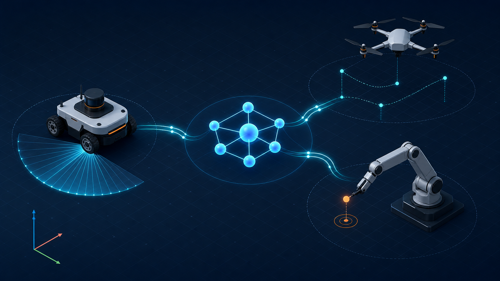

# Ros2Sample

> [!WARNING]
> **本リポジトリは検証中です。** 収録しているサンプル・ドキュメントは開発途上のものであり、すべての環境・手順で確実に動作することを確認したものではありません。利用は自己責任でお願いします。問題を見つけた場合は Issue で報告してください。

**Ros2Sample** は、ROS 2 でロボット／ドローンのサンプルを学習・検証するためのワークスペースです。<br>
このリポジトリは **日本語を第一言語** として、開発者が Ubuntu 20.04 / 24.04 / 26.04 と ROS 2 Foxy / Lyrical / Jazzy / Kilted / Rolling の環境で、依存関係の取得、ビルド、実行、CI 検証を迷わず行えることを目標にしています。

> 現在は依存を軽くした Python ベースの地上ロボット／クアッドローターシミュレーションサンプルを `src/` 以下に収録しています。Gazebo 等の重いシミュレータに進む前に、ROS 2 の topic、launch、namespace、TF、センサー風データの流れを確認するための入口として使えます。



> この画像は GPT Image 2 で生成した概念図です。厳密なノード接続、topic 名、TF 構成は下記の仕様書を参照してください。

## 対象環境

| OS | ROS 2 | 用途 | 備考 |
| --- | --- | --- | --- |
| Ubuntu 26.04 LTS | Lyrical Luth | 推奨 | 2026年5月リリースの新 LTS。サポート期間 2031年5月まで。CI ではまだ検証していません。 |
| Ubuntu 24.04 LTS | Jazzy Jalisco | 安定版・CI 対象 | 現時点で CI が実際に検証している唯一の組み合わせです。Lyrical でも Noble は 2029年まで引き続きサポートされます。 |
| Ubuntu 20.04 LTS | Foxy Fitzroy | 互換対象 | EOL 済みのため新規採用は非推奨ですが、既存環境向けに軽量 Python サンプルのビルド・実行互換性を維持します。Gazebo/GZ 連携は対象外です。 |
| Ubuntu 24.04 LTS | Kilted Kaiju | 開発候補 | パッケージ互換性を確認しながら利用してください。 |
| Ubuntu 24.04 / 26.04 | Rolling Ridley | 最新 API 検証 | API 変更が頻繁に入るため、CI 失敗時は変更内容を確認してください。 |

## リポジトリ構成

```text
.
├── .github/workflows/ci.yml   # GitHub Actions: Ubuntu 24.04/Jazzy 単一組み合わせの colcon build/test
├── docker/                    # Docker 開発環境
├── docs/                      # 補足ドキュメント
├── scripts/                   # 開発者向けヘルパースクリプト
├── ros2.repos                 # vcs import 用の依存リポジトリ定義
└── src/                       # ROS 2 サンプルパッケージ配置先
```

## パッケージ一覧

現在、このリポジトリには次の ROS 2 パッケージがあります。

| パッケージ | 目的 | 主な実行ファイル |
| --- | --- | --- |
| `ground_robot_sim` | 差動二輪風の地上ロボット、LiDAR 風停止判定、PID閉ループウェイポイント追従、障害物回避、緊急停止サービス、複数ロボット namespace の軽量サンプル | `ground_robot_node`, `diff_drive_patrol`, `lidar_obstacle_stop`, `lidar_obstacle_avoid`, `waypoint_follower` |
| `drone_sim` | クアッドローター風の位置・PID高度制御、waypoint 指令、風外乱、ジオフェンス、フォーメーション飛行、テレメトリ、バッテリーモニター、緊急着陸、小規模 swarm namespace の軽量サンプル | `sim_drone`, `altitude_hold`, `waypoint_commander`, `wind_disturbance`, `geofence_monitor`, `formation_controller`, `telemetry_logger`, `battery_monitor`, `emergency_land` |
| `manipulator_sim` | 2自由度平面マニピュレータの JointState / TF / 目標姿勢追従を学ぶ軽量サンプル | `manipulator_simulator`, `target_commander` |
| `sensor_fusion_sim` | ノイズ付きセンサー、相補フィルタによるセンサーフュージョン、ライフサイクルノードを学ぶ軽量サンプル。QoS プロファイル、コールバックグループ、動的パラメータ更新の実例を含む | `noisy_sensor_node`, `complementary_filter`, `lifecycle_data_recorder` |
| `ros2_learning` | ROS 2 の基礎概念を段階的に学ぶチュートリアルパッケージ。Publisher/Subscriber、Service、Action、パラメータ、TF、ライフサイクルノードの最小構成サンプル | `minimal_publisher`, `minimal_subscriber`, `minimal_service_server`, `minimal_service_client`, `minimal_action_server`, `minimal_action_client`, `parameter_demo`, `tf_broadcaster_demo`, `tf_listener_demo`, `lifecycle_demo` |
| `nav2_learning` | Navigation2 の概念を Nav2 を使わずに段階的に学ぶ学習パッケージ。OccupancyGrid マップ配信、A* 経路計画、Pure Pursuit 経路追従、Nav2 waypoint action クライアント、コストマップ監視、log-odds によるオンライン占有格子地図マッピング（SLAM入門）の軽量サンプル | `simple_map_publisher`, `simple_path_planner`, `simple_path_follower`, `nav2_waypoint_client`, `costmap_monitor`, `simple_occupancy_mapper` |
| `openusd_bridge` | `Odometry` の位置・姿勢を OpenUSD stage の時系列 `Xform` として保存するオプション連携サンプル | `odom_to_usd` |
| `sample_interfaces` | カスタム msg / srv / action 定義（ROS 2 インターフェース定義の学習用） | _(ライブラリパッケージ：実行ファイルなし)_ |

検出結果は `colcon list` で確認できます。

## チュートリアル

各サンプルのビルド、起動、topic 確認、主要パラメータは次のチュートリアルから確認できます。

| チュートリアル | 内容 |
| --- | --- |
| [`ground_robot_sim`](src/ground_robot_sim/README.md) | 差動二輪ロボット、LiDAR 停止、ウェイポイント追従、障害物回避、複数ロボット namespace |
| [`drone_sim`](src/drone_sim/README.md) | クアッドローター、waypoint 飛行、高度維持、バッテリー監視、小規模 swarm |
| [`manipulator_sim`](src/manipulator_sim/README.md) | 2自由度平面マニピュレータ、JointState / TF / tool pose、目標姿勢追従 |
| [`nav2_learning`](src/nav2_learning/README.md) | Navigation2 の概念（マップ、コストマップ、A* 経路計画、Pure Pursuit 経路追従、占有格子地図マッピング）を Nav2 なしで学ぶ学習パッケージ |
| [`openusd_bridge`](src/openusd_bridge/README.md) | ROS 2 の odometry を OpenUSD の時系列 transform へ記録するサンプル |
| [`docs/simulation_spec.md`](docs/simulation_spec.md) | 全サンプル共通の観測ポイント、topic / service / action、代表デモの詳細仕様 |

## 依存関係

### 基本ツール

Ubuntu 26.04/Lyrical の例です。Jazzy/Kilted/Rolling を使う場合は `ROS_DISTRO` を変更してください。

```bash
sudo apt update
sudo apt install -y \
  curl \
  git \
  python3-colcon-common-extensions \
  python3-pip \
  python3-rosdep \
  python3-vcstool
```

ROS 2 の apt リポジトリ設定とインストールは、利用する ROS 2 ディストリビューションの公式手順に従ってください。インストール後、次のように環境を読み込みます。

```bash
# Lyrical (推奨)
source /opt/ros/lyrical/setup.bash

# Jazzy
source /opt/ros/jazzy/setup.bash

# Foxy (Ubuntu 20.04 既存環境向け)
source /opt/ros/foxy/setup.bash
```

### rosdep

初回のみ rosdep を初期化します。

```bash
sudo rosdep init || true
rosdep update
```

ワークスペース依存関係を解決します。

```bash
rosdep install --from-paths src --ignore-src -r -y --rosdistro lyrical
```

`src/` のパッケージが増えた場合も、`package.xml` に依存関係を追加していれば同じコマンドで解決できます。

## セットアップ

```bash
git clone <this-repository-url> Ros2Sample
cd Ros2Sample

# 外部リポジトリ依存が追加された場合に利用します。
vcs import src < ros2.repos

# ROS 2 環境を読み込みます (Lyrical 推奨)。
source /opt/ros/lyrical/setup.bash

# 依存関係を解決します。
./scripts/rosdep-install.sh lyrical
```

`ros2.repos` は現在空に近いテンプレートです。外部 ROS 2 パッケージを固定したい場合は、`repositories:` 以下に追加してください。

## ビルド

```bash
./scripts/build.sh
```

内部では `colcon build --symlink-install` を実行します。ビルド後、ワークスペースを読み込みます。

```bash
source install/setup.bash
```

## テストと lint

```bash
./scripts/lint.sh
colcon test --event-handlers console_direct+
colcon test-result --verbose
```

各パッケージの `test/` 以下に pytest 単体テスト（純粋関数向け）と flake8 / pep257 の lint テストを収録しています。`scripts/lint.sh` は検出できるパッケージに対して colcon test の lint 系テストを実行します。パッケージが存在しない作業途中の状態でも成功するようにしており、初期セットアップや段階的な開発でも CI を通しやすくしています。

## 実行例

ビルド後に `source install/setup.bash` を実行してから、別々のターミナルでノードを起動します。

```bash
# 地上ロボット状態を publish するサンプル
ros2 run ground_robot_sim ground_robot_node

# 差動二輪風の巡回コマンドを publish するサンプル
ros2 run ground_robot_sim diff_drive_patrol

# LiDAR 風データで停止判断するサンプル
ros2 run ground_robot_sim lidar_obstacle_stop

# 閉ループウェイポイント追従サンプル
ros2 run ground_robot_sim waypoint_follower

# LiDAR 風データで障害物を回避するサンプル
ros2 run ground_robot_sim lidar_obstacle_avoid

# ドローン状態を publish するサンプル
ros2 run drone_sim sim_drone

# PID高度維持コマンドを publish するサンプル
ros2 run drone_sim altitude_hold

# waypoint 指令を publish するサンプル
ros2 run drone_sim waypoint_commander

# バッテリーモニター（電力消費シミュレーション）
ros2 run drone_sim battery_monitor

# 風外乱ベクトルを publish するサンプル
ros2 run drone_sim wind_disturbance

# ジオフェンス監視と補正 setpoint の publish
ros2 run drone_sim geofence_monitor

# leader odom に対する相対位置を追従するフォーメーション制御
ros2 run drone_sim formation_controller

# 飛行距離・最大高度・最大速度などのテレメトリ要約
ros2 run drone_sim telemetry_logger

# 緊急着陸（バッテリー低下時の自動降下 + サービストリガー）
ros2 run drone_sim emergency_land

# マニピュレータの状態 publish サンプル
ros2 run manipulator_sim manipulator_simulator

# 平面ターゲット列から関節指令を publish するサンプル
ros2 run manipulator_sim target_commander

# ノイズ付きセンサー（GPS / IMU / wheel odom）を publish するサンプル
ros2 run sensor_fusion_sim noisy_sensor_node

# 相補フィルタによるセンサーフュージョン
ros2 run sensor_fusion_sim complementary_filter

# ライフサイクル管理のデータレコーダー
ros2 run sensor_fusion_sim lifecycle_data_recorder

# 地上ロボットの緊急停止サービス呼び出し例
ros2 service call /emergency_stop std_srvs/srv/Trigger
ros2 service call /reset_emergency std_srvs/srv/Trigger

# ノード一覧確認
ros2 node list

# topic 確認
ros2 topic list
```

launch ファイルと RViz 設定も同梱しています。代表的なデモは次の通りです。

```bash
# 地上ロボット: 巡回、LiDAR停止、ウェイポイント追従、障害物回避、複数ロボット
ros2 launch ground_robot_sim diff_drive_patrol.launch.py
ros2 launch ground_robot_sim lidar_obstacle_stop.launch.py
ros2 launch ground_robot_sim waypoint_follower.launch.py
ros2 launch ground_robot_sim lidar_obstacle_avoid.launch.py
ros2 launch ground_robot_sim multi_robot.launch.py
ros2 launch ground_robot_sim gazebo.launch.py use_gui:=false

# ドローン: waypoint飛行、高度維持、バッテリー、風/ジオフェンス/テレメトリ、フォーメーション、小規模swarm
ros2 launch drone_sim single_quad_waypoint.launch.py
ros2 launch drone_sim altitude_hold.launch.py
ros2 launch drone_sim battery_demo.launch.py
ros2 launch drone_sim wind_demo.launch.py
ros2 launch drone_sim formation_demo.launch.py
ros2 launch drone_sim swarm.launch.py drone_count:=5

# マニピュレータ: 平面到達デモ（JointState / TF / tool pose）
ros2 launch manipulator_sim planar_reach_demo.launch.py

# センサーフュージョン: ノイズ付きセンサー + 相補フィルタ + ライフサイクルレコーダー
ros2 launch sensor_fusion_sim sensor_fusion_demo.launch.py

# OpenUSD: 地上ロボット odometry を USD stage へ記録（別途 pxr が必要）
ros2 launch openusd_bridge ground_robot_openusd.launch.py

# チュートリアル: Publisher/Subscriber デモ
ros2 launch ros2_learning pubsub_demo.launch.py

# チュートリアル: サービスサーバー/クライアント デモ
ros2 launch ros2_learning service_demo.launch.py

# チュートリアル: アクションサーバー/クライアント デモ
ros2 launch ros2_learning action_demo.launch.py

# チュートリアル: パラメータ デモ
ros2 launch ros2_learning parameter_demo.launch.py

# チュートリアル: TF ブロードキャスター/リスナー デモ
ros2 launch ros2_learning tf_demo.launch.py

# チュートリアル: ライフサイクルノード デモ
ros2 launch ros2_learning lifecycle_demo.launch.py
```

RViz を使う場合は、ビルド後に `install/<package>/share/<package>/rviz/` 以下の設定ファイルを開いてください。

## チュートリアル（学習パス）

ROS 2 初学者向けの段階的なチュートリアルを `docs/tutorials/` に収録しています。`ros2_learning` パッケージの最小構成サンプルを使いながら、基礎概念を学んだ後に既存パッケージの実装を読み解けるよう構成しています。

| チュートリアル | 目安時間 | 内容 |
| --- | --- | --- |
| [`00_learning_path.md`](docs/tutorials/00_learning_path.md) | 5分 | 学習パスの概要と環境構築 |
| [`01_publisher_subscriber.md`](docs/tutorials/01_publisher_subscriber.md) | 30分 | トピック通信の基礎 |
| [`02_service_action.md`](docs/tutorials/02_service_action.md) | 45分 | サービスとアクション |
| [`03_launch_params.md`](docs/tutorials/03_launch_params.md) | 30分 | Launch ファイルとパラメータ |
| [`04_tf_transforms.md`](docs/tutorials/04_tf_transforms.md) | 45分 | TF2 と座標変換 |
| [`05_custom_interfaces.md`](docs/tutorials/05_custom_interfaces.md) | 30分 | カスタムメッセージ定義 |
| [`06_lifecycle_qos.md`](docs/tutorials/06_lifecycle_qos.md) | 45分 | ライフサイクルノードと QoS |
| [`07_nav2_overview.md`](docs/tutorials/07_nav2_overview.md) | 45分 | Navigation2 の全体像 |
| [`08_costmap_and_map.md`](docs/tutorials/08_costmap_and_map.md) | 45分 | マップとコストマップ |
| [`09_path_planning.md`](docs/tutorials/09_path_planning.md) | 60分 | A* による経路計画 |
| [`10_nav2_controller.md`](docs/tutorials/10_nav2_controller.md) | 45分 | Pure Pursuit による経路追従 |
| [`11_behavior_tree.md`](docs/tutorials/11_behavior_tree.md) | 45分 | ビヘイビアツリー入門 |
| [`12_rviz_visualization.md`](docs/tutorials/12_rviz_visualization.md) | 45分 | RViz で TF、センサー、マップ、経路を可視化 |
| [`13_debugging_ros2_systems.md`](docs/tutorials/13_debugging_ros2_systems.md) | 45分 | ROS 2 CLI と rqt_graph によるデバッグ入門 |
| [`14_reading_existing_packages.md`](docs/tutorials/14_reading_existing_packages.md) | 60分 | 既存パッケージの読み解き方とチュートリアル対応表 |
| [`15_mini_projects.md`](docs/tutorials/15_mini_projects.md) | 90分 | 複数概念を組み合わせた実践課題 |
| [`16_troubleshooting.md`](docs/tutorials/16_troubleshooting.md) | — | よくあるエラーと対処法 |
| [`17_gazebo_integration.md`](docs/tutorials/17_gazebo_integration.md) | 60分 | Gazebo / GZ Sim と ros_gz_bridge の連携入門 |

```bash
# チュートリアル用パッケージのビルド
colcon build --packages-select \
  ros2_learning \
  sample_interfaces \
  nav2_learning \
  ground_robot_sim \
  drone_sim \
  manipulator_sim
source install/setup.bash
```

## 詳細仕様ドキュメント

| 文書 | 対象読者 | 内容 |
| --- | --- | --- |
| [`docs/simulation_spec.md`](docs/simulation_spec.md) | 利用者 | 各デモで観測できる挙動、topic / service / action、主要パラメータ |
| [`docs/implementation_spec.md`](docs/implementation_spec.md) | 実装者・レビュー担当 | ノード接続、制御式、実装上の制約、異常系、受け入れ確認 |
| [`docs/development.md`](docs/development.md) | コントリビューター | ビルド、テスト、パッケージ追加時の更新手順 |

## Docker 開発環境

Ubuntu 26.04 + ROS 2 Lyrical の開発コンテナを既定にしています。Ubuntu 20.04 + ROS 2 Foxy など、ROS 2 公式 Docker イメージに存在する組み合わせも `ROS_DISTRO` と `UBUNTU_CODENAME` で指定できます。

```bash
# Lyrical (デフォルト・推奨)
docker compose -f docker/compose.yml build
docker compose -f docker/compose.yml run --rm ros2sample

# Jazzy を使う場合
ROS_DISTRO=jazzy UBUNTU_CODENAME=noble docker compose -f docker/compose.yml build
ROS_DISTRO=jazzy UBUNTU_CODENAME=noble docker compose -f docker/compose.yml run --rm ros2sample

# Foxy / Ubuntu 20.04 を使う場合（既存環境互換）
ROS_DISTRO=foxy UBUNTU_CODENAME=focal docker compose -f docker/compose.yml build
ROS_DISTRO=foxy UBUNTU_CODENAME=focal docker compose -f docker/compose.yml run --rm ros2sample
```

コンテナ内ではリポジトリが `/workspace/Ros2Sample` にマウントされます。

## CI

GitHub Actions は `.github/workflows/ci.yml` で定義しています。現在の `strategy.matrix` の `include` には Ubuntu 24.04/Jazzy の1組み合わせのみが登録されており、CI が実際に検証しているのはこの組み合わせだけです。`fail-fast: false` は設定していますが、今のところ matrix エントリが1つなので効果はありません。

「対象環境」に記載している Foxy・Kilted・Rolling（および CI 未実行の Lyrical）は、互換性維持や開発候補としての対象ではあるものの、CI では検証されていません。これらの組み合わせを CI に追加したい場合は `ci.yml` の `matrix.include` にエントリを追加してください。

次のタイミングで自動的に実行されます（`src/**`、`scripts/**`、`docs/**`、`README.md`、`ros2.repos`、`.github/workflows/**` に変更があった場合のみ）。CI の先頭では `scripts/check_docs_consistency.py` により、パッケージ実態と README・仕様書の整合性チェックも行います。

- `main` ブランチへの `push`
- Pull Request（対象ブランチを問わず）
- 手動実行 (`workflow_dispatch`)

各ジョブでは次の流れで検証します。

1. `rosdep install`
2. `./scripts/lint.sh`
3. `./scripts/build.sh`
4. `colcon test`
5. `colcon test-result --verbose`（結果は Job Summary にも出力されます）

`src/` のパッケージが追加・変更されても、ワークスペース全体の基本検証を同じ流れで実行できるようにしています。

## トラブルシューティング

### `colcon: command not found`

`python3-colcon-common-extensions` が未インストールです。

```bash
sudo apt install -y python3-colcon-common-extensions
```

### `rosdep: command not found`

`python3-rosdep` をインストールしてください。

```bash
sudo apt install -y python3-rosdep
```

### `rosdep init` が失敗する

既に初期化済みの場合があります。`rosdep update` を実行してください。

```bash
rosdep update
```

### `No packages found` と表示される

`src/` が取得できていない、またはパッケージ構成が壊れている可能性があります。`find src -maxdepth 2 -name package.xml -print` と `colcon list` で認識状況を確認してください。

### ROS 2 ディストリビューションを切り替えたい

環境変数 `ROS_DISTRO` またはスクリプト引数で指定します。

```bash
# Jazzy に切り替える例
source /opt/ros/jazzy/setup.bash
./scripts/rosdep-install.sh jazzy

# Rolling に切り替える例
source /opt/ros/rolling/setup.bash
./scripts/rosdep-install.sh rolling
```

## コントリビューション

バグ報告、機能要望、チュートリアルに関する質問は GitHub issue（テンプレートあり）からお願いします。開発環境のセットアップ、ブランチ・コミットメッセージの慣例、ローカルでの lint・テスト実行方法は [`CONTRIBUTING.md`](CONTRIBUTING.md) にまとめています。Pull Request を送る際は [`.github/pull_request_template.md`](.github/pull_request_template.md) のチェックリストをご確認ください。

## English summary

Ros2Sample is a ROS 2 workspace for robot and drone examples. Documentation and tooling are Japanese-first, with Ubuntu 20.04 / 24.04 / 26.04 and ROS 2 Foxy / Lyrical / Jazzy / Kilted / Rolling in mind. The default and CI-primary distribution is Lyrical Luth (May 2026 LTS). Use `scripts/build.sh`, `scripts/lint.sh`, and `scripts/rosdep-install.sh` for common development tasks.

Packages include `ground_robot_sim` (diff-drive robot with synthetic LiDAR, PID waypoint following, emergency stop service), `drone_sim` (quadrotor with PID altitude hold, wind disturbance, geofence monitoring, formation control, telemetry logging, battery monitoring, emergency landing), `manipulator_sim` (2-DOF planar manipulator), `sensor_fusion_sim` (noisy sensors, complementary filter fusion, lifecycle node with QoS profiles and callback groups), `sample_interfaces` (custom msg/srv/action definitions for learning ROS 2 interface design), and `ros2_learning` (step-by-step tutorial package covering Publisher/Subscriber, Service, Action, Parameters, TF, and Lifecycle nodes with progressive tutorials in `docs/tutorials/`).
