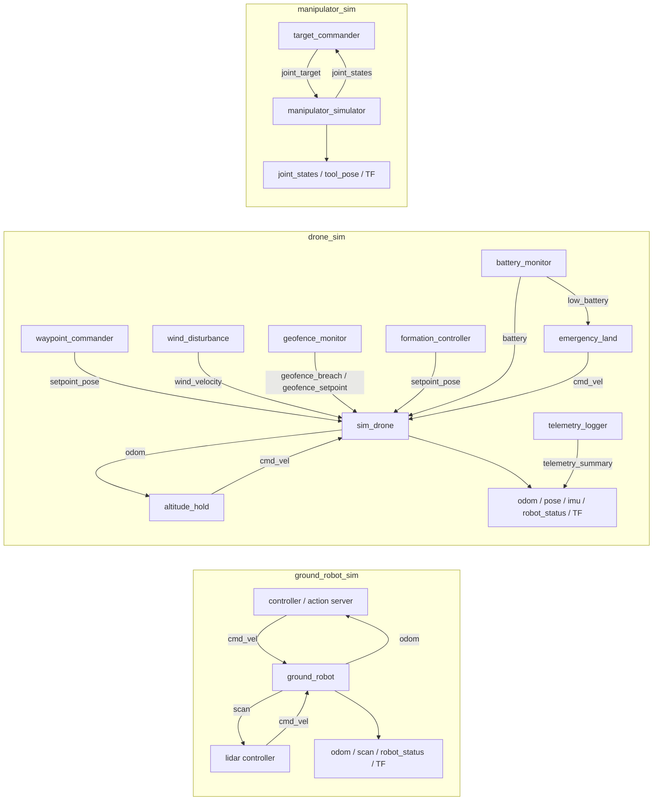

# ROS 2 サンプル実装仕様書

この文書は、`src/` の実装を基準に Ros2Sample の内部仕様を説明します。利用手順とデモの見え方は [simulation_spec.md](simulation_spec.md) を参照してください。仕様とコードが食い違う場合はコードを正とし、変更時に本書も更新します。

## 1. スコープと非目標

本ワークスペースは ROS 2 の通信、launch、namespace、TF、簡易制御を学ぶための軽量サンプルです。

- 対象: 2D 差動二輪、3D クアッドローター風運動、2 自由度平面アーム
- 実装: Python (`rclpy`) と標準的な ROS 2 message
- 時間: 各ノードの ROS clock。launch の `use_sim_time` で切り替え可能
- 非目標: 接触、摩擦、空力、衝突応答、センサーノイズ、実機安全保証
- QoS: publisher/subscription はすべて depth `10` の既定 QoS。センサー専用 QoS は未使用
- 単位: SI 単位系（m、s、rad、m/s、rad/s）。バッテリー表示のみ `%`

## 2. システム構成



複数ノードが同じ `cmd_vel` に publish する構成では、最後に受信した値がシミュレータの指令になります。優先度調停や command mux は実装していないため、通常は1つの制御ノードだけを接続します。

## 3. 共通インターフェース

### 3.1 `RobotStatus.msg`

| フィールド | 型 | 契約 |
| --- | --- | --- |
| `header` | `std_msgs/Header` | 状態生成時刻と odom 系 frame |
| `robot_name` | `string` | parameter または namespace 由来の識別名 |
| `state` | `string` | 地上: `idle`, `moving`, `emergency_stop`; ドローン: `idle`, `moving` |
| `battery_percentage` | `float64` | 0--100。地上は固定 100、ドローンは `battery.percentage * 100` |
| `position` | `geometry_msgs/Point` | odom frame 上の位置 |
| `linear_velocity` | `geometry_msgs/Vector3` | 現在の線速度 |
| `heading_rad` | `float64` | `[-pi, pi]` の yaw |

### 3.2 Service と Action

- `GetRobotStatus.srv`: 空 request に対し最新スナップショット、`success`、`message` を返す。
- `NavigateWaypoints.action`: 空 waypoint goal は reject。cancel は常に accept し、ゼロ `Twist` を発行する。
- action の `tolerance_m` が 0 の場合は `0.15`、それ以外も最小 `0.01` に補正する。
- `loop=true` の action は明示的に cancel されるまで成功 result を返さない。

## 4. 地上ロボット

### 4.1 ノード契約

| 実行ファイル（ノード名） | Subscribe | Publish / 提供 | 役割 |
| --- | --- | --- | --- |
| `ground_robot_node` (`ground_robot`) | `cmd_vel: Twist` | `odom: Odometry`, `scan: LaserScan`, `robot_status: RobotStatus`, TF, `emergency_stop`, `reset_emergency`, `get_robot_status` | 本体と擬似 LiDAR |
| `diff_drive_patrol` | なし | `cmd_vel: Twist` | 時間駆動の直進・停止・旋回 |
| `lidar_obstacle_stop` | `scan` | `cmd_vel` | 前方最短距離による停止 |
| `lidar_obstacle_avoid` | `scan` | `cmd_vel` | 左右最短距離による減速・旋回 |
| `waypoint_follower` | `odom` | `cmd_vel` | 固定 waypoint 列の PID 追従 |
| `navigate_waypoints_server` | `odom` | `cmd_vel`, `navigate_waypoints` action | goal 指定 waypoint の PID 追従 |

### 4.2 運動と LiDAR

周期 `dt` ごとに、受信指令を速度上限へ clamp して次式を積分します。

```text
x(k+1)   = x(k) + v cos(yaw) dt
y(k+1)   = y(k) + v sin(yaw) dt
yaw(k+1) = normalize(yaw(k) + omega dt)
```

`emergency_stop` 中は速度をゼロにし、新しい `cmd_vel` を無視します。位置の境界 clamp や衝突応答はなく、LiDAR の障害物検出と車体運動は独立しています。

LiDAR は `-pi/2` から `+pi/2` を `scan_samples` 点で走査し、各 ray と円形障害物および正方形境界の最短交点を返します。交点がない、または `range_max` を超える場合は `range_max`、`range_min` 未満の場合は `range_min` へ丸めます。

### 4.3 制御則

waypoint 制御は距離 `d` と方位誤差 `e_yaw` に独立 PID を適用します。`|e_yaw| > heading_gate_rad` の間は直進を止め、linear PID を reset します。到着後、`waypoint_follower` は `hold_time_sec` 停止して次点へ進みます。action server は hold を設けません。

障害物回避は前方 sector を左右に分けます。最短距離 `r` が `stop_distance` 以下なら停止旋回、`avoid_distance` 以下なら次式で直進速度を線形に落とします。

```text
factor = clamp((r - stop_distance) / (avoid_distance - stop_distance), 0, 1)
v      = factor * forward_speed
omega  = away_from_nearer_side * turn_speed * (1 - factor)
```

### 4.4 本体 parameter

| parameter | default | 制約・意味 |
| --- | ---: | --- |
| `robot_name` / `frame_prefix` | `""` / `""` | 未指定時の識別名、複数台 TF prefix |
| `odom_frame` / `base_frame` / `laser_frame` | `odom` / `base_link` / `base_scan` | TF frame 名 |
| `publish_rate` / `scan_rate` | `30.0` / `10.0` | 1 Hz 未満は 1 Hz に補正 |
| `wheel_base` | `0.36` | 現状は宣言のみで運動式には未使用 |
| `max_linear_speed` / `max_angular_speed` | `0.8` / `1.8` | 入力 clamp 上限 |
| `initial_x`, `initial_y`, `initial_yaw` | `0`, `0`, `0` | 初期姿勢 |
| `scan_range_min` / `scan_range_max` | `0.08` / `8.0` | scan 距離範囲 |
| `scan_samples` | `181` | 最小 3 |
| `world_half_size` | `5.0` | 原点中心の正方形半幅 |
| `obstacles` | 3円のリスト | `[x, y, radius, ...]`; 3の倍数でない場合は起動失敗 |

制御ノードの全 default はソースの `declare_parameter`、デモ用上書き値は `config/*.yaml` を正とします。

## 5. ドローン

### 5.1 ノード契約

| 実行ファイル（ノード名） | Subscribe | Publish / 提供 | 役割 |
| --- | --- | --- | --- |
| `sim_drone` | `cmd_vel`, `setpoint_pose`, `wind_velocity`, `geofence_breach`, `geofence_setpoint`, `battery` | `odom`, `pose`, `imu`, `robot_status`, TF, `get_robot_status` | 3D 簡易運動 |
| `waypoint_commander` | `pose` | `setpoint_pose` | 3D waypoint 列 |
| `altitude_hold` | `odom` | `cmd_vel` | z 軸 PID |
| `wind_disturbance` | なし | `wind_velocity` | 時間変化する風速ベクトル |
| `geofence_monitor` | `odom` | `geofence_breach`, `geofence_setpoint` | 3D 境界監視と補正 setpoint |
| `formation_controller` | leader `odom` | `setpoint_pose` | leader 追従 offset 制御 |
| `telemetry_logger` | `odom`, `battery` | `telemetry_summary` | 飛行統計集計 |
| `battery_monitor` | `cmd_vel` | `battery`, `low_battery` | 電力消費モデル |
| `emergency_land` | `low_battery`, `odom` | `cmd_vel`, `emergency_land` service | 手動・自動降下 |

### 5.2 運動モデルと指令選択

`cmd_vel` は速度目標、`setpoint_pose` は位置誤差へ `position_kp` を乗じた速度目標です。いずれも `max_linear_speed` で制限され、現在速度は `linear_accel_limit * dt` 以下の変化量で目標へ近づきます。位置と yaw は速度積分で更新し、z は 0 未満になりません。`wind_velocity` の各成分は積分時に機体速度へ加算される外乱速度として扱います。

`setpoint_pose` は受信後 `setpoint_timeout_sec` 以内なら `cmd_vel` より優先されます。setpoint が失効すると、受信後 `cmd_timeout_sec` 以内の `cmd_vel` を使用し、両方が失効するとゼロ指令になります。`geofence_breach=true` の間に `geofence_setpoint` を受信した場合は、その補正 setpoint を通常の setpoint として取り込みます。同時利用するデモではどちらが指令元かを明確にしてください。厳密な姿勢・角速度・推力モデルはありません。


### 5.3 風外乱、ジオフェンス、フォーメーション、テレメトリ

`wind_disturbance` は `base_wind_*` に周期 gust と turbulence を加えた `geometry_msgs/Vector3` を `wind_velocity` へ publish します。`sim_drone` はこの値を速度外乱として位置積分に加算します。

`geofence_monitor` は `boundary_min_*` / `boundary_max_*` の 3D bounding box と `margin_m` を使って `odom` を監視します。境界外なら `geofence_breach=true` を publish し、境界内へ clamp した `geofence_setpoint` を publish します。境界に近い warning 状態ではログ警告のみで、breach topic は false です。

`formation_controller` は `leader_odom_topic` の位置に `offset_x/y/z` を加えた follower 目標を作り、`smoothing_gain` で前回目標から平滑化して `setpoint_pose` へ publish します。launch では `/leader`、`/follower_1`、`/follower_2` の namespace を使います。

`telemetry_logger` は `odom` から総移動距離、最大速度、最大高度、飛行時間、現在位置を集計し、`battery` から最新バッテリー[%]を取り込んで `telemetry_summary` (`std_msgs/String`) に JSON 風の要約文字列を publish します。

### 5.4 バッテリーと緊急着陸

```text
throttle = min(1, (|vx| + |vy| + |vz| + |wz|) / 4)
power_W  = idle_power_W + throttle * motor_power_W
drain_Wh = power_W * dt / 3600
```

`BatteryState.percentage` は 0--1、`RobotStatus.battery_percentage` は 0--100 です。残量が `critical_pct` 以下になると `low_battery=true`。緊急着陸ノードは高度が 0.05 m より高い間 `linear.z=-descent_speed` を発行し、地面到達後に停止します。

### 5.5 主要 parameter

| ノード | parameter default |
| --- | --- |
| `sim_drone` | `publish_rate_hz=50`, `cmd_timeout_sec=0.6`, `setpoint_timeout_sec=1.0`, `linear_accel_limit=3.0`, `yaw_accel_limit=4.0`, `max_linear_speed=5.0`, `max_yaw_rate=2.5`, `position_kp=1.2`, `yaw_kp=1.8` |
| `waypoint_commander` | `publish_rate_hz=10`, `tolerance_m=0.25`, `hold_time_sec=1.0`, `loop=true` |
| `altitude_hold` | `target_altitude_m=2.0`, PID=`1.3/0.1/0.3`, `max_vertical_speed=1.5`, `publish_rate_hz=20` |
| `wind_disturbance` | `base_wind_x=0.5`, `base_wind_y=0`, `base_wind_z=0`, `gust_amplitude=0.3`, `gust_period_sec=8`, `turbulence_intensity=0.1`, `publish_rate_hz=10` |
| `geofence_monitor` | bounds=`[-10,10]x[-10,10]x[0,20]`, `margin_m=1`, `publish_rate_hz=5` |
| `formation_controller` | `leader_odom_topic=/drone_1/odom`, offset=`[2,0,0]`, `frame_id=odom`, `publish_rate_hz=10`, `smoothing_gain=0.8` |
| `telemetry_logger` | `log_interval_sec=5`, `publish_rate_hz=1` |
| `battery_monitor` | `capacity_wh=50`, `idle_power_w=5`, `motor_power_w=80`, `critical_pct=15`, `publish_rate_hz=1` |
| `emergency_land` | `descent_speed=0.5`, `publish_rate_hz=20` |

## 6. マニピュレータ

### 6.1 ノード契約

| 実行ファイル（ノード名） | Subscribe | Publish | 役割 |
| --- | --- | --- | --- |
| `manipulator_simulator` | `joint_target: JointState` | `joint_states`, `tool_pose`, TF | 速度制限付き関節追従 |
| `target_commander` | `joint_states` | `joint_target` | XY 目標の逆運動学と順次指令 |

### 6.2 運動学

リンク長を `l1`, `l2`、関節角を `theta1`, `theta2` とします。

```text
x = l1 cos(theta1) + l2 cos(theta1 + theta2)
y = l1 sin(theta1) + l2 sin(theta1 + theta2)
```

逆運動学は cosine rule で2解を求め、`elbow_up` で分岐を選択します。到達可能範囲 `|l1-l2| <= hypot(x,y) <= l1+l2` 外の目標は起動時に `ValueError` になります。各 tick の関節変位は `max_joint_speed / publish_rate_hz` 以下です。

### 6.3 parameter と入力検証

| ノード | parameter default | 検証 |
| --- | --- | --- |
| simulator | frames=`base_link/link1/tool0`, joints=`joint1/joint2`, lengths=`[0.8,0.6]`, initial=`[0,0]`, speed=`1.2`, rate=`30` | joints、lengths、initial は各2要素 |
| commander | targets=`[1.0,0.2,0.8,0.8,0.4,0.9,1.1,-0.2]`, rate=`10`, hold=`1`, tolerance=`0.03`, loop=`true`, elbow_up=`false` | targets は1組以上の偶数要素、全点が到達可能 |

`joint_target` の name 順は任意です。期待する joint 名が含まれる要素だけを更新し、不足要素は直前の目標を維持します。

## 7. namespace と TF

- 地上ロボット複数台: topic/service は launch namespace、TF は `frame_prefix` で分離。
- swarm: topic は `/drone_N/*`、child frame は `drone_N/base_link`。
- formation: leader/follower は `/leader`、`/follower_1`、`/follower_2` namespace を使い、follower の controller は `/leader/odom` を絶対 topic として購読する。
- マニピュレータ: 単体起動前提。複数台では frame parameter と namespace の両方を変更する。
- TF timestamp と message timestamp は同じ ROS clock から取得する。

## 8. 失敗モードと制約

| 条件 | 現在の挙動 | 利用側の対策 |
| --- | --- | --- |
| `odom` / `scan` 未受信 | controller は初期値を使用。LiDAR stop は前進し得る | simulator と controller を同じ launch で起動する |
| 複数 `cmd_vel` publisher | 指令が競合し、受信順で上書き | 同時起動しない、または将来 mux を追加 |
| 過大/負の rate | 多くは最小 1 Hz へ補正。一部 parameter は前提値 | 正の値だけを指定 |
| 不正な配列 parameter | `ValueError` でノード起動失敗 | YAML を事前レビューし単体テストを追加 |
| 実時間遅延 | timer jitter と callback 遅延が積分誤差になる | 本サンプルを実機制御に転用しない |
| `use_sim_time=true` で `/clock` なし | timer が進行しない | clock publisher を起動するか false を使う |

## 9. 受け入れ確認

### 9.1 静的・単体確認

```bash
./scripts/lint.sh
./scripts/build.sh
colcon test --event-handlers console_direct+
colcon test-result --verbose
```

### 9.2 地上ロボット smoke test

```bash
ros2 launch ground_robot_sim waypoint_follower.launch.py
ros2 topic hz /odom
ros2 topic echo /robot_status --once
ros2 service call /emergency_stop std_srvs/srv/Trigger
ros2 service call /reset_emergency std_srvs/srv/Trigger
```

期待結果: `odom` が約30 Hz、status が `moving` または `idle`、非常停止中は位置が変化しない。

### 9.3 ドローン smoke test

```bash
ros2 launch drone_sim single_quad_waypoint.launch.py
ros2 topic echo /pose --once
ros2 topic echo /imu --once
ros2 service call /get_robot_status sample_interfaces/srv/GetRobotStatus
```

期待結果: waypoint に向けて3D位置が変化し、status service が成功する。

### 9.4 マニピュレータ smoke test

```bash
ros2 launch manipulator_sim planar_reach_demo.launch.py
ros2 topic echo /joint_states --once
ros2 topic echo /tool_pose --once
ros2 run tf2_ros tf2_echo base_link tool0
```

期待結果: 2関節の状態、手先 pose、連続した TF が取得できる。

## 10. 変更時チェックリスト

1. `declare_parameter` と `config/*.yaml` の default/上書きを更新する。
2. topic、service、action、TF の型と方向を本書へ反映する。
3. launch の namespace、remap、`use_sim_time` を確認する。
4. 純粋関数は pytest、ROS graph は smoke test で確認する。
5. 利用者から見える挙動は [simulation_spec.md](simulation_spec.md) と README も更新する。
