# ROS 2 Jazzy 学習パス

このリポジトリは、ROS 2 Jazzy の基礎概念を実際に動くコードで段階的に学ぶための学習用リポジトリです。シミュレーションパッケージ（ドローン・地上ロボット・マニピュレータ・センサフュージョン）と、基礎概念を最小構成で学ぶ `ros2_learning` パッケージで構成されています。

## 対象読者

- ROS 2 を初めて学ぶ方
- Ubuntu 24.04 と Python の基本操作ができる方
- ロボットプログラミングの概念に興味がある方

---

## 前提条件

| 項目 | 内容 |
|------|------|
| OS | Ubuntu 24.04 LTS |
| ROS 2 | Jazzy Jalisco（インストール済み） |
| Python | 3.12 以上、基本的な文法を理解していること |
| Git | リポジトリのクローンができること |

ROS 2 Jazzy のインストールは [公式ドキュメント](https://docs.ros.org/en/jazzy/Installation.html) を参照してください。

---

## ビルドと実行準備

各チュートリアルを試す前に、以下の手順でパッケージをビルドしてください。

```bash
source /opt/ros/jazzy/setup.bash
cd Ros2Sample
colcon build --packages-select ros2_learning sample_interfaces
source install/setup.bash
```

> **注意**: `source install/setup.bash` はターミナルを新しく開くたびに実行する必要があります。毎回入力する手間を省くには `~/.bashrc` に追記することもできます。

---

## 学習パス概要

以下の順番で進めることを推奨します。各ステップは前のステップの知識を前提としています。

| ステップ | チュートリアル | 目安時間 | 内容 |
|----------|---------------|----------|------|
| 1 | [Publisher と Subscriber](01_publisher_subscriber.md) | 30 分 | トピック通信の基礎 |
| 2 | [サービスとアクション](02_service_action.md) | 45 分 | リクエスト/レスポンス型通信 |
| 3 | [Launch ファイルとパラメータ](03_launch_params.md) | 30 分 | ノード管理と設定 |
| 4 | [TF と座標変換](04_tf_transforms.md) | 45 分 | フレーム間の位置関係 |
| 5 | [カスタムインターフェース](05_custom_interfaces.md) | 30 分 | 独自メッセージ型定義 |
| 6 | [ライフサイクルノードと QoS](06_lifecycle_qos.md) | 45 分 | 高度なノード管理 |
| 7 | [Navigation2 の全体像](07_nav2_overview.md) | 45 分 | ナビゲーションスタックの理解 |
| 8 | [マップとコストマップ](08_costmap_and_map.md) | 45 分 | 環境認識の基礎 |
| 9 | [経路計画](09_path_planning.md) | 60 分 | A* アルゴリズムと経路生成 |
| 10 | [コントローラーと経路追従](10_nav2_controller.md) | 45 分 | Pure Pursuit による移動制御 |
| 11 | [ビヘイビアツリー入門](11_behavior_tree.md) | 45 分 | タスク管理とリカバリ |

### 学習全体の見取り図

```mermaid
flowchart LR
    start["ROS 2 の通信を知る"] --> topic["1. Topic<br/>Publisher / Subscriber"]
    topic --> request["2. Request 型通信<br/>Service / Action"]
    request --> config["3. 起動と設定<br/>Launch / Parameter"]
    config --> tf["4. ロボットの座標<br/>TF2"]
    tf --> iface["5. 型を設計する<br/>msg / srv / action"]
    iface --> ops["6. 運用の基礎<br/>Lifecycle / QoS"]
    ops --> nav2["7. Nav2 全体像"]
    nav2 --> map["8. Map / Costmap"]
    map --> planner["9. Planner"]
    planner --> controller["10. Controller"]
    controller --> bt["11. Behavior Tree"]
    bt --> apps["既存パッケージを読む<br/>ground_robot_sim / drone_sim"]
```



前半の 1〜6 は ROS 2 の共通部品を学ぶ段階です。後半の 7〜11 は、その部品を自律移動システムに組み合わせる段階です。途中で詰まった場合は、図の左側に戻って前提概念を確認してください。

---

### ステップ 1: Publisher と Subscriber（30 分）

ROS 2 の最も基本的な通信方式です。ノードがトピックにメッセージを送信（Publish）し、別のノードがそれを受信（Subscribe）します。センサデータの配信やコマンドの送受信など、ROS 2 のほぼすべてのシステムで使われます。

- 学習ファイル: `src/ros2_learning/ros2_learning/minimal_publisher.py`
- 学習ファイル: `src/ros2_learning/ros2_learning/minimal_subscriber.py`

### ステップ 2: サービスとアクション（45 分）

サービスは「質問して答えをもらう」同期型通信、アクションは「長時間タスクの進捗を受け取りながら待つ」非同期型通信です。ナビゲーションや制御コマンドによく使われます。

- 学習ファイル: `src/ros2_learning/ros2_learning/minimal_service_server.py`
- 学習ファイル: `src/ros2_learning/ros2_learning/minimal_service_client.py`

### ステップ 3: Launch ファイルとパラメータ（30 分）

複数のノードを一度に起動したり、ノードの動作を設定ファイルで調整する方法を学びます。実用的なシステム構築に必須の知識です。

- 学習ファイル: `src/ros2_learning/ros2_learning/parameter_demo.py`

### ステップ 4: TF と座標変換（45 分）

ロボットの各部位（ボディ・センサ・地図原点）の位置関係を管理する TF ライブラリを学びます。複数フレーム間の座標変換はロボティクスの要です。

- 学習ファイル: `src/ros2_learning/ros2_learning/tf_broadcaster_demo.py`
- 学習ファイル: `src/ros2_learning/ros2_learning/tf_listener_demo.py`

### ステップ 5: カスタムインターフェース（30 分）

`std_msgs` や `geometry_msgs` に用意されていない独自のメッセージ・サービス・アクション型を定義する方法を学びます。

- 参照パッケージ: `src/sample_interfaces/`

### ステップ 6: ライフサイクルノードと QoS（45 分）

ノードの起動・設定・アクティブ・シャットダウンという状態遷移を管理するライフサイクルノードと、通信品質を制御する QoS（Quality of Service）を学びます。

- 学習ファイル: `src/ros2_learning/ros2_learning/lifecycle_demo.py`

### ステップ 7: Navigation2 の全体像（45 分）

ROS 2 向け自律移動フレームワーク Navigation2（Nav2）のアーキテクチャを俯瞰します。Planner Server・Controller Server・BT Navigator・Costmap 2D などの主要コンポーネントの役割と、`ground_robot_sim` のカスタム実装と Nav2 の対応関係を理解します。

- 学習ファイル: `docs/tutorials/07_nav2_overview.md`
- 参照パッケージ: `src/ground_robot_sim/`

### ステップ 8: マップとコストマップ（45 分）

ナビゲーションの基盤となる `nav_msgs/OccupancyGrid` メッセージの構造と、静的マップ・動的コストマップ・インフレーションレイヤーの仕組みを学びます。簡易マップパブリッシャーで実際に地図を配信して RViz で確認します。

- 学習ファイル: `src/nav2_learning/nav2_learning/simple_map_publisher.py`
- 学習ファイル: `src/nav2_learning/nav2_learning/map_utils.py`

### ステップ 9: 経路計画（60 分）

A* アルゴリズムの動作原理（コスト関数・ヒューリスティック・8 方向探索）を学び、OccupancyGrid 上での実装を通して経路計画を体験します。Nav2 の NavFn・Smac プランナーとの比較も行います。

- 学習ファイル: `src/nav2_learning/nav2_learning/simple_path_planner.py`

### ステップ 10: コントローラーと経路追従（45 分）

計画された経路に沿ってロボットを動かす Pure Pursuit アルゴリズムを実装します。`ground_robot_sim` の PID 制御との比較を通して、パス追従制御の考え方を理解します。Nav2 の DWB・RPP・MPPI コントローラーとの比較も行います。

- 学習ファイル: `src/nav2_learning/nav2_learning/simple_path_follower.py`

### ステップ 11: ビヘイビアツリー入門（45 分）

Nav2 がナビゲーション全体を管理するために使うビヘイビアツリー（BT）の基本概念を学びます。Sequence・Fallback・Action・Condition の各ノード種別と、リプランニング・リカバリを BT で表現する方法を理解します。

- 参照ファイル: `/opt/ros/jazzy/share/nav2_bt_navigator/behavior_trees/navigate_to_pose_w_replanning_and_recovery.xml`

---

## 既存パッケージとの関係

`ros2_learning` パッケージは最小構成のサンプルコードです。各チュートリアルで概念を理解したら、既存のシミュレーションパッケージで実際のシステムでの使われ方を確認することを強く推奨します。

```
ros2_learning（基礎を学ぶ）
    │
    ├── drone_sim        : Publisher/TF/パラメータの実例
    │   └── sim_drone.py  → odom, pose, imu をパブリッシュ
    │
    ├── ground_robot_sim : サービス/アクションの実例
    │   └── navigate_waypoints_server.py → NavigateWaypoints アクション
    │   └── ground_robot_node.py → emergency_stop サービス
    │
    ├── manipulator_sim  : カスタム型 / 制御ループの実例
    │
    ├── sensor_fusion_sim: ライフサイクルノードの実例
    │   └── lifecycle_data_recorder → 状態遷移管理
    │
    ├── sample_interfaces: カスタム msg/srv/action 定義の実例
    │   ├── RobotStatus.msg
    │   ├── GetRobotStatus.srv
    │   └── NavigateWaypoints.action
    │
    └── nav2_learning   : Navigation2 の概念を学ぶ実装例
        ├── simple_map_publisher.py → OccupancyGrid の生成と配信
        ├── simple_path_planner.py → A* 経路計画
        ├── simple_path_follower.py → Pure Pursuit 経路追従
        ├── nav2_waypoint_client.py → Nav2 アクションクライアント
        └── costmap_monitor.py → コストマップの観察
```

---

## Navigation2 学習の進め方

Navigation2 のチュートリアル（ステップ 7〜11）は、ステップ 1〜6 の基礎知識を前提としています。
特に以下の概念が重要です:

- **トピック通信**（ステップ 1）: Nav2 の全コンポーネントがトピックで通信します
- **アクション**（ステップ 2）: Nav2 のナビゲーション指令はアクションインターフェースです
- **TF**（ステップ 4）: Nav2 は map→odom→base_link の TF チェーンを必須とします
- **ライフサイクルノード**（ステップ 6）: Nav2 の各サーバーはライフサイクルノードです

ステップ 7 から順番に進むことを推奨しますが、特定のコンポーネントだけを学びたい場合は以下を参考にしてください:

| 興味のあるトピック | 推奨ステップ |
|------------------|------------|
| Nav2 の全体像だけ知りたい | ステップ 7 のみ |
| マップ表現を理解したい | ステップ 7 → 8 |
| 経路計画アルゴリズムを学びたい | ステップ 7 → 8 → 9 |
| ロボット制御を実装したい | ステップ 7 → 9 → 10 |
| Nav2 の仕組みを完全に理解したい | ステップ 7 → 8 → 9 → 10 → 11（順番通り） |

---

## 効果的な学習のヒント

1. **手を動かす**: コードを読むだけでなく、必ず実際に動かしてみましょう。ログ出力を見るだけでも理解が深まります。
2. **コマンドラインツールを使う**: `ros2 topic echo`、`ros2 service call`、`ros2 node info` などの CLI ツールは、システムの状態をリアルタイムで確認するのに非常に便利です。
3. **コードを改造する**: サンプルコードのパラメータ値や処理内容を変えてみることで、各要素の役割が体感的に理解できます。
4. **既存パッケージを読む**: `drone_sim` や `ground_robot_sim` のコードは、実際のロボットシステムでの ROS 2 の使い方を示しています。チュートリアルを終えたら積極的に読んでみましょう。
5. **エラーを恐れない**: ビルドエラーや実行時エラーのメッセージは情報の宝庫です。エラー文をよく読むと解決策が見つかることがほとんどです。
