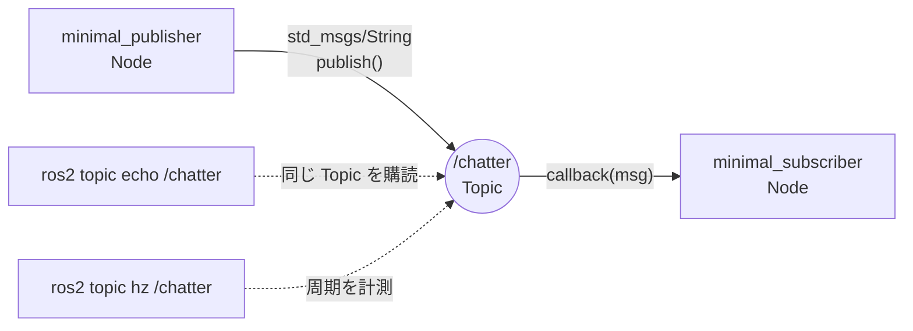

# チュートリアル 1: Publisher と Subscriber

## 学習目標

- ROS 2 のトピック通信の仕組みを理解する
- `rclpy` を使って Publisher ノードを作成できる
- `rclpy` を使って Subscriber ノードを作成できる
- `ros2 topic` コマンドでトピックの状態を確認できる

---

## 図で見るトピック通信



この図では、Publisher と Subscriber は互いを直接呼び出していません。両者は `/chatter` というトピック名と `std_msgs/String` というメッセージ型だけを共有しており、CLI ツールも同じトピックに横から参加できます。

## ROS 2 トピック通信とは

トピック通信は ROS 2 の最も基本的な通信方式です。**Publisher** がトピックにメッセージを送信し、**Subscriber** がそのメッセージを受信します。送受信は非同期で行われ、Publisher は Subscriber の存在を知らなくても送信できます。

```
┌─────────────────┐        /chatter トピック        ┌──────────────────┐
│   Publisher     │  ─── std_msgs/String ──────────►│   Subscriber     │
│ (minimal_pub..) │                                  │ (minimal_sub..)  │
└─────────────────┘                                  └──────────────────┘
```

- **1 対多**: 1 つのトピックに複数の Subscriber が接続できます
- **疎結合**: Publisher と Subscriber は互いを直接知りません。トピック名とメッセージ型が一致していれば通信できます
- **非同期**: Publisher はメッセージを送るだけで、Subscriber の処理完了を待ちません

---

## Step 1: Publisher を理解する

ソースファイル: `src/ros2_learning/ros2_learning/minimal_publisher.py`

### コードの構造

```python
import rclpy
from rclpy.node import Node
from std_msgs.msg import String

class MinimalPublisher(Node):
    def __init__(self):
        super().__init__('minimal_publisher')          # (1) ノード名を登録

        self.declare_parameter('publish_rate_hz', 1.0) # (2) パラメータ宣言
        rate = self.get_parameter('publish_rate_hz').get_parameter_value().double_value

        self._publisher = self.create_publisher(       # (3) Publisher 作成
            String, 'chatter', 10)                     #     型, トピック名, QoS

        self._timer = self.create_timer(               # (4) 定期タイマー作成
            1.0 / rate, self._timer_callback)

    def _timer_callback(self):
        msg = String()
        msg.data = f'こんにちは ROS 2! メッセージ番号: {self._count}'
        self._publisher.publish(msg)                   # (5) 送信
```

### キーポイント

| ポイント | 説明 |
|----------|------|
| `super().__init__('minimal_publisher')` | ノード名を `minimal_publisher` として ROS 2 に登録します。`ros2 node list` で確認できます |
| `create_publisher(String, 'chatter', 10)` | 第1引数: メッセージ型、第2引数: トピック名、第3引数: QoS キューサイズ |
| `create_timer(period, callback)` | `period` 秒ごとに `callback` 関数を呼び出します |
| `publisher.publish(msg)` | メッセージをトピックに送信します |

### 実行方法

```bash
ros2 run ros2_learning minimal_publisher
```

正常に起動すると以下のようなログが表示されます:

```
[INFO] [minimal_publisher]: パブリッシャーを起動しました。送信レート: 1.0 Hz
[INFO] [minimal_publisher]: 送信: "こんにちは ROS 2! メッセージ番号: 0"
[INFO] [minimal_publisher]: 送信: "こんにちは ROS 2! メッセージ番号: 1"
```

---

## Step 2: Subscriber を理解する

ソースファイル: `src/ros2_learning/ros2_learning/minimal_subscriber.py`

### コードの構造

```python
import rclpy
from rclpy.node import Node
from std_msgs.msg import String

class MinimalSubscriber(Node):
    def __init__(self):
        super().__init__('minimal_subscriber')

        self._subscription = self.create_subscription( # (1) Subscriber 作成
            String,                                    #     メッセージ型
            'chatter',                                 #     トピック名
            self._listener_callback,                   #     コールバック
            10,                                        #     QoS キューサイズ
        )

    def _listener_callback(self, msg):                 # (2) 受信時に呼ばれる
        self.get_logger().info(f'受信: "{msg.data}"')
```

### キーポイント

| ポイント | 説明 |
|----------|------|
| `create_subscription(型, トピック名, コールバック, QoS)` | 指定トピックの購読を開始します |
| `_listener_callback(self, msg)` | メッセージが届くたびに自動で呼ばれます。`msg` には受信データが入っています |
| QoS キューサイズ `10` | Publisher 側と一致させる必要はありませんが、同じ型・トピック名は必須です |

### 実行方法

```bash
ros2 run ros2_learning minimal_subscriber
```

---

## Step 3: 動かしてみる

### 両方を同時に起動する

2 つのターミナルで別々に起動することもできますが、Launch ファイルを使うと一度に起動できます:

```bash
ros2 launch ros2_learning pubsub_demo.launch.py
```

または、ターミナルを 2 つ用意して:

```bash
# ターミナル 1
ros2 run ros2_learning minimal_publisher

# ターミナル 2
ros2 run ros2_learning minimal_subscriber
```

### 便利な確認コマンド

別のターミナルを開いて、以下のコマンドでトピックの状態を確認できます:

```bash
# 現在アクティブなトピック一覧を表示
ros2 topic list

# /chatter トピックのメッセージをリアルタイムで表示
ros2 topic echo /chatter

# /chatter トピックの接続情報（Publisher/Subscriber の数など）を表示
ros2 topic info /chatter

# /chatter トピックのメッセージ受信レートを測定
ros2 topic hz /chatter

# メッセージ型の定義を確認
ros2 interface show std_msgs/msg/String
```

`ros2 topic echo /chatter` を実行すると、Publisher が送信しているメッセージをターミナルで確認できます:

```
data: 'こんにちは ROS 2! メッセージ番号: 5'
---
data: 'こんにちは ROS 2! メッセージ番号: 6'
---
```

---

## 既存パッケージでの応用

`ros2_learning` の最小サンプルを理解したら、実際のシステムでの使われ方を確認しましょう。

### drone_sim: 多様な Publisher の例

ソースファイル: `src/drone_sim/drone_sim/sim_drone.py`

`SimDrone` ノードは複数のトピックを同時にパブリッシュしています:

```python
# 位置・速度情報
self.odom_pub  = self.create_publisher(Odometry,     'odom',  10)
# 姿勢情報
self.pose_pub  = self.create_publisher(PoseStamped,  'pose',  10)
# IMU（慣性センサ）データ
self.imu_pub   = self.create_publisher(Imu,          'imu',   10)
# カスタム型ステータス
# self.status_pub = self.create_publisher(RobotStatus, ...)
```

`std_msgs/String` とは異なり、`Odometry` や `Imu` など専用のメッセージ型を使うことで、構造化されたデータを効率的に送れます。

drone_sim を起動してトピックを確認するには:

```bash
colcon build --packages-select drone_sim sample_interfaces
source install/setup.bash
ros2 run drone_sim sim_drone
# 別ターミナルで
ros2 topic list
```

### ground_robot_sim: cmd_vel Subscriber の例

ソースファイル: `src/ground_robot_sim/ground_robot_sim/ground_robot_node.py`

地上ロボットは `cmd_vel` トピックを Subscribe して速度コマンドを受け取ります:

```python
self.create_subscription(Twist, 'cmd_vel', self.cmd_vel_callback, 10)
```

`geometry_msgs/Twist` はロボットの速度指令に広く使われる標準的なメッセージ型です。`linear.x` が前後速度、`angular.z` が回転速度を表します。

---

## 演習問題

### 演習 1: 送信レートをパラメータで変更する

`minimal_publisher` はすでに `publish_rate_hz` パラメータを持っています。
起動時にパラメータを指定して、送信レートを変えてみましょう:

```bash
# 5 Hz で送信する
ros2 run ros2_learning minimal_publisher --ros-args -p publish_rate_hz:=5.0

# 別ターミナルで受信レートを確認
ros2 topic hz /chatter
```

期待される結果: `average rate: 5.000` と表示されることを確認してください。

### 演習 2: メッセージ型を geometry_msgs/Point に変更する

`minimal_publisher.py` をコピーして、送信するメッセージ型を `std_msgs/String` から `geometry_msgs/Point` に変更してみましょう。

```python
# 変更前
from std_msgs.msg import String
msg = String()
msg.data = 'hello'

# 変更後
from geometry_msgs.msg import Point
msg = Point()
msg.x = 1.0
msg.y = 2.0
msg.z = 0.0
```

`geometry_msgs/Point` の定義は以下で確認できます:

```bash
ros2 interface show geometry_msgs/msg/Point
```

### 演習 3: drone_sim のトピックを確認する

`drone_sim` をビルドして `sim_drone` ノードを起動し、どのようなトピックが使われているかを確認してみましょう:

```bash
colcon build --packages-select drone_sim sample_interfaces
source install/setup.bash
ros2 run drone_sim sim_drone &
ros2 topic list
ros2 topic info /odom
ros2 topic echo /odom --once
```

`sim_drone.py` のソースコードと照らし合わせながら、各トピックの用途を確認してください。
