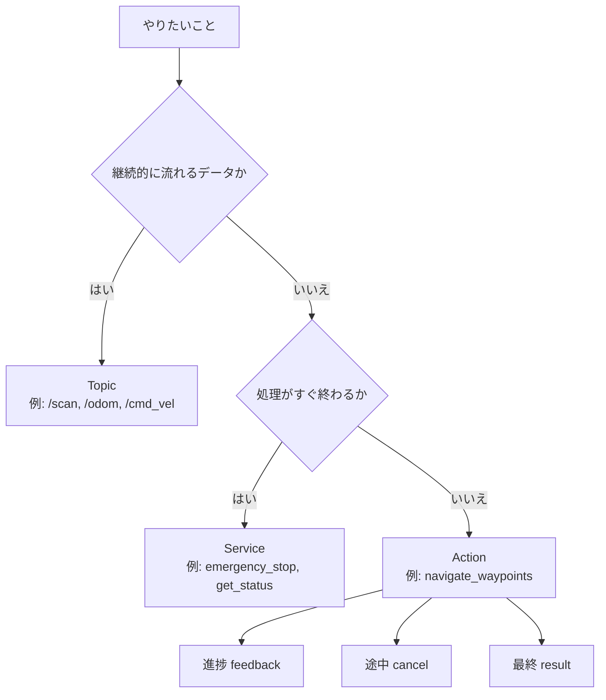

# チュートリアル 2: サービスとアクション

## 学習目標

- サービス・アクション・トピックの違いを説明できる
- `SetBool` サービスのサーバーとクライアントを実装できる
- アクションサーバーとクライアントの構造を理解する
- CLI ツールでサービスを手動呼び出しできる

---

## 図で見る通信方式の使い分け



迷ったときは、まず「データが流れ続けるか」「完了まで待つ必要があるか」で分けると判断しやすくなります。サービスは短い確認や設定変更、アクションはナビゲーションのような長時間タスクに向いています。

## サービス vs トピック vs アクション

ROS 2 には 3 種類の通信方式があります。用途に応じて使い分けることが重要です。

| 特性 | トピック | サービス | アクション |
|------|----------|----------|------------|
| 通信形式 | 一方向・継続送信 | リクエスト/レスポンス | 目標送信 + フィードバック + 結果 |
| 同期 / 非同期 | 非同期 | 同期（ブロッキング可） | 非同期（進捗を受け取れる） |
| 向いている用途 | センサデータ配信、制御コマンド | 設定変更、状態確認 | ナビゲーション、長時間タスク |
| 典型的な例 | `/odom`, `/cmd_vel`, `/scan` | `emergency_stop`, `get_status` | `navigate_waypoints` |
| キャンセル | 不可 | 不可 | 可能 |

```
【トピック】 Publisher ──連続送信──► Subscriber
【サービス】 Client ──要求──► Server ──応答──► Client
【アクション】 Client ──目標──► Server
                     ◄──フィードバック──
                     ◄──最終結果──
```

---

## Part A: サービス

### 概念

サービスは「リクエストを送り、レスポンスを受け取る」同期型通信です。センサの初期化コマンドや緊急停止など、**確実に処理されたかどうかを確認したい**場面に適しています。

- サービス型は `.srv` ファイルで定義されます
- `---` 区切りの上がリクエスト型、下がレスポンス型です
- `std_srvs/SetBool` はよく使われる標準サービス型で、`bool` の入力に対して `bool success + string message` を返します

### サービスサーバーの構造

ソースファイル: `src/ros2_learning/ros2_learning/minimal_service_server.py`

```python
from std_srvs.srv import SetBool

class MinimalServiceServer(Node):
    def __init__(self):
        super().__init__('minimal_service_server')
        self._flag = False

        # サービスサーバーを作成する
        # 引数: サービス型, サービス名, コールバック関数
        self._srv = self.create_service(
            SetBool,
            'set_flag',
            self._handle_set_flag,
        )

    def _handle_set_flag(self, request, response):
        # request.data でリクエスト値を取得
        self._flag = request.data

        # response オブジェクトを組み立てて返す
        response.success = True
        response.message = 'フラグをONにしました' if request.data else 'フラグをOFFにしました'
        return response
```

**ポイント**: コールバック関数は `request` と `response` を受け取り、`response` を `return` する必要があります。

### サービスクライアントの構造

ソースファイル: `src/ros2_learning/ros2_learning/minimal_service_client.py`

```python
class MinimalServiceClient(Node):
    def __init__(self):
        super().__init__('minimal_service_client')

        # クライアントを作成する
        self._client = self.create_client(SetBool, 'set_flag')

        # サービスが起動するまで待機する
        while not self._client.wait_for_service(timeout_sec=1.0):
            self.get_logger().info('サービスがまだ起動していません。再試行中...')

        # タイマーで定期的に呼び出す
        self._timer = self.create_timer(2.0, self._timer_callback)

    def _timer_callback(self):
        request = SetBool.Request()
        request.data = self._next_value

        # 非同期で呼び出す（call_async）
        future = self._client.call_async(request)
        # レスポンスが届いたときのコールバックを登録する
        future.add_done_callback(self._response_callback)

    def _response_callback(self, future):
        response = future.result()
        self.get_logger().info(
            f'レスポンス受信: success={response.success}, message="{response.message}"'
        )
```

**ポイント**: `call_async()` は即座に `Future` オブジェクトを返します。`add_done_callback()` でレスポンス受信時の処理を登録することで、スピンをブロックせずに非同期で結果を取得できます。

### サービスの実行方法

**ターミナル 1**: サーバーを起動

```bash
ros2 run ros2_learning minimal_service_server
```

**ターミナル 2**: クライアントを起動（自動で 2 秒ごとに呼び出す）

```bash
ros2 run ros2_learning minimal_service_client
```

または Launch ファイルで両方を起動:

```bash
ros2 launch ros2_learning service_demo.launch.py
```

### CLI でサービスを手動テストする

クライアントノードを使わず、コマンドラインから直接サービスを呼び出すことができます:

```bash
# set_flag サービスに True を送る
ros2 service call /set_flag std_srvs/srv/SetBool "{data: true}"

# set_flag サービスに False を送る
ros2 service call /set_flag std_srvs/srv/SetBool "{data: false}"

# 利用可能なサービス一覧を表示
ros2 service list

# サービスの型を確認
ros2 service type /set_flag
```

`ros2 service call` の出力例:

```
requester: making request: std_srvs.srv.SetBool_Request(data=True)
response: std_srvs.srv.SetBool_Response(success=True, message='フラグをONにしました')
```

### 既存パッケージでのサービス例: ground_robot_sim

ソースファイル: `src/ground_robot_sim/ground_robot_sim/ground_robot_node.py`

`GroundRobotNode` は `std_srvs/Trigger` 型のサービスを 2 つ提供しています:

```python
# 緊急停止を有効にする
self.create_service(Trigger, 'emergency_stop', self._emergency_stop_callback)
# 緊急停止を解除する
self.create_service(Trigger, 'reset_emergency', self._reset_emergency_callback)
```

`Trigger` サービスはリクエストにフィールドがなく、「呼び出すだけで動作する」シンプルなサービス型です:

```bash
# 起動後に試す
ros2 service call /emergency_stop std_srvs/srv/Trigger
```

---

## Part B: アクション

### 概念

アクションは「長時間かかるタスクを非同期で実行しながら、進捗をフィードバックで受け取る」通信方式です。ナビゲーションのようにゴールに到達するまで時間がかかる処理に適しています。

アクション通信の流れ:

```
クライアント              サーバー
    │── ゴール送信 ──────────►│
    │◄── ゴール受理/拒否 ─────│
    │◄── フィードバック ───────│ (処理中、繰り返し)
    │◄── 最終結果 ────────────│ (完了または失敗)
    │
    ※途中でキャンセルも可能
```

このリポジトリでは `sample_interfaces/action/NavigateWaypoints.action` を使用しています:

```
# ---- Goal ----
geometry_msgs/PoseStamped[] waypoints  # 巡回するウェイポイントのリスト
bool loop                               # true のとき繰り返し巡回する
float64 tolerance_m                     # ウェイポイント到達と判定する距離
---
# ---- Result ----
bool success
uint32 waypoints_completed
string message
---
# ---- Feedback ----
uint32 current_index           # 現在向かっているウェイポイントの番号
uint32 total_waypoints
float64 distance_to_current    # 現在地から目標ウェイポイントまでの距離
geometry_msgs/Point current_position
```

### アクションサーバーの構造

ソースファイル: `src/ros2_learning/ros2_learning/minimal_action_server.py`（準備中）

アクションサーバーの基本構造は以下のようになります:

```python
from rclpy.action import ActionServer
from sample_interfaces.action import NavigateWaypoints

class MinimalActionServer(Node):
    def __init__(self):
        super().__init__('minimal_action_server')
        self._action_server = ActionServer(
            self,
            NavigateWaypoints,          # アクション型
            'navigate_waypoints',        # アクション名
            execute_callback=self._execute_callback,
            goal_callback=self._goal_callback,
            cancel_callback=self._cancel_callback,
        )

    def _goal_callback(self, goal_request):
        # ゴールを受理するか拒否するか決める
        return GoalResponse.ACCEPT

    def _cancel_callback(self, goal_handle):
        # キャンセルを受け入れるか決める
        return CancelResponse.ACCEPT

    def _execute_callback(self, goal_handle):
        # 長時間処理をここに書く
        feedback_msg = NavigateWaypoints.Feedback()

        for i, waypoint in enumerate(goal_handle.request.waypoints):
            if goal_handle.is_cancel_requested:
                goal_handle.canceled()
                return NavigateWaypoints.Result(success=False)

            # フィードバックを送信する
            feedback_msg.current_index = i
            goal_handle.publish_feedback(feedback_msg)

        # 完了時に結果を返す
        goal_handle.succeed()
        return NavigateWaypoints.Result(success=True)
```

### アクションクライアントの構造

ソースファイル: `src/ros2_learning/ros2_learning/minimal_action_client.py`（準備中）

```python
from rclpy.action import ActionClient

class MinimalActionClient(Node):
    def __init__(self):
        super().__init__('minimal_action_client')
        self._client = ActionClient(self, NavigateWaypoints, 'navigate_waypoints')

    def send_goal(self, waypoints):
        goal_msg = NavigateWaypoints.Goal()
        goal_msg.waypoints = waypoints

        # ゴールを送信し、フィードバックと結果のコールバックを登録
        self._client.send_goal_async(
            goal_msg,
            feedback_callback=self._feedback_callback,
        ).add_done_callback(self._goal_response_callback)

    def _feedback_callback(self, feedback):
        fb = feedback.feedback
        self.get_logger().info(
            f'フィードバック: {fb.current_index + 1}/{fb.total_waypoints} '
            f'残り距離: {fb.distance_to_current:.2f}m'
        )
```

### アクションの実行方法

```bash
ros2 launch ros2_learning action_demo.launch.py
```

CLI でアクションを確認するコマンド:

```bash
# 利用可能なアクション一覧を表示
ros2 action list

# アクションの型を確認
ros2 action type /navigate_waypoints

# アクションの情報を表示
ros2 action info /navigate_waypoints
```

### 既存パッケージでのアクション例: ground_robot_sim

ソースファイル: `src/ground_robot_sim/ground_robot_sim/navigate_waypoints_server.py`

`NavigateWaypointsServer` は実際のロボット制御でアクションを使う例を示しています。ウェイポイントリストを受け取り、ロボットを次々と目標位置へ誘導しながらオドメトリからの現在位置を使ってフィードバックを送信します。

Launch ファイルで起動:

```bash
ros2 launch ground_robot_sim navigate_waypoints.launch.py
```

---

## 演習問題

### 演習 1: サービスを CLI で操作する

`minimal_service_server` を起動して、以下の操作をすべて CLI で行ってみましょう:

```bash
# サーバーを起動
ros2 run ros2_learning minimal_service_server

# 別ターミナルで以下を試す
ros2 service list
ros2 service type /set_flag
ros2 interface show std_srvs/srv/SetBool
ros2 service call /set_flag std_srvs/srv/SetBool "{data: true}"
ros2 service call /set_flag std_srvs/srv/SetBool "{data: false}"
```

サーバー側のログを確認しながら、リクエストが届いているかを確認してください。

### 演習 2: サービスとトピックを組み合わせる

`minimal_service_server` のフラグの状態（`True` / `False`）を `std_msgs/Bool` トピックとしてパブリッシュするように改造してみましょう。

ヒント: `_handle_set_flag` コールバック内に以下を追加します:

```python
from std_msgs.msg import Bool
# __init__ で
self._flag_pub = self.create_publisher(Bool, 'flag_status', 10)
# _handle_set_flag で
flag_msg = Bool()
flag_msg.data = self._flag
self._flag_pub.publish(flag_msg)
```

### 演習 3: NavigateWaypoints アクション型を読む

`sample_interfaces/action/NavigateWaypoints.action` を読み、以下を確認してください:

1. Goal のフィールドはどれか
2. Feedback でリアルタイムに送られる情報はどれか
3. Result の `waypoints_completed` はどのような場面で使うか

また、`navigate_waypoints_server.py` の `_execute_callback` を読んで、フィードバックがどのタイミングで送信されているかを確認してください。

> 💡 演習のヒントと解答例は [こちら](answers/02_answers.md) を参照してください。

---

## 確認チェックリスト

演習を終えたら、以下のチェックリストで学習内容を確認してください。

### サービスの動作確認

- [ ] サービスサーバーが正常に起動することを確認する

```bash
ros2 run ros2_learning minimal_service_server
```

期待される出力例:

```
[INFO] [minimal_service_server]: 'set_flag' サービスの待機を開始しました。
```

- [ ] `/set_flag` サービスがサービス一覧に表示されることを確認する（サーバーを起動した状態で別ターミナルで実行）

```bash
ros2 service list
```

期待される出力例（`/set_flag` が含まれること）:

```
/set_flag
/minimal_service_server/describe_parameters
/minimal_service_server/get_parameter_types
/minimal_service_server/get_parameters
/minimal_service_server/list_parameters
/minimal_service_server/set_parameters
/minimal_service_server/set_parameters_atomically
```

- [ ] CLI でサービスを呼び出してレスポンスが返ることを確認する

```bash
ros2 service call /set_flag std_srvs/srv/SetBool "{data: true}"
```

期待される出力例:

```
requester: making request: std_srvs.srv.SetBool_Request(data=True)

response:
  std_srvs.srv.SetBool_Response(success=True, message='フラグをONにしました')
```

- [ ] サービスクライアントが正常に動作することを確認する（サーバーを起動した状態で別ターミナルで実行）

```bash
ros2 run ros2_learning minimal_service_client
```

期待される出力例:

```
[INFO] [minimal_service_client]: レスポンス受信: success=True, message="フラグをONにしました"
[INFO] [minimal_service_client]: レスポンス受信: success=True, message="フラグをOFFにしました"
```

- [ ] Launch ファイルでサーバーとクライアントを同時に起動できることを確認する

```bash
ros2 launch ros2_learning service_demo.launch.py
```

### アクションの動作確認

- [ ] アクションデモを Launch ファイルで起動できることを確認する

```bash
ros2 launch ros2_learning action_demo.launch.py
```

- [ ] アクション一覧にアクションが表示されることを確認する（起動した状態で別ターミナルで実行）

```bash
ros2 action list
```

期待される出力例（`/navigate_waypoints` が含まれること）:

```
/navigate_waypoints
```

- [ ] アクションの型を確認する

```bash
ros2 action type /navigate_waypoints
```

期待される出力例:

```
sample_interfaces/action/NavigateWaypoints
```

- [ ] アクションの詳細情報を確認する

```bash
ros2 action info /navigate_waypoints
```

期待される出力例:

```
Action: /navigate_waypoints
Action clients: 1
    /minimal_action_client
Action servers: 1
    /minimal_action_server
```

### 完了条件

- サービスサーバーを起動して CLI から `/set_flag` サービスを呼び出し、正しいレスポンスが返ること
- サービスクライアントがサーバーへ自動でリクエストを送り、レスポンスを受け取れること
- `ros2 action list` でアクションが表示され、型が `sample_interfaces/action/NavigateWaypoints` であること
- サービス・トピック・アクションの使い分け（継続データ / 即時応答 / 長時間タスク）を説明できること

### トラブルシューティング

**サービスクライアントを起動しても「サービスがまだ起動していません」が繰り返し表示される場合**

サービスサーバーが起動していないか、別の ROS_DOMAIN_ID で起動している可能性があります。別ターミナルでサーバーを先に起動してから、クライアントを起動してください。

**`ros2 service call` でエラーが出る場合**

サービス型のフォーマットが正しいか確認してください。`std_srvs/srv/SetBool` の場合、リクエストフィールドは `data` のみです:

```bash
ros2 interface show std_srvs/srv/SetBool
```

**アクションが `ros2 action list` に表示されない場合**

アクションサーバーが起動していない可能性があります。`ros2 launch ros2_learning action_demo.launch.py` でサーバーとクライアントを両方起動しているか確認してください。
