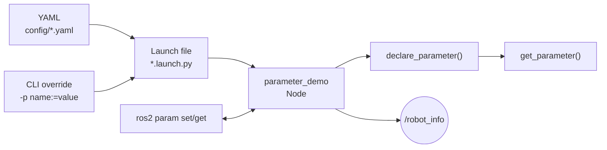

# チュートリアル 3: Launch ファイルとパラメータ

## 学習目標

- ROS 2 パラメータの宣言・取得・動的変更ができる
- YAML ファイルでパラメータを管理できる
- Launch ファイルで複数ノードを一度に起動できる
- Launch ファイルにパラメータや引数を渡せる

---

## 図で見る起動設定の流れ



Launch ファイルは「どのノードを、どの設定で起動するか」をまとめる入口です。YAML は再利用しやすい既定値、CLI override は一時的な実験値、`ros2 param set` は実行中の調整に向いています。

## Part A: パラメータ

### 概念

ROS 2 のパラメータは、ノードの動作を外部から設定するための仕組みです。コードを変更・再ビルドせずに、起動時や実行中に値を変えられます。

```
コード内         起動時               実行中
declare_parameter  -p name:=value      ros2 param set
get_parameter  ←  --params-file       ros2 param get
```

パラメータはノードごとに管理されます。型は宣言時のデフォルト値から推論されます（文字列・整数・浮動小数点数・真偽値・配列に対応）。

### parameter_demo.py の構造

ソースファイル: `src/ros2_learning/ros2_learning/parameter_demo.py`

```python
from rcl_interfaces.msg import SetParametersResult

class ParameterDemo(Node):
    def __init__(self):
        super().__init__('parameter_demo')

        # (1) パラメータの宣言 (名前, デフォルト値)
        # デフォルト値の型がパラメータの型になる
        self.declare_parameter('robot_name', 'learning_bot')  # string
        self.declare_parameter('max_speed', 1.0)              # double
        self.declare_parameter('update_rate_hz', 2.0)         # double
        self.declare_parameter('enable_logging', True)         # bool

        # (2) 値の取得
        self._robot_name = (
            self.get_parameter('robot_name').get_parameter_value().string_value
        )
        self._max_speed = (
            self.get_parameter('max_speed').get_parameter_value().double_value
        )

        # (3) 動的変更コールバックの登録
        # ros2 param set で変更されると呼ばれる
        self.add_on_set_parameters_callback(self._on_parameter_change)

    def _on_parameter_change(self, params):
        for param in params:
            if param.name == 'max_speed':
                self._max_speed = param.value
            elif param.name == 'update_rate_hz':
                # タイマー周期もリアルタイムで変更する
                self._timer.cancel()
                self._timer = self.create_timer(
                    1.0 / max(param.value, 0.1), self._publish_info
                )
        # successful=True を返すと変更が確定する
        return SetParametersResult(successful=True)
```

### パラメータの動作確認

**ターミナル 1**: ノードを起動

```bash
ros2 run ros2_learning parameter_demo
```

**ターミナル 2**: パラメータを確認・変更

```bash
# ノードのパラメータ一覧を表示
ros2 param list /parameter_demo

# 特定パラメータの値を確認
ros2 param get /parameter_demo max_speed
ros2 param get /parameter_demo robot_name

# パラメータを動的に変更（ノードの再起動不要）
ros2 param set /parameter_demo max_speed 2.0
ros2 param set /parameter_demo robot_name "new_bot"
ros2 param set /parameter_demo enable_logging false

# 変更後に robot_info トピックの内容を確認
ros2 topic echo /robot_info
```

パラメータを変更するたびに、ターミナル 1 のログに変更内容が表示されます:

```
[INFO] [parameter_demo]: パラメータ変更: max_speed 1.0 -> 2.0
```

### 起動時にパラメータを渡す

`--ros-args -p` オプションで起動時に値を上書きできます:

```bash
ros2 run ros2_learning parameter_demo \
    --ros-args \
    -p max_speed:=3.0 \
    -p robot_name:=fast_bot \
    -p update_rate_hz:=5.0
```

### YAML ファイルでパラメータを管理する

複数のパラメータや複数ノードの設定は YAML ファイルにまとめるのが一般的です。

```yaml
# config/parameter_demo.yaml の例
parameter_demo:
  ros__parameters:
    robot_name: "yaml_bot"
    max_speed: 1.5
    update_rate_hz: 3.0
    enable_logging: true
```

YAML ファイルを指定して起動:

```bash
ros2 run ros2_learning parameter_demo \
    --ros-args --params-file src/ros2_learning/config/parameter_demo.yaml
```

> **YAML の書式**: `ノード名.ros__parameters` の下にパラメータを書きます。`ros__parameters` のアンダースコアは 2 つです。

### 既存パッケージでのパラメータ例: drone_sim

ソースファイル: `src/drone_sim/config/altitude_hold.yaml`

```yaml
sim_drone:
  ros__parameters:
    frame_id: odom
    base_frame_id: base_link
    publish_rate_hz: 50.0
    cmd_timeout_sec: 0.8
altitude_hold:
  ros__parameters:
    target_altitude_m: 2.0
    kp: 1.3
    max_vertical_speed: 1.5
```

1 つの YAML ファイルに複数のノードの設定をまとめています。`sim_drone` ノードと `altitude_hold` ノードそれぞれに設定が対応します。

`sim_drone.py` では多数のパラメータが宣言されており、物理シミュレーションの挙動（最大速度、加速度制限、PID ゲインなど）を YAML ファイルから調整できるようになっています。

---

## Part B: Launch ファイル

### Launch ファイルとは

Launch ファイルは複数のノードを一度に起動・管理するための Python スクリプトです。以下の問題を解決します:

- ターミナルを何個も開いてノードを起動する手間が省ける
- ノードにパラメータや名前空間を一括設定できる
- ノード間の起動順序や依存関係を管理できる

### Launch ファイルの基本構造

```python
from launch import LaunchDescription
from launch.actions import DeclareLaunchArgument
from launch.substitutions import LaunchConfiguration
from launch_ros.actions import Node


def generate_launch_description():
    # LaunchDescription を返す関数を定義する
    return LaunchDescription([
        # (1) Launch 引数を宣言する（ros2 launch ... arg:=value で上書き可能）
        DeclareLaunchArgument(
            'publish_rate_hz',
            default_value='1.0',
            description='Publisher の送信レート (Hz)',
        ),

        # (2) Node アクションでノードを起動する
        Node(
            package='ros2_learning',           # パッケージ名
            executable='minimal_publisher',    # entry_points のキー名
            name='my_publisher',               # ノード名（省略可）
            output='screen',                   # ログをターミナルに表示
            parameters=[{
                'publish_rate_hz': LaunchConfiguration('publish_rate_hz'),
            }],
        ),
        Node(
            package='ros2_learning',
            executable='minimal_subscriber',
            name='my_subscriber',
            output='screen',
        ),
    ])
```

### pubsub_demo.launch.py の例

Publisher と Subscriber を同時に起動する最もシンプルな Launch ファイルです:

```bash
# デフォルト引数で起動
ros2 launch ros2_learning pubsub_demo.launch.py

# 引数を上書きして起動
ros2 launch ros2_learning pubsub_demo.launch.py publish_rate_hz:=5.0
```

### YAML ファイルを読み込む Launch ファイルの例

パラメータが多い場合は YAML ファイルを指定します:

```python
from os.path import join
from ament_index_python.packages import get_package_share_directory
from launch import LaunchDescription
from launch_ros.actions import Node


def generate_launch_description():
    # インストール先の共有ディレクトリから設定ファイルを探す
    share_dir = get_package_share_directory('ros2_learning')
    config_file = join(share_dir, 'config', 'parameter_demo.yaml')

    return LaunchDescription([
        Node(
            package='ros2_learning',
            executable='parameter_demo',
            name='parameter_demo',
            output='screen',
            parameters=[config_file],   # YAML ファイルを直接渡す
        ),
    ])
```

起動方法:

```bash
ros2 launch ros2_learning parameter_demo.launch.py
```

### 便利な Launch コマンド

```bash
# 利用可能な Launch ファイルを一覧表示
ros2 pkg executables ros2_learning --launch

# Launch ファイルの引数を確認
ros2 launch ros2_learning pubsub_demo.launch.py --show-args

# 起動中のノードを確認
ros2 node list

# ノードの詳細情報を確認（トピック・サービス・パラメータ）
ros2 node info /minimal_publisher
```

### 既存パッケージの応用例: drone_sim/swarm.launch.py

ソースファイル: `src/drone_sim/launch/swarm.launch.py`

`swarm.launch.py` は Launch ファイルの高度な使い方を示しています:

```python
def generate_launch_description():
    return LaunchDescription([
        # 引数の宣言
        DeclareLaunchArgument('drone_count', default_value='3'),
        DeclareLaunchArgument('spacing_m', default_value='2.0'),
        DeclareLaunchArgument('altitude_m', default_value='1.2'),
        # 動的なノード生成（OpaqueFunction を使用）
        OpaqueFunction(function=_spawn_swarm),
    ])

def _spawn_swarm(context):
    drone_count = int(LaunchConfiguration('drone_count').perform(context))
    # drone_count の数だけノードを動的に生成する
    for index in range(drone_count):
        namespace = f'drone_{index + 1}'
        # PushRosNamespace でトピック名を自動的に名前空間下に配置
        GroupAction([
            PushRosNamespace(namespace),
            Node(package='drone_sim', executable='sim_drone', ...),
            Node(package='drone_sim', executable='waypoint_commander', ...),
        ])
```

注目すべき点:

- `drone_count` 引数でドローンの数を変えられる
- `PushRosNamespace` で各ドローンのトピックを `/drone_1/odom`、`/drone_2/odom` のように分離
- `OpaqueFunction` で引数の値に応じて動的にノードを生成

起動例:

```bash
# デフォルト（3 機）で起動
ros2 launch drone_sim swarm.launch.py

# 5 機、間隔 3m で起動
ros2 launch drone_sim swarm.launch.py drone_count:=5 spacing_m:=3.0

# 起動後にトピック一覧を確認（名前空間が分かれていることを確認）
ros2 topic list | grep odom
```

---

## 演習問題

### 演習 1: パラメータを動的に変更して動作を確認する

`parameter_demo` を起動し、以下の操作をして動作変化を観察しましょう:

```bash
# 起動
ros2 run ros2_learning parameter_demo

# 別ターミナルで robot_info トピックを監視
ros2 topic echo /robot_info

# パラメータを変更してみる
ros2 param set /parameter_demo enable_logging false  # ログが止まる
ros2 param set /parameter_demo update_rate_hz 5.0    # トピック送信が速くなる
ros2 param set /parameter_demo robot_name "my_robot" # トピック内容が変わる
```

`enable_logging` を `false` にするとノードのログは止まりますが、トピックは送信され続けることを確認してください。

### 演習 2: 自前の YAML 設定ファイルを作る

以下の内容で `my_demo.yaml` を作り、それを使って `parameter_demo` を起動してみましょう:

```yaml
# my_demo.yaml
parameter_demo:
  ros__parameters:
    robot_name: "my_yaml_bot"
    max_speed: 0.5
    update_rate_hz: 0.5
    enable_logging: true
```

```bash
ros2 run ros2_learning parameter_demo \
    --ros-args --params-file my_demo.yaml
```

起動後に `ros2 param get /parameter_demo robot_name` で値が反映されているか確認してください。

### 演習 3: swarm.launch.py の名前空間を観察する

`drone_sim` をビルドして `swarm.launch.py` を起動し、名前空間の動作を確認しましょう:

```bash
colcon build --packages-select drone_sim sample_interfaces
source install/setup.bash

# 2 機のドローンで起動
ros2 launch drone_sim swarm.launch.py drone_count:=2

# 別ターミナルでトピック一覧を確認
ros2 topic list

# 各ドローンのトピックが分離されていることを確認
ros2 topic echo /drone_1/odom --once
ros2 topic echo /drone_2/odom --once
```

`/drone_1/odom` と `/drone_2/odom` が独立してパブリッシュされていることを確認してください。これが名前空間を使う利点です。複数の同じノードを衝突なく起動できます。

> 💡 演習のヒントと解答例は [こちら](answers/03_answers.md) を参照してください。

---

## 確認チェックリスト

演習を終えたら、以下のチェックリストで学習内容を確認してください。

### パラメータの動作確認

- [ ] `parameter_demo` ノードが正常に起動することを確認する

```bash
ros2 run ros2_learning parameter_demo
```

期待される出力例:

```
[INFO] [parameter_demo]: パラメータデモ起動: robot_name=learning_bot, max_speed=1.0, update_rate_hz=2.0, enable_logging=True
[INFO] [parameter_demo]: robot_info: robot_name=learning_bot, max_speed=1.00, enable_logging=True
```

- [ ] ノードのパラメータ一覧を表示できることを確認する（ノードを起動した状態で別ターミナルで実行）

```bash
ros2 param list /parameter_demo
```

期待される出力例:

```
/parameter_demo:
  enable_logging
  max_speed
  robot_name
  update_rate_hz
  use_sim_time
```

- [ ] パラメータの値を取得できることを確認する

```bash
ros2 param get /parameter_demo max_speed
ros2 param get /parameter_demo robot_name
```

期待される出力例:

```
Double value is: 1.0
String value is: learning_bot
```

- [ ] パラメータを動的に変更してノードの動作が変わることを確認する

```bash
ros2 param set /parameter_demo max_speed 2.0
ros2 param set /parameter_demo robot_name "test_bot"
```

期待されるログ出力例:

```
[INFO] [parameter_demo]: パラメータ変更: max_speed 1.0 -> 2.0
[INFO] [parameter_demo]: パラメータ変更: robot_name 'learning_bot' -> 'test_bot'
```

- [ ] 起動時にパラメータを指定して動作が変わることを確認する

```bash
ros2 run ros2_learning parameter_demo \
    --ros-args -p max_speed:=3.0 -p robot_name:=fast_bot
# 別ターミナルで
ros2 param get /parameter_demo max_speed
```

期待される出力例:

```
Double value is: 3.0
```

### Launch ファイルの動作確認

- [ ] `pubsub_demo.launch.py` で Publisher と Subscriber を同時に起動できることを確認する

```bash
ros2 launch ros2_learning pubsub_demo.launch.py
```

- [ ] Launch ファイルに引数を渡して動作が変わることを確認する

```bash
ros2 launch ros2_learning pubsub_demo.launch.py publish_rate_hz:=5.0
# 別ターミナルで
ros2 topic hz /chatter
```

期待される出力例:

```
average rate: 5.000
	min: 0.199s max: 0.201s std dev: 0.00012s window: 10
```

- [ ] `parameter_demo.launch.py` で YAML ファイルを使ってノードを起動できることを確認する

```bash
ros2 launch ros2_learning parameter_demo.launch.py
```

- [ ] Launch ファイルの引数一覧を確認できることを確認する

```bash
ros2 launch ros2_learning pubsub_demo.launch.py --show-args
```

期待される出力例:

```
Arguments (pass arguments as '<name>:=<value>'):

    'publish_rate_hz':
        Publisher の送信レート (Hz)
        (default: '1.0')
```

- [ ] 起動中のノード一覧を確認できることを確認する（Launch ファイルを起動した状態で別ターミナルで実行）

```bash
ros2 node list
```

### 完了条件

- `parameter_demo` ノードのパラメータを `ros2 param set` で動的に変更でき、ノードの動作が即座に変わること
- YAML ファイルでパラメータを管理してノードを起動できること
- Launch ファイルで複数ノードを一括起動し、引数でパラメータを上書きできること
- `ros2 pkg executables ros2_learning` でパッケージ内の実行可能ファイルを確認できること

### トラブルシューティング

**`ros2 param set` を実行しても変更が反映されない場合**

ノードが動的パラメータ変更コールバック（`add_on_set_parameters_callback`）を登録していないか、コールバックが `SetParametersResult(successful=True)` を返していない可能性があります。`parameter_demo.py` の `_on_parameter_change` メソッドを確認してください。

**Launch ファイルが見つからない場合**

ビルドと `source install/setup.bash` を実行しているか確認してください。Launch ファイルはビルド後にインストールディレクトリにコピーされます:

```bash
colcon build --packages-select ros2_learning
source install/setup.bash
ros2 pkg executables ros2_learning
```

**YAML ファイルのパラメータが反映されない場合**

YAML ファイルの書式を確認してください。`ros__parameters`（アンダースコア 2 つ）の下にパラメータを書く必要があります。ノード名も正確に一致させてください:

```yaml
parameter_demo:
  ros__parameters:
    robot_name: "yaml_bot"
```
