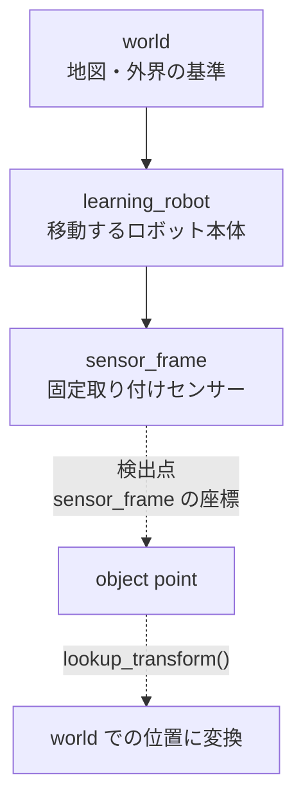

# チュートリアル 4: TF2 と座標変換

## 学習目標

このチュートリアルを完了すると、以下のことが理解できます。

- TF ツリーとは何か、なぜロボットに座標変換が必要かを説明できる
- 親フレームと子フレームの階層関係を図示できる
- `TransformBroadcaster` と `StaticTransformBroadcaster` の違いを説明できる
- `Buffer` と `TransformListener` を使ってフレーム間の変換を取得できる
- `ros2 run tf2_tools view_frames` で TF ツリーを可視化できる

---

## 図で見る TF の役割



TF は「どの座標系から見た位置なのか」をつなぐための仕組みです。センサーで見えた点をそのまま制御に使うのではなく、`sensor_frame -> learning_robot -> world` の変換をたどって、必要な基準座標へ写します。

## TF2 の概念

### TF とは?

TF (Transform Framework) は ROS2 が提供する座標変換管理ライブラリです。
ロボットシステムでは、センサー・アーム・車輪など多くの部品がそれぞれ独自の座標系（フレーム）を持ちます。
TF はこれらのフレーム間の変換（位置・姿勢）を時系列で記録・参照できるようにします。

**例:** カメラで検出した物体の位置は「カメラフレーム」で表現されますが、
ロボットを動かすには「ワールドフレーム」での位置が必要です。
TF を使うと `camera_frame → world` の変換を一行で取得できます。

### フレーム階層（親 → 子の関係）

TF フレームはツリー構造で管理されます。
各フレームは必ず 1 つの親フレームを持ちます（ルートフレームを除く）。
子フレームの位置・姿勢は、親フレームを基準として記述されます。

```
world
└── learning_robot  (動的: 円軌道を移動)
    └── sensor_frame  (静的: Z 方向 +0.1m)
```

このチュートリアルでは上記のシンプルな TF ツリーを実際に構築します。

---

## Step 1: TF Broadcaster

### `tf_broadcaster_demo.py` の構造

`src/ros2_learning/ros2_learning/tf_broadcaster_demo.py` では、
2 種類のブロードキャスターを使って TF ツリーを配信しています。

```
TfBroadcasterDemo ノード
├── TransformBroadcaster     # 動的変換 (毎フレーム更新)
│   └── world → learning_robot  (30 Hz, 円軌道)
└── StaticTransformBroadcaster  # 静的変換 (起動時に 1 回だけ配信)
    └── learning_robot → sensor_frame  (Z + 0.1m 固定)
```

**パラメータ:**

| パラメータ名    | デフォルト値      | 説明                             |
|----------------|------------------|----------------------------------|
| `parent_frame` | `world`          | ルートフレーム名                 |
| `child_frame`  | `learning_robot` | 動的変換の子フレーム名           |
| `orbit_radius` | `2.0`            | 円軌道の半径 [m]                 |
| `orbit_speed`  | `0.5`            | 角速度 [rad/s]                   |

### 動的変換 vs 静的変換

| 種類                        | クラス                        | 配信タイミング     | トピック     |
|----------------------------|------------------------------|-------------------|--------------|
| 動的変換 (Dynamic)          | `TransformBroadcaster`       | タイマーで繰り返し | `/tf`        |
| 静的変換 (Static)           | `StaticTransformBroadcaster` | 起動時に 1 回     | `/tf_static` |

静的変換はラッチされたトピックで配信されるため、後から参加したノードも
最新の静的変換を受け取ることができます。
固定取り付けのセンサー位置などには静的変換を使いましょう。

### 動的変換のコード概要

```python
from tf2_ros import TransformBroadcaster
from geometry_msgs.msg import TransformStamped

# ブロードキャスターの作成
self._broadcaster = TransformBroadcaster(self)

# 変換メッセージの構築
msg = TransformStamped()
msg.header.stamp = self.get_clock().now().to_msg()
msg.header.frame_id = 'world'          # 親フレーム
msg.child_frame_id = 'learning_robot'  # 子フレーム

msg.transform.translation.x = x       # 位置
msg.transform.translation.y = y
msg.transform.translation.z = 0.0

msg.transform.rotation.z = math.sin(yaw / 2.0)  # 姿勢 (クォータニオン)
msg.transform.rotation.w = math.cos(yaw / 2.0)

self._broadcaster.sendTransform(msg)
```

### ブロードキャスターを起動して観察する

ターミナル 1 でブロードキャスターを起動します。

```bash
ros2 run ros2_learning tf_broadcaster_demo
```

ターミナル 2 で TF ツリーを PDF として生成します。

```bash
ros2 run tf2_tools view_frames
```

実行後、カレントディレクトリに `frames.pdf` が生成されます。
PDF を開くと `world → learning_robot → sensor_frame` のツリーが確認できます。

ターミナル 2 で `/tf` トピックを確認します。

```bash
ros2 topic echo /tf
```

動的変換が 30 Hz で流れているのが確認できます。
静的変換は `/tf_static` で確認できます。

```bash
ros2 topic echo /tf_static
```

---

## Step 2: TF Listener

### `tf_listener_demo.py` の構造

`src/ros2_learning/ros2_learning/tf_listener_demo.py` では、
`Buffer` と `TransformListener` を使ってフレーム間の変換を取得します。

```
TfListenerDemo ノード
├── tf2_ros.Buffer           # 変換履歴のキャッシュ
├── tf2_ros.TransformListener  # /tf, /tf_static を購読してバッファに蓄積
└── タイマー (1 Hz)          # lookup_transform で変換を取得してログ出力
```

### Buffer と TransformListener の使い方

```python
import tf2_ros
from rclpy.duration import Duration

# バッファとリスナーの作成
self._tf_buffer = tf2_ros.Buffer()
self._tf_listener = tf2_ros.TransformListener(self._tf_buffer, self)

# 変換の取得 (lookup_transform)
try:
    transform = self._tf_buffer.lookup_transform(
        'world',          # ターゲットフレーム
        'sensor_frame',   # ソースフレーム
        rclpy.time.Time(),  # 最新の変換を取得
        timeout=Duration(seconds=1.0),
    )
    x = transform.transform.translation.x
    y = transform.transform.translation.y
    z = transform.transform.translation.z
    distance = math.sqrt(x**2 + y**2 + z**2)
    self.get_logger().info(f'sensor_frame の距離: {distance:.3f} m')

except tf2_ros.LookupException:
    # フレームがまだ配信されていない
    self.get_logger().warn('変換が見つかりません')
except tf2_ros.ExtrapolationException:
    # 要求した時刻の変換がキャッシュにない
    self.get_logger().warn('変換の補間に失敗しました')
```

### エラーハンドリング

| 例外クラス                  | 原因                                           | 対処法                                 |
|----------------------------|------------------------------------------------|----------------------------------------|
| `LookupException`          | 指定したフレームが存在しない                   | ブロードキャスターが起動しているか確認 |
| `ExtrapolationException`   | 要求した時刻の変換がキャッシュにない           | `rclpy.time.Time()` で最新を取得する   |
| `ConnectivityException`    | 2 つのフレーム間にパスがない                  | TF ツリーに接続されているか確認        |

### TF Listener を起動する

```bash
ros2 run ros2_learning tf_listener_demo
```

ブロードキャスターと同時に起動すると、`world → sensor_frame` の距離が
1 Hz でログ出力されます。

---

## Step 3: 動かしてみる

### ランチファイルで一括起動

ブロードキャスターとリスナーの両方を同時に起動するには、
ランチファイルを使います。

```bash
ros2 launch ros2_learning tf_demo.launch.py
```

### 便利なデバッグコマンド

2 つのフレーム間の変換をリアルタイムで表示します。

```bash
ros2 run tf2_ros tf2_echo world sensor_frame
```

TF ツリー全体の構造を確認します。

```bash
ros2 run tf2_tools view_frames
```

`/tf` トピックの配信レートを確認します。

```bash
ros2 topic hz /tf
```

---

## 既存パッケージでの応用

### `manipulator_sim`: 順運動学の TF チェーン

`src/manipulator_sim/` では 2-DOF ロボットアームの TF チェーンを配信しています。

```
base_link
└── link1  (関節 1 の回転に応じて動的に変化)
    └── link2  (関節 2 の回転に応じて動的に変化)
        └── tool  (ツール先端の静的オフセット)
```

各リンクの変換を積み重ねることで、ツール先端の位置を求めるのが順運動学です。
TF がその計算を担当しています。

### `drone_sim`: 3D 空間の TF

`src/drone_sim/drone_sim/sim_drone.py` では 3D 空間でのドローン TF を配信しています。

```
odom
└── base_link  (ドローン本体の位置・姿勢)
    └── imu_link  (IMU センサーの取り付け位置)
```

### `ground_robot_sim`: 2D 平面の TF

`src/ground_robot_sim/ground_robot_sim/ground_robot_node.py` では
差動二輪ロボットの TF を配信しています。

```
odom
└── base_link  (ロボット本体の位置・ヨー角)
```

---

## 演習問題

### 演習 1: 軌道半径の変更

`orbit_radius` パラメータを変更して、円軌道の大きさが変わることを確認しましょう。

```bash
# ターミナル 1: ブロードキャスターを起動
ros2 run ros2_learning tf_broadcaster_demo

# ターミナル 2: パラメータを変更
ros2 param set /tf_broadcaster_demo orbit_radius 5.0

# ターミナル 2: TF ツリーを再生成して確認
ros2 run tf2_tools view_frames
```

### 演習 2: sensor_frame の位置を変更する

`tf_broadcaster_demo.py` の `_publish_static_transform` メソッドを編集して、
`sensor_frame` の位置を `Z + 0.1m` から `X + 0.5m` に変更してみましょう。

変更後にリビルドして動作を確認します。

```bash
colcon build --packages-select ros2_learning
source install/setup.bash
ros2 run ros2_learning tf_broadcaster_demo
```

### 演習 3: manipulator_sim の TF チェーンを確認する

`manipulator_sim` を起動して、TF ツリーを可視化してみましょう。

```bash
# ターミナル 1: manipulator_sim を起動
ros2 launch manipulator_sim planar_reach_demo.launch.py

# ターミナル 2: TF ツリーを PDF として生成
ros2 run tf2_tools view_frames

# ターミナル 2: ツール先端フレームの変換を確認
ros2 run tf2_ros tf2_echo base_link tool
```

`base_link → link1 → link2 → tool` の TF チェーンが確認できます。
