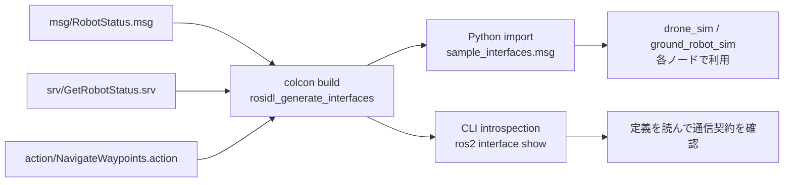

# チュートリアル 5: カスタムメッセージ・サービス・アクション定義

## 学習目標

このチュートリアルを完了すると、以下のことが理解できます。

- 標準メッセージ型とカスタム型を使い分ける判断基準を説明できる
- `.msg` / `.srv` / `.action` ファイルの書き方を理解できる
- `sample_interfaces` パッケージのビルドの仕組みを説明できる
- Python コードでカスタムインターフェースをインポートして使える
- `ros2 interface show` でインターフェース定義を確認できる

---

## 図で見るインターフェース生成



`.msg` / `.srv` / `.action` は単なるメモではなく、ビルド時に各言語向けの型へ変換される通信契約です。ノード実装を読む前に `ros2 interface show` で型を確認すると、どのフィールドが必須かを把握しやすくなります。

## なぜカスタムインターフェースが必要か

### 標準メッセージ型では足りない場合

ROS2 には `std_msgs`、`geometry_msgs`、`sensor_msgs` など多くの標準メッセージ型があります。
まずは標準型で表現できないか検討するのが基本です。

| 標準型で表現できる例                | カスタム型が必要な例                        |
|------------------------------------|---------------------------------------------|
| 単純な数値・文字列 → `std_msgs`    | 複数フィールドをまとめたドメイン固有の型    |
| 3D 位置・姿勢 → `geometry_msgs`    | ロボット固有のステータス情報（名前＋状態＋バッテリー等） |
| カメラ画像 → `sensor_msgs`         | 複雑なゴール・フィードバック構造を持つアクション |

**カスタム型を作るべき目安:**

- 複数のフィールドを常にセットで扱い、個別に配信するのが不自然な場合
- アプリケーション固有の意味を型名で表現したい場合
- サービスやアクションの Request/Response が標準型のみでは表現できない場合

---

## `sample_interfaces` パッケージの構成

```
src/sample_interfaces/
├── CMakeLists.txt           # ビルド設定 (ament_cmake)
├── package.xml              # パッケージ定義・依存関係
├── msg/
│   └── RobotStatus.msg      # カスタムメッセージ定義
├── srv/
│   └── GetRobotStatus.srv   # カスタムサービス定義
└── action/
    └── NavigateWaypoints.action  # カスタムアクション定義
```

インターフェース定義パッケージは Python コードを含まず、
定義ファイルと CMakeLists.txt だけで構成されます。

---

## Part A: カスタムメッセージ (msg)

### `RobotStatus.msg` の定義

```
# src/sample_interfaces/msg/RobotStatus.msg

# Status information for a simulated robot.

std_msgs/Header header          # タイムスタンプとフレーム ID

string robot_name               # ロボットの識別名 (例: "drone_0", "robot1")

string state                    # 動作状態: "idle" / "moving" /
                                # "emergency_stop" / "landing" / "landed"

float64 battery_percentage      # バッテリー残量 0.0〜100.0 [%]

geometry_msgs/Point position    # odom フレームでの現在 3D 位置

geometry_msgs/Vector3 linear_velocity  # ボディフレームでの速度ベクトル

float64 heading_rad             # 進行方向角 [-π, π] [rad]
```

各フィールドの形式は `型名 フィールド名` です。
`std_msgs/Header` や `geometry_msgs/Point` のように、
他のパッケージのメッセージ型をフィールドに使うことができます。

### 使用箇所

`RobotStatus.msg` は以下のパッケージで使われています。

- `src/drone_sim/drone_sim/sim_drone.py`: ドローンのテレメトリ配信
- `src/ground_robot_sim/ground_robot_sim/ground_robot_node.py`: 地上ロボットのステータス配信

### Python コードでの使い方

```python
from sample_interfaces.msg import RobotStatus
from std_msgs.msg import Header
import rclpy.time

# パブリッシャーの作成
pub = self.create_publisher(RobotStatus, 'robot_status', 10)

# メッセージの構築
msg = RobotStatus()
msg.header.stamp = self.get_clock().now().to_msg()
msg.header.frame_id = 'odom'
msg.robot_name = 'drone_0'
msg.state = 'moving'
msg.battery_percentage = 85.0
msg.position.x = 1.0
msg.position.y = 2.0
msg.position.z = 3.0
msg.heading_rad = 0.5

pub.publish(msg)
```

---

## Part B: カスタムサービス (srv)

### `GetRobotStatus.srv` の定義

```
# src/sample_interfaces/srv/GetRobotStatus.srv

# Request the current status of a robot.
# No request fields needed — the server returns the latest snapshot.
---
# Response containing the robot's latest status.
sample_interfaces/RobotStatus status
bool success
string message
```

`.srv` ファイルは `---` (3 本のハイフン) でリクエストとレスポンスを区切ります。
このサービスはリクエストフィールドがない（空のリクエスト）タイプです。

**リクエスト/レスポンスの構造:**

```
GetRobotStatus
├── Request  (空: フィールドなし)
└── Response
    ├── RobotStatus status    # 最新のロボット状態
    ├── bool success          # 取得に成功したか
    └── string message        # エラーメッセージなど
```

### `drone_sim` での使用例

`src/drone_sim/` では以下のようにサービスサーバーを実装しています。

```python
from sample_interfaces.srv import GetRobotStatus

# サービスサーバーの作成
self._status_srv = self.create_service(
    GetRobotStatus,
    'get_robot_status',
    self._handle_get_status,
)

def _handle_get_status(self, request, response):
    """最新のロボットステータスを返す。"""
    response.status = self._build_status_msg()
    response.success = True
    response.message = 'OK'
    return response
```

CLI でサービスを呼び出して確認することもできます。

```bash
ros2 service call /get_robot_status sample_interfaces/srv/GetRobotStatus
```

---

## Part C: カスタムアクション (action)

### `NavigateWaypoints.action` の定義

```
# src/sample_interfaces/action/NavigateWaypoints.action

# ---- Goal (ゴール) ----
geometry_msgs/PoseStamped[] waypoints   # 経由するウェイポイントのリスト
bool loop                               # true のとき繰り返し巡回する
float64 tolerance_m                     # ウェイポイント到達とみなす距離閾値 [m]
---
# ---- Result (結果) ----
bool success                            # ナビゲーション全体の成否
uint32 waypoints_completed              # 到達したウェイポイント数
string message                          # 完了メッセージやエラー詳細
---
# ---- Feedback (フィードバック) ----
uint32 current_index                    # 現在目指しているウェイポイントの番号
uint32 total_waypoints                  # ウェイポイントの総数
float64 distance_to_current            # 現在のウェイポイントまでの残距離 [m]
geometry_msgs/Point current_position    # 現在のロボット位置
```

`.action` ファイルは `---` 2 つでゴール・結果・フィードバックの 3 セクションに分けます。
アクションはサービスと異なり、実行中にフィードバックを定期的に送れます。
長時間かかるタスク（ナビゲーション、把持動作など）に適しています。

**ゴール・結果・フィードバックの役割:**

| セクション        | 送信タイミング         | 役割                                   |
|------------------|----------------------|----------------------------------------|
| Goal (ゴール)    | アクション開始時に 1 回 | タスクへの入力（目標地点など）          |
| Feedback (FB)    | 実行中に定期的に        | 進捗状況の報告（現在位置・残距離など） |
| Result (結果)    | アクション完了時に 1 回 | タスクの最終結果                       |

### `ground_robot_sim` での使用例

`src/ground_robot_sim/ground_robot_sim/navigate_waypoints_server.py` で
アクションサーバーが実装されています。

```python
from sample_interfaces.action import NavigateWaypoints
from rclpy.action import ActionServer

# アクションサーバーの作成
self._action_server = ActionServer(
    self,
    NavigateWaypoints,
    'navigate_waypoints',
    self._execute_callback,
)

async def _execute_callback(self, goal_handle):
    """ウェイポイントを順に移動し、フィードバックを送りながら完了を報告する。"""
    waypoints = goal_handle.request.waypoints
    feedback_msg = NavigateWaypoints.Feedback()

    for i, wp in enumerate(waypoints):
        # 目標地点へ移動しながらフィードバックを送る
        feedback_msg.current_index = i
        feedback_msg.total_waypoints = len(waypoints)
        goal_handle.publish_feedback(feedback_msg)

    goal_handle.succeed()
    result = NavigateWaypoints.Result()
    result.success = True
    result.waypoints_completed = len(waypoints)
    return result
```

---

## ビルドの仕組み

### `CMakeLists.txt` のポイント

```cmake
# src/sample_interfaces/CMakeLists.txt (抜粋)

cmake_minimum_required(VERSION 3.8)
project(sample_interfaces)

find_package(ament_cmake REQUIRED)
find_package(rosidl_default_generators REQUIRED)
find_package(geometry_msgs REQUIRED)
find_package(std_msgs REQUIRED)
find_package(action_msgs REQUIRED)

# インターフェース定義ファイルの登録
rosidl_generate_interfaces(${PROJECT_NAME}
  "msg/RobotStatus.msg"
  "srv/GetRobotStatus.srv"
  "action/NavigateWaypoints.action"
  DEPENDENCIES geometry_msgs std_msgs action_msgs
)

ament_export_dependencies(rosidl_default_runtime)
ament_package()
```

`rosidl_generate_interfaces()` が各定義ファイルから Python/C++ のコードを
自動生成します。`DEPENDENCIES` には使用している外部メッセージ型のパッケージを
列挙します。

### `package.xml` のポイント

```xml
<!-- src/sample_interfaces/package.xml (抜粋) -->

<!-- インターフェース定義パッケージには ament_cmake が必須 -->
<buildtool_depend>ament_cmake</buildtool_depend>

<!-- コード生成ツール -->
<build_depend>rosidl_default_generators</build_depend>

<!-- 生成されたコードの実行時依存 -->
<exec_depend>rosidl_default_runtime</exec_depend>

<!-- 使用している型のパッケージ -->
<depend>geometry_msgs</depend>
<depend>std_msgs</depend>
<depend>action_msgs</depend>
```

### なぜ `ament_cmake` が必要か

インターフェース定義パッケージは Python ファイルを含みませんが、
コード生成処理 (`rosidl_generate_interfaces`) が CMake の機能を必要とするため、
`ament_python` ではなく `ament_cmake` を使います。
Python ノードがカスタムインターフェースを使う場合も、
インターフェース定義パッケージ自体は `ament_cmake` で作成します。

### ビルドコマンド

```bash
# sample_interfaces だけをビルドする
colcon build --packages-select sample_interfaces

# ビルド後に環境を再読み込みする (重要)
source install/setup.bash

# インターフェースが認識されているか確認する
ros2 interface list | grep sample_interfaces
```

---

## 演習問題

### 演習 1: フィールドを追加してリビルドする

`src/sample_interfaces/msg/RobotStatus.msg` に温度フィールドを追加して、
ビルドが成功することを確認しましょう。

```
# 以下の行を RobotStatus.msg の末尾に追加する
float64 temperature   # センサー温度 [℃]
```

リビルドして確認します。

```bash
colcon build --packages-select sample_interfaces
source install/setup.bash
ros2 interface show sample_interfaces/msg/RobotStatus
```

出力に `float64 temperature` が表示されれば成功です。

### 演習 2: 新しいサービス定義を作成する

`src/sample_interfaces/srv/SetRobotMode.srv` を新規作成してみましょう。

```
# リクエスト: 設定したいモード
string mode        # "manual" or "autonomous"
---
# レスポンス: 設定の成否
bool success
string message
```

作成後に `CMakeLists.txt` の `rosidl_generate_interfaces()` に追記してリビルドします。

### 演習 3: CLI でインターフェースを確認する

各インターフェースの定義を CLI で確認してみましょう。

```bash
# メッセージ定義の表示
ros2 interface show sample_interfaces/msg/RobotStatus

# サービス定義の表示
ros2 interface show sample_interfaces/srv/GetRobotStatus

# アクション定義の表示
ros2 interface show sample_interfaces/action/NavigateWaypoints

# sample_interfaces パッケージの全インターフェースを一覧表示
ros2 interface list | grep sample_interfaces

# インターフェース型のパッケージ一覧
ros2 interface packages
```

> 💡 演習のヒントと解答例は [こちら](answers/05_answers.md) を参照してください。

---

## 確認チェックリスト

このチュートリアルを完了したら、以下の項目を順番に確認してください。

### チェック 1: sample_interfaces のビルド確認

- [ ] `sample_interfaces` パッケージが正常にビルドできることを確認する

```bash
colcon build --packages-select sample_interfaces
source install/setup.bash
```

期待される出力:
```
Starting >>> sample_interfaces
Finished <<< sample_interfaces [...]
Summary: 1 package finished [...]
```

### チェック 2: インターフェースが認識されていることを確認する

- [ ] `ros2 interface list` で `sample_interfaces` の型が表示されることを確認する

```bash
ros2 interface list | grep sample_interfaces
```

期待される出力:
```
sample_interfaces/action/NavigateWaypoints
sample_interfaces/msg/RobotStatus
sample_interfaces/srv/GetRobotStatus
```

### チェック 3: メッセージ定義を確認する

- [ ] `RobotStatus.msg` の全フィールドが表示されることを確認する

```bash
ros2 interface show sample_interfaces/msg/RobotStatus
```

期待される出力:
```
std_msgs/Header header
	builtin_interfaces/Time stamp
	string frame_id
string robot_name
string state
float64 battery_percentage
geometry_msgs/Point position
	float64 x
	float64 y
	float64 z
geometry_msgs/Vector3 linear_velocity
	float64 x
	float64 y
	float64 z
float64 heading_rad
```

### チェック 4: サービス定義を確認する

- [ ] `GetRobotStatus.srv` のリクエスト・レスポンス構造が確認できることを確認する

```bash
ros2 interface show sample_interfaces/srv/GetRobotStatus
```

期待される出力（`---` でリクエストとレスポンスを区切る）:
```
# Request (空)
---
sample_interfaces/RobotStatus status
	std_msgs/Header header
		...
bool success
string message
```

### チェック 5: アクション定義を確認する

- [ ] `NavigateWaypoints.action` のゴール・結果・フィードバック構造が確認できることを確認する

```bash
ros2 interface show sample_interfaces/action/NavigateWaypoints
```

期待される出力（`---` が 2 つでゴール・結果・フィードバックに区切られる）:
```
geometry_msgs/PoseStamped[] waypoints
	...
bool loop
float64 tolerance_m
---
bool success
uint32 waypoints_completed
string message
---
uint32 current_index
uint32 total_waypoints
float64 distance_to_current
geometry_msgs/Point current_position
	...
```

### チェック 6: Python からのインポート確認

- [ ] Python インタープリタでカスタム型をインポートできることを確認する

```bash
python3 -c "from sample_interfaces.msg import RobotStatus; print('OK:', RobotStatus())"
```

期待される出力:
```
OK: sample_interfaces.msg.RobotStatus(header=..., robot_name='', state='', ...)
```

### 完了条件

- `sample_interfaces` パッケージがエラーなくビルドできた
- `ros2 interface list` に `msg/RobotStatus`、`srv/GetRobotStatus`、`action/NavigateWaypoints` の 3 つが表示されている
- `ros2 interface show` で各型のフィールド定義が正しく表示された
- Python から `from sample_interfaces.msg import RobotStatus` がエラーなく実行できた

### トラブルシューティング

**`ros2 interface list` に `sample_interfaces` が表示されない場合**

`source install/setup.bash` を実行していない可能性があります。ビルド後は必ず環境を再読み込みしてください。

```bash
# ワークスペースのルートで実行する
source install/setup.bash
ros2 interface list | grep sample_interfaces
```

**`colcon build` で `rosidl_generate_interfaces` が見つからないエラーが出る場合**

```bash
# ROS2 のシステム環境を読み込んでからビルドする
source /opt/ros/jazzy/setup.bash
colcon build --packages-select sample_interfaces
```

**`ImportError: No module named 'sample_interfaces'` が出る場合**

ビルドは成功しているが環境が再読み込みされていない場合があります。

```bash
source install/setup.bash
python3 -c "from sample_interfaces.msg import RobotStatus; print('OK')"
```

**新しいフィールドを追加後に既存ノードでエラーが出る場合**

インターフェースを変更した場合、依存するパッケージも再ビルドが必要です。

```bash
colcon build --packages-select sample_interfaces
colcon build --packages-select drone_sim ground_robot_sim
source install/setup.bash
```
