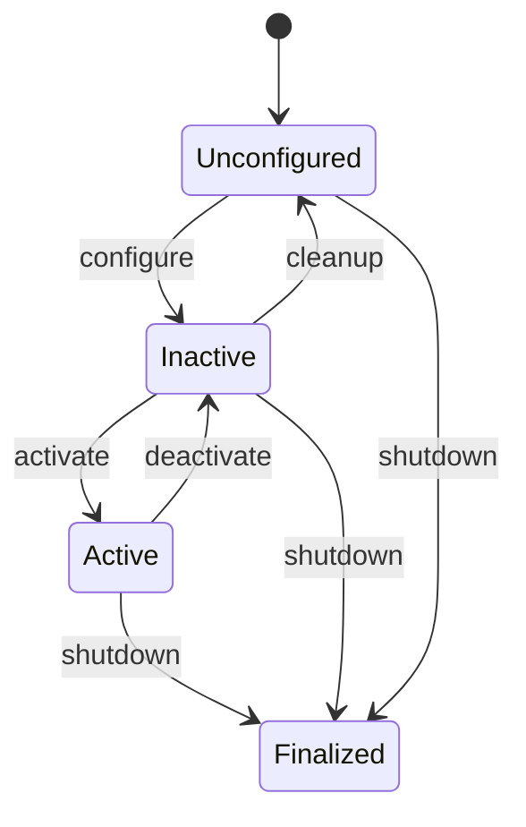
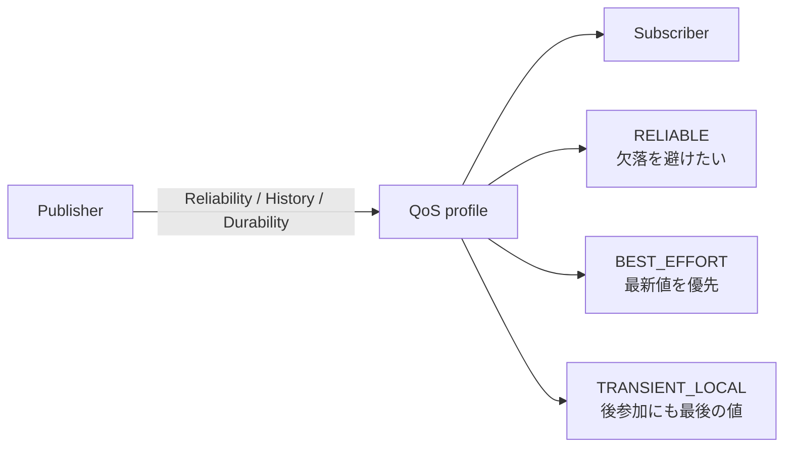

# チュートリアル 6: ライフサイクルノードと QoS

## 学習目標

このチュートリアルを完了すると、以下のことが理解できます。

- ライフサイクルノードの状態遷移モデルを説明できる
- `on_configure` / `on_activate` / `on_deactivate` / `on_cleanup` の役割を説明できる
- QoS の主要ポリシー (Reliability / History / Durability) を使い分けられる
- `MutuallyExclusiveCallbackGroup` と `ReentrantCallbackGroup` の違いを説明できる
- `MultiThreadedExecutor` が必要になる場面を判断できる

---

## 図で見るライフサイクルと QoS





ライフサイクルは「いつ動き始めるか」を制御し、QoS は「通信をどの品質で届けるか」を制御します。どちらも実運用で重要ですが、責務は別です。

## Part A: ライフサイクルノード

### なぜライフサイクル管理が必要か

通常の ROS2 ノード (`rclpy.node.Node`) は起動するとすぐにトピックの配信・購読を
開始します。複数のノードが協調するシステムでは、以下の問題が起きることがあります。

- センサードライバーが初期化完了前にデータを配信してしまう
- 依存するノードが起動していない状態で処理を開始してしまう
- シャットダウン順序が保証されずリソースリークが起きる

**ライフサイクルノード (`LifecycleNode`)** は状態機械によってノードの動作を
制御します。各状態への遷移は明示的なコマンドまたはランチファイルで管理できるため、
システム全体の起動・停止を決定論的に制御できます。

### 状態遷移図

```
[Unconfigured]
      |
      | configure  (on_configure: リソース確保、パブリッシャー作成)
      v
  [Inactive]  <---+
      |            |
      | activate   | cleanup  (on_cleanup: リソース解放)
      |            |
      v            |
   [Active]        |
      |            |
      | deactivate |  (on_deactivate: タイマー停止、配信一時停止)
      +------------+

  ※ いずれの状態からも [Finalized] (シャットダウン) に遷移できます
```

| 遷移          | コールバック      | 主な処理                                   |
|--------------|------------------|--------------------------------------------|
| configure    | `on_configure`   | パラメータ読み込み、パブリッシャー作成     |
| activate     | `on_activate`    | タイマー開始、サブスクライバー開始         |
| deactivate   | `on_deactivate`  | タイマー停止、処理の一時停止               |
| cleanup      | `on_cleanup`     | パブリッシャー・タイマー破棄、初期状態へ戻す |

### `lifecycle_demo.py` の構造

`src/ros2_learning/ros2_learning/lifecycle_demo.py` は
ライフサイクルノードの最小実装例です。

```python
from rclpy.lifecycle import LifecycleNode, LifecycleState, TransitionCallbackReturn
from rclpy.lifecycle.node import LifecyclePublisher

class LifecycleDemo(LifecycleNode):

    def __init__(self) -> None:
        super().__init__('lifecycle_demo')
        # __init__ ではパラメータの宣言のみ行う
        # パブリッシャー・タイマーは on_configure/on_activate で作成する
        self._pub = None
        self._timer = None

    def on_configure(self, state: LifecycleState) -> TransitionCallbackReturn:
        """リソースを確保し、パブリッシャーを作成する。"""
        # create_lifecycle_publisher を使う (通常の create_publisher ではない)
        self._pub = self.create_lifecycle_publisher(String, 'lifecycle_output', 10)
        return TransitionCallbackReturn.SUCCESS

    def on_activate(self, state: LifecycleState) -> TransitionCallbackReturn:
        """タイマーを開始してメッセージ配信を始める。"""
        self._timer = self.create_timer(1.0, self._publish)
        return super().on_activate(state)  # パブリッシャーを有効化するために必須

    def on_deactivate(self, state: LifecycleState) -> TransitionCallbackReturn:
        """タイマーを停止して配信を一時停止する。"""
        self.destroy_timer(self._timer)
        self._timer = None
        return super().on_deactivate(state)  # パブリッシャーを無効化するために必須

    def on_cleanup(self, state: LifecycleState) -> TransitionCallbackReturn:
        """リソースを解放して初期状態に戻す。"""
        self.destroy_publisher(self._pub)
        self._pub = None
        return TransitionCallbackReturn.SUCCESS
```

`create_lifecycle_publisher` で作成したパブリッシャーは、
`on_activate` / `on_deactivate` の `super()` 呼び出しによって
自動的に有効化・無効化されます。
`Active` 状態以外での `publish()` 呼び出しはメッセージを送信しません。

### ライフサイクルノードを手動で操作する

ターミナル 1 でノードを起動します。

```bash
ros2 run ros2_learning lifecycle_demo
```

ターミナル 2 で現在の状態を確認します。

```bash
ros2 lifecycle get /lifecycle_demo
```

状態を `configure` に遷移させます。

```bash
ros2 lifecycle set /lifecycle_demo configure
```

状態を `activate` に遷移させます（この後から `/lifecycle_output` にメッセージが流れます）。

```bash
ros2 lifecycle set /lifecycle_demo activate
```

配信されているメッセージを確認します。

```bash
ros2 topic echo /lifecycle_output
```

一時停止します。

```bash
ros2 lifecycle set /lifecycle_demo deactivate
```

リソースを解放して初期状態に戻します。

```bash
ros2 lifecycle set /lifecycle_demo cleanup
```

### ランチファイルでの自動遷移

実際のシステムでは、ランチファイルから `lifecycle_manager` や
`EmitEvent` を使って自動的に状態遷移させます。

```python
# launch ファイルの例 (自動遷移)
from launch_ros.actions import LifecycleNode
from launch_ros.event_handlers import OnStateTransition
from launch_ros.events.lifecycle import ChangeState
from lifecycle_msgs.msg import Transition

lifecycle_node = LifecycleNode(
    package='ros2_learning',
    executable='lifecycle_demo',
    name='lifecycle_demo',
    output='screen',
)
```

---

## Part B: QoS (Quality of Service)

### QoS とは?

QoS はトピックの配信品質を制御するポリシーの集合です。
ROS2 は DDS (Data Distribution Service) を通信基盤として使っており、
QoS プロファイルによって「確実に届けるか」「古いデータを保持するか」などを
ノードごとに設定できます。

パブリッシャーとサブスクライバーの QoS が互換していない場合、
接続が確立されず通信が行われないため、QoS の理解は重要です。

### 主要な QoS ポリシー

#### Reliability (信頼性)

| 設定            | 挙動                                         | 用途                         |
|----------------|----------------------------------------------|------------------------------|
| `RELIABLE`     | 全メッセージの到達を保証（再送あり）          | コマンド、サービス呼び出し   |
| `BEST_EFFORT`  | 到達を保証しない（再送なし、低レイテンシ優先） | 高頻度センサーデータ         |

#### History (履歴)

| 設定         | 挙動                                    |
|-------------|----------------------------------------|
| `KEEP_LAST` | 直近 N 件 (`depth`) のメッセージを保持  |
| `KEEP_ALL`  | 全メッセージを保持（メモリ使用量に注意） |

#### Durability (永続性)

| 設定              | 挙動                                             | 用途                 |
|------------------|--------------------------------------------------|----------------------|
| `VOLATILE`       | 接続前に配信されたメッセージは受け取れない        | 通常のトピック       |
| `TRANSIENT_LOCAL`| 接続前に配信されたメッセージも受け取れる（後から参加するノード向け） | マップ、設定値 |

#### Depth (深さ)

`KEEP_LAST` のときに保持するメッセージ数です。
高頻度トピックで処理が追いつかない場合は `depth=1` にして常に最新値だけを使うこともあります。

### QoS プロファイルの定義例

```python
from rclpy.qos import QoSProfile, ReliabilityPolicy, HistoryPolicy, DurabilityPolicy

# センサーデータ向け: 高頻度・欠落許容
sensor_qos = QoSProfile(
    reliability=ReliabilityPolicy.BEST_EFFORT,
    history=HistoryPolicy.KEEP_LAST,
    depth=10,
)

# コマンド向け: 確実な到達が必要
command_qos = QoSProfile(
    reliability=ReliabilityPolicy.RELIABLE,
    history=HistoryPolicy.KEEP_LAST,
    depth=10,
)

# 後から参加するノード向け: 最新の設定値を受け取る
latched_qos = QoSProfile(
    reliability=ReliabilityPolicy.RELIABLE,
    durability=DurabilityPolicy.TRANSIENT_LOCAL,
    history=HistoryPolicy.KEEP_LAST,
    depth=1,
)
```

### 用途別の QoS 選択指針

| トピックの種類           | Reliability  | History    | Durability        | Depth |
|------------------------|--------------|------------|-------------------|-------|
| IMU (50 Hz)            | BEST_EFFORT  | KEEP_LAST  | VOLATILE          | 10    |
| GPS (1 Hz)             | RELIABLE     | KEEP_LAST  | VOLATILE          | 10    |
| 速度コマンド            | RELIABLE     | KEEP_LAST  | VOLATILE          | 10    |
| マップ・設定（後参加）   | RELIABLE     | KEEP_LAST  | TRANSIENT_LOCAL   | 1     |

### 既存パッケージ: `sensor_fusion_sim` での実例

#### `noisy_sensor_node.py` の QoS 設定

`src/sensor_fusion_sim/sensor_fusion_sim/noisy_sensor_node.py` では
GPS と IMU で異なる QoS を使っています。

```python
# GPS: 低頻度 (1 Hz) のため RELIABLE で確実に届ける
reliable_qos = QoSProfile(
    reliability=ReliabilityPolicy.RELIABLE,
    history=HistoryPolicy.KEEP_LAST,
    depth=10,
)

# IMU: 高頻度 (50 Hz) のため BEST_EFFORT で低レイテンシを優先する
best_effort_qos = QoSProfile(
    reliability=ReliabilityPolicy.BEST_EFFORT,
    history=HistoryPolicy.KEEP_LAST,
    depth=10,
)

self.create_publisher(PointStamped, 'gps', reliable_qos)
self.create_publisher(Imu, 'imu', best_effort_qos)
```

#### `lifecycle_data_recorder.py` のライフサイクル実装

`src/sensor_fusion_sim/sensor_fusion_sim/lifecycle_data_recorder.py` は
`sensor_fusion_sim` パッケージにおけるライフサイクルノードの実用例です。

- `on_configure`: バッファサイズのパラメータ検証、ステータスパブリッシャー作成
- `on_activate`: オドメトリのサブスクライバー開始、タイマー開始
- `on_deactivate`: 記録を停止、タイマー解除
- `on_cleanup`: バッファクリア、パブリッシャー破棄

---

## Part C: コールバックグループとエグゼキュータ

### コールバックグループとは?

ROS2 のコールバック（タイマー・サブスクライバー・サービス）は
デフォルトでは 1 つずつ順番に実行されます。
**コールバックグループ**を使うと、複数のコールバックを並列実行するかどうかを
コントロールできます。

### 2 種類のコールバックグループ

#### `MutuallyExclusiveCallbackGroup`

同じグループ内のコールバックは同時に実行されません（排他的）。
複数スレッドのエグゼキュータを使っても、このグループ内のコールバックは
1 つずつ順番に実行されます。

**用途:** 共有状態を持つコールバック同士で競合を避けたい場合。

#### `ReentrantCallbackGroup`

同じグループ内のコールバックが同時に複数実行されることを許可します。
複数スレッドのエグゼキュータと組み合わせて初めて並列実行が実現します。

**用途:** 独立した処理を並列化してスループットを上げたい場合。

### `complementary_filter_node.py` での使用例

`src/sensor_fusion_sim/sensor_fusion_sim/complementary_filter_node.py` では
2 種類のグループを使い分けています。

```python
from rclpy.callback_groups import MutuallyExclusiveCallbackGroup, ReentrantCallbackGroup
from rclpy.executors import MultiThreadedExecutor

# センサーコールバック: 複数センサーを並列処理してよい
sensor_cb_group = ReentrantCallbackGroup()

# 出力タイマー: 他のコールバックと排他的に実行する
timer_cb_group = MutuallyExclusiveCallbackGroup()

self.create_subscription(Imu, 'imu', self._on_imu,
                         best_effort_qos,
                         callback_group=sensor_cb_group)
self.create_subscription(PointStamped, 'gps', self._on_gps,
                         reliable_qos,
                         callback_group=sensor_cb_group)
self.create_timer(1.0 / publish_rate, self._publish,
                  callback_group=timer_cb_group)
```

コールバックグループを活用するには `MultiThreadedExecutor` が必要です。

```python
def main(args=None):
    rclpy.init(args=args)
    node = ComplementaryFilterNode()

    # MultiThreadedExecutor で並列コールバックを有効にする
    executor = MultiThreadedExecutor()
    executor.add_node(node)
    executor.spin()
```

### エグゼキュータの選択

| エグゼキュータ                  | スレッド数 | 用途                                         |
|--------------------------------|-----------|----------------------------------------------|
| `SingleThreadedExecutor`       | 1         | シンプルなノード（デフォルト）               |
| `MultiThreadedExecutor`        | 複数      | `ReentrantCallbackGroup` を活用した並列処理  |

**注意:** `MultiThreadedExecutor` を使うだけでは並列実行されません。
`ReentrantCallbackGroup` と組み合わせて初めて並列処理が有効になります。

### グループとエグゼキュータの組み合わせ

| コールバックグループ           | SingleThreadedExecutor | MultiThreadedExecutor |
|-------------------------------|------------------------|----------------------|
| `MutuallyExclusive` (デフォルト) | 順番に実行            | 順番に実行           |
| `ReentrantCallbackGroup`      | 順番に実行             | 並列実行 (可能)      |

---

## 演習問題

### 演習 1: lifecycle_demo を手動で状態遷移させてログを確認する

`lifecycle_demo` を起動して、全状態を一通り遷移させてみましょう。

```bash
# ターミナル 1: ノードを起動
ros2 run ros2_learning lifecycle_demo

# ターミナル 2: 状態遷移を実行
ros2 lifecycle set /lifecycle_demo configure
ros2 lifecycle set /lifecycle_demo activate

# ターミナル 3: 配信されているメッセージを確認
ros2 topic echo /lifecycle_output

# ターミナル 2: 一時停止
ros2 lifecycle set /lifecycle_demo deactivate

# ターミナル 2: クリーンアップ
ros2 lifecycle set /lifecycle_demo cleanup

# 現在の状態を確認
ros2 lifecycle get /lifecycle_demo
```

ターミナル 1 のログを見て、各状態遷移コールバックが呼ばれていることを確認しましょう。

### 演習 2: sensor_fusion_sim の QoS プロファイルを変更して挙動の違いを観察する

`src/sensor_fusion_sim/sensor_fusion_sim/noisy_sensor_node.py` の
IMU QoS を `BEST_EFFORT` から `RELIABLE` に変更し、
`complementary_filter_node.py` 側の購読 QoS も同様に変更してから
動作を比較してみましょう。

```bash
# sensor_fusion_sim をビルド
colcon build --packages-select sensor_fusion_sim
source install/setup.bash

# sensor_fusion_sim を起動
ros2 launch sensor_fusion_sim sensor_fusion_demo.launch.py

# IMU トピックのレートを確認
ros2 topic hz /imu
```

### 演習 3: complementary_filter.py のコールバックグループを確認する

`src/sensor_fusion_sim/sensor_fusion_sim/complementary_filter_node.py` を開き、
以下の点を確認しましょう。

1. `sensor_cb_group` (ReentrantCallbackGroup) に属するコールバックはどれか
2. `timer_cb_group` (MutuallyExclusiveCallbackGroup) に属するコールバックはどれか
3. `main()` 関数でどのエグゼキュータが使われているか

確認後、`ReentrantCallbackGroup` を `MutuallyExclusiveCallbackGroup` に変更して
リビルドし、高負荷時の挙動の違いを観察しましょう。

```bash
# ノード内のコールバックグループとエグゼキュータの確認
ros2 node info /complementary_filter
```

> 💡 演習のヒントと解答例は [こちら](answers/06_answers.md) を参照してください。

---

## 確認チェックリスト

このチュートリアルを完了したら、以下の項目を順番に確認してください。

### チェック 1: ライフサイクルノードの起動と初期状態確認

- [ ] `lifecycle_demo` ノードを起動して初期状態が `unconfigured` であることを確認する

```bash
ros2 run ros2_learning lifecycle_demo
```

別ターミナルで現在の状態を確認します。

```bash
ros2 lifecycle get /lifecycle_demo
```

期待される出力:
```
unconfigured [1]
```

### チェック 2: 状態遷移の確認（configure → activate）

- [ ] `configure` 遷移が成功することを確認する

```bash
ros2 lifecycle set /lifecycle_demo configure
```

期待される出力:
```
Transitioning successful
```

確認:
```bash
ros2 lifecycle get /lifecycle_demo
```

期待される出力:
```
inactive [2]
```

- [ ] `activate` 遷移が成功し、メッセージ配信が始まることを確認する

```bash
ros2 lifecycle set /lifecycle_demo activate
```

期待される出力:
```
Transitioning successful
```

配信されているメッセージを確認します。

```bash
ros2 topic echo /lifecycle_output
```

期待される出力（1 Hz でメッセージが流れる）:
```
data: 'Lifecycle demo: count=1'
---
data: 'Lifecycle demo: count=2'
---
```

### チェック 3: 一時停止と再開の確認

- [ ] `deactivate` でメッセージ配信が停止することを確認する

```bash
ros2 lifecycle set /lifecycle_demo deactivate
```

`ros2 topic echo /lifecycle_output` で出力が止まることを確認します。

- [ ] `activate` で配信が再開することを確認する

```bash
ros2 lifecycle set /lifecycle_demo activate
```

### チェック 4: クリーンアップ確認

- [ ] `deactivate` → `cleanup` の順で初期状態に戻せることを確認する

```bash
ros2 lifecycle set /lifecycle_demo deactivate
ros2 lifecycle set /lifecycle_demo cleanup
ros2 lifecycle get /lifecycle_demo
```

期待される出力:
```
unconfigured [1]
```

### チェック 5: QoS 互換性の確認

- [ ] `ros2 topic info` で QoS プロファイルを確認できることを確認する（`sensor_fusion_sim` 利用時）

```bash
ros2 topic info /imu --verbose
```

期待される出力（パブリッシャー側）:
```
Publisher count: 1
Node name: noisy_sensor_node
QoS profile:
  Reliability: BEST_EFFORT
  Durability: VOLATILE
  History (Depth): KEEP_LAST (10)
```

### チェック 6: ライフサイクルノードの状態一覧確認

- [ ] `lifecycle_demo` ノードで利用可能な遷移一覧が表示されることを確認する

```bash
ros2 lifecycle get /lifecycle_demo
ros2 lifecycle list /lifecycle_demo
```

`unconfigured` 状態での期待される出力:
```
- configure [1]
- shutdown [5]
```

`inactive` 状態での期待される出力:
```
- activate [3]
- cleanup [2]
- shutdown [5]
```

### 完了条件

- `lifecycle_demo` ノードを `unconfigured → inactive → active → inactive → unconfigured` と手動で遷移できた
- `active` 状態のときだけ `/lifecycle_output` にメッセージが流れることを確認した
- QoS の Reliability（`BEST_EFFORT` / `RELIABLE`）の違いを理解し、`ros2 topic info --verbose` で確認できた
- `MutuallyExclusiveCallbackGroup` と `ReentrantCallbackGroup` の違いを説明できる

### トラブルシューティング

**`ros2 lifecycle set` で `Transitioning failed` が返される場合**

遷移の順序が正しくない可能性があります。ライフサイクルの遷移は順序が決まっています。

```bash
# 現在の状態と可能な遷移を確認する
ros2 lifecycle get /lifecycle_demo
ros2 lifecycle list /lifecycle_demo
```

**`ros2 topic echo /lifecycle_output` で何も出力されない場合**

ノードが `active` 状態になっていない可能性があります。

```bash
ros2 lifecycle get /lifecycle_demo
# inactive であれば activate する
ros2 lifecycle set /lifecycle_demo activate
```

**QoS 不一致で通信が確立されない場合**

パブリッシャーとサブスクライバーの QoS が互換していないと接続されません。

```bash
# トピックの QoS 設定を確認して不一致を特定する
ros2 topic info /imu --verbose
```

`BEST_EFFORT` パブリッシャーに `RELIABLE` サブスクライバーを接続しようとすると接続が確立されません。どちらかに合わせて修正が必要です。

**`sensor_fusion_demo.launch.py` が見つからないエラーが出る場合**

```bash
# sensor_fusion_sim パッケージが正しくビルドされているか確認する
colcon build --packages-select sensor_fusion_sim
source install/setup.bash
ros2 launch sensor_fusion_sim sensor_fusion_demo.launch.py
```
