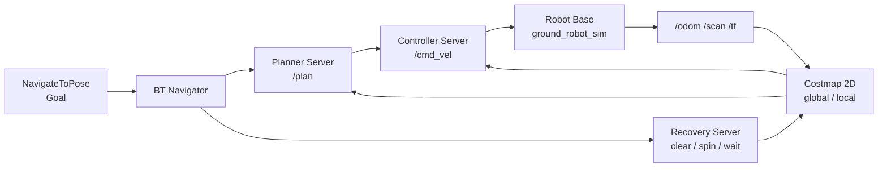

# チュートリアル 7: Navigation2 の全体像

## 学習目標

- Nav2 のアーキテクチャとコンポーネント構成を理解する
- 各コンポーネント（Planner、Controller、BT Navigator 等）の役割を説明できる
- 既存の `ground_robot_sim` カスタム実装と Nav2 の対応関係を理解する

---

## 図で見る Nav2 のデータフロー



Nav2 は単一の巨大ノードではなく、役割ごとに分かれたサーバー群です。BT Navigator がタスクの順番を決め、Costmap が環境情報を共有し、Planner と Controller がそれぞれ「道を作る」「道を追う」を担当します。

## Nav2 とは何か

Navigation2（Nav2）は ROS 2 向けの自律移動ロボット用ナビゲーションフレームワークです。目標地点への経路計画・経路追従・障害物回避・リカバリ動作を統合的に提供し、倉庫ロボット・サービスロボット・自動搬送車（AGV）などの実用システムに広く使われています。

Nav2 の主な特徴は以下の通りです:

- **プラグインアーキテクチャ**: 経路計画アルゴリズムや制御アルゴリズムをプラグインとして差し替え可能
- **Behavior Tree によるタスク管理**: 複雑なナビゲーションシーケンスとリカバリをBTで宣言的に記述
- **ライフサイクルノード**: 各サーバーはライフサイクル管理付きで、起動・設定・終了を安全に制御可能
- **標準インターフェース**: `nav_msgs/OccupancyGrid`、`nav_msgs/Path`、`geometry_msgs/Twist` など標準メッセージ型を使用

---

## Nav2 のアーキテクチャ

```
┌─────────────────────────────────────────────────────────┐
│                   Behavior Tree (bt_navigator)           │
│  ┌──────────┐  ┌──────────────┐  ┌──────────────────┐  │
│  │ Planner  │  │  Controller  │  │  Recovery/Smoother│  │
│  │ Server   │  │  Server      │  │  Servers          │  │
│  └────┬─────┘  └──────┬───────┘  └──────────────────┘  │
│       │               │                                  │
│  ┌────▼───────────────▼──────────────────────┐          │
│  │         Costmap 2D (global / local)        │          │
│  └─────────────────┬─────────────────────────┘          │
└────────────────────┼────────────────────────────────────┘
                     │
┌────────────────────▼────────────────────────────────────┐
│  Robot: odom, scan, TF (map→odom→base_link→sensors)    │
└─────────────────────────────────────────────────────────┘
```

BT Navigator が全体を統括し、Planner Server で経路を計算、Controller Server でロボットを動かします。何か問題が起きたときは Recovery Server が自動的に回復動作を実行します。

---

## ground_robot_sim との対応関係

このリポジトリの `ground_robot_sim` は Nav2 を使わずにカスタム実装でナビゲーションを実現しています。両者の対応関係を理解することで、Nav2 が何を解決しているかが明確になります。

| 機能 | ground_robot_sim（カスタム実装） | Nav2 |
|------|--------------------------------|------|
| 経路追従 | `waypoint_follower.py`（PID 制御） | Controller Server（DWB / RPP / MPPI） |
| 障害物回避 | `lidar_obstacle_avoid.py`（直接 LiDAR） | Costmap 2D + Controller |
| 経路計画 | なし（事前定義ウェイポイント） | Planner Server（NavFn / Smac） |
| タスク管理 | なし | Behavior Tree |
| リカバリ | なし | Recovery Server（回転 / 後退 / 待機） |

`ground_robot_sim` のカスタム実装は理解しやすい一方、障害物の多い環境や複雑なミッションには限界があります。Nav2 を使うと、これらの課題をフレームワークとして解決できます。

---

## Nav2 の主要コンポーネント

### Planner Server

スタート地点からゴール地点までの経路を計画するコンポーネントです。グローバルコストマップ上で動作し、NavFn（Dijkstra / A* ベース）や Smac Planner（ハイブリッド A*、格子ベース）などのアルゴリズムをプラグインとして使用できます。生成した経路は `nav_msgs/Path` メッセージとして `/plan` トピックに配信されます。

### Controller Server

Planner Server が生成した経路に沿ってロボットを動かすコンポーネントです。ローカルコストマップ上でリアルタイムに動作し、`geometry_msgs/Twist` の速度コマンドを `/cmd_vel` トピックに送信します。DWB（Dynamic Window Based）、RPP（Regulated Pure Pursuit）、MPPI など複数のアルゴリズムに対応しています。

### BT Navigator

Behavior Tree を実行してナビゲーション全体のシーケンスを管理するコンポーネントです。NavigateToPose アクションのサーバーとして動作し、経路計画・経路追従・リカバリの順序と条件を BT XML ファイルで定義します。

### Costmap 2D

センサデータ（LiDAR 等）と静的マップを統合して、ロボットが走行可能な領域のコスト値マップを生成するコンポーネントです。グローバルコストマップ（全体地図）とローカルコストマップ（ロボット周辺の動的障害物）の 2 種類があります。

### Recovery Server

経路計画や経路追従が失敗した場合に自動で回復動作を実行するコンポーネントです。Spin（その場で回転）、BackUp（後退）、Wait（一時停止）、ClearCostmap（コストマップのリセット）などのリカバリ動作を提供します。

### Smoother Server

Planner が生成した経路をよりなめらかに修正するコンポーネントです。急カーブや不連続な経路を修正し、Controller Server による追従精度を向上させます。

### Waypoint Follower

複数のウェイポイントを順番にナビゲートするコンポーネントです。`NavigateWaypoints` アクションのサーバーとして動作し、各ウェイポイントで任意のタスクプラグインを実行できます。

### Velocity Smoother

Controller Server が出力する速度コマンドを平滑化するコンポーネントです。急激な加減速を防いでハードウェアへの負担を軽減し、より自然なロボット動作を実現します。

---

## TF フレームの要件

Nav2 は以下の TF チェーンが正しく配信されていることを前提としています。

```
map
└── odom
    └── base_link
        └── base_scan（または lidar 等のセンサフレーム）
```

| フレーム | 役割 | 配信者 |
|----------|------|--------|
| `map` | 静的なワールド座標系（マップ原点） | `map_server` または SLAM |
| `odom` | ドリフトを含むローカル座標系 | ロボットドライバ |
| `base_link` | ロボット本体の座標系 | ロボットドライバ |
| `base_scan` | LiDAR センサの座標系 | ロボットドライバ（静的 TF） |

`ground_robot_sim` の `ground_robot_node.py` はすでに `odom → base_link` の TF を配信しているため、`map → odom` を追加すれば Nav2 が要求する TF チェーンを満たせます。

---

## nav2_learning パッケージの位置づけ

このチュートリアルシリーズ（ステップ 7〜11）では、Nav2 の各コンポーネントを段階的に理解するために `nav2_learning` パッケージを使います。

```
nav2_learning（Nav2 の概念を学ぶ）
    │
    ├── simple_map_publisher.py  → OccupancyGrid の生成と配信（ステップ 8）
    ├── map_utils.py             → 座標変換ユーティリティ（ステップ 8）
    ├── simple_path_planner.py   → A* 経路計画の実装（ステップ 9）
    ├── simple_path_follower.py  → Pure Pursuit 経路追従（ステップ 10）
    ├── nav2_waypoint_client.py  → Nav2 アクションクライアント（ステップ 11）
    └── costmap_monitor.py       → コストマップの観察（ステップ 8）
```

簡易実装でアルゴリズムの動作原理を理解してから、本物の Nav2 スタックの設定や使い方を学ぶという順序で進めます。

---

## Step 1: Nav2 の依存関係を確認する

Nav2 がインストールされているか確認しましょう。

```bash
apt list --installed 2>/dev/null | grep nav2
```

インストールされている場合、以下のようなパッケージ一覧が表示されます:

```
ros-jazzy-nav2-bringup/...
ros-jazzy-nav2-bt-navigator/...
ros-jazzy-nav2-controller/...
ros-jazzy-nav2-costmap-2d/...
ros-jazzy-nav2-planner/...
```

インストールされていない場合は、以下のコマンドでインストールできます:

```bash
sudo apt install ros-jazzy-navigation2 ros-jazzy-nav2-bringup
```

---

## Step 2: Nav2 のトピック構成を理解する

Nav2 が使用する主なトピックを確認しておきましょう。

```bash
# Nav2 起動後に確認できるトピック一覧
ros2 topic list
```

| トピック | 型 | 役割 |
|----------|----|------|
| `/plan` | `nav_msgs/Path` | グローバルプランナーが生成した経路 |
| `/cmd_vel` | `geometry_msgs/Twist` | コントローラーが出力する速度コマンド |
| `/global_costmap/costmap` | `nav_msgs/OccupancyGrid` | グローバルコストマップ |
| `/local_costmap/costmap` | `nav_msgs/OccupancyGrid` | ローカルコストマップ |
| `/map` | `nav_msgs/OccupancyGrid` | 静的マップ |
| `/initialpose` | `geometry_msgs/PoseWithCovarianceStamped` | AMCL への初期位置指定 |
| `/goal_pose` | `geometry_msgs/PoseStamped` | RViz からのゴール指定 |
| `/behavior_tree_log` | `nav2_msgs/BehaviorTreeLog` | BT の実行ログ |

これらのトピックは `ground_robot_sim` が使う `/odom`、`/scan`、`/cmd_vel` と一部共通しています。Nav2 は `/cmd_vel` を書き込み、ロボットドライバはそれを読み取るという役割分担は変わりません。

---

## 既存パッケージでの応用

`ground_robot_sim` はすでに Nav2 互換のインターフェースを備えています。

ソースファイル: `src/ground_robot_sim/ground_robot_sim/ground_robot_node.py`

```python
# Nav2 が期待するインターフェースをすでに実装している
self.create_subscription(Twist, 'cmd_vel', self.cmd_vel_callback, 10)  # 速度コマンド受信
self.odom_publisher = self.create_publisher(Odometry, 'odom', 10)       # オドメトリ配信
self.scan_publisher = self.create_publisher(LaserScan, 'scan', 10)      # LiDAR 配信
# TF も odom → base_link を配信
```

つまり `ground_robot_sim` のロボットノードはそのまま Nav2 のコントローラーと接続できます。`cmd_vel` を受け取り、`odom` と `scan` を返す、という標準インターフェースを守っているためです。

---

## 演習問題

### 演習 1: Nav2 コンポーネントと役割の対応

以下の各説明が Nav2 のどのコンポーネントに対応するか答えてください:

1. 「スタート地点からゴール地点への衝突しない経路を計算する」
2. 「計画された経路に沿って `/cmd_vel` を送信してロボットを動かす」
3. 「LiDAR データをリアルタイムに反映してロボット周辺のコスト値を更新する」
4. 「経路追従が失敗したときにロボットをその場で回転させて再試行する」

### 演習 2: TF チェーンの確認

`ground_robot_sim` を起動して、TF チェーンを確認してみましょう:

```bash
# ターミナル 1: ground_robot_sim を起動
ros2 run ground_robot_sim ground_robot_node

# ターミナル 2: TF ツリーを確認
ros2 run tf2_tools view_frames
```

`odom → base_link` が配信されていることを確認してください。Nav2 で動かすには、ここに `map → odom` を追加する必要があります。

### 演習 3: ground_robot_sim と Nav2 の比較

`ground_robot_sim` の `waypoint_follower.py` と `lidar_obstacle_avoid.py` のコードを読んで、以下の点を考えてみましょう:

- これらのカスタム実装はどのような状況では十分か？
- どのような状況で Nav2 のような本格的なナビゲーションスタックが必要になるか？
- `ground_robot_sim` では実装されていない機能（例: リカバリ動作）を Nav2 はどのように実現しているか？

> 💡 演習のヒントと解答例は [こちら](answers/07_answers.md) を参照してください。

---

## 確認チェックリスト

このチュートリアルを完了したら、以下の項目を順番に確認してください。

### チェック 1: Nav2 のインストール確認

- [ ] Nav2 パッケージがインストールされていることを確認する

```bash
apt list --installed 2>/dev/null | grep nav2
```

期待される出力（一部抜粋）:
```
ros-jazzy-nav2-bringup/... [installed]
ros-jazzy-nav2-bt-navigator/... [installed]
ros-jazzy-nav2-controller/... [installed]
ros-jazzy-nav2-costmap-2d/... [installed]
ros-jazzy-nav2-planner/... [installed]
```

インストールされていない場合は以下を実行します。

```bash
sudo apt install ros-jazzy-navigation2 ros-jazzy-nav2-bringup
```

### チェック 2: ground_robot_sim の起動と TF チェーン確認

- [ ] `ground_robot_sim` を起動して TF が配信されていることを確認する

```bash
ros2 run ground_robot_sim ground_robot_node
```

別ターミナルで TF ツリーを確認します。

```bash
ros2 run tf2_tools view_frames
```

期待される出力: `frames.pdf` に `odom → base_link` のチェーンが表示される。

- [ ] Nav2 が要求する TF フレームを確認する

```bash
ros2 topic echo /tf --once
```

`odom → base_link` が配信されていることを確認してください（Nav2 動作には `map → odom` も必要）。

### チェック 3: ground_robot_sim のインターフェース確認

- [ ] `ground_robot_sim` が Nav2 互換のトピックを配信していることを確認する

```bash
ros2 run ground_robot_sim ground_robot_node &
ros2 topic list
```

期待される出力（Nav2 互換トピックを含む）:
```
/cmd_vel
/odom
/scan
/robot_status
/tf
/tf_static
```

- [ ] `/odom` と `/scan` が正しいメッセージ型で配信されていることを確認する

```bash
ros2 topic info /odom
ros2 topic info /scan
```

期待される出力:
```
/odom  →  nav_msgs/msg/Odometry
/scan  →  sensor_msgs/msg/LaserScan
```

### チェック 4: Nav2 のトピック理解確認

- [ ] Nav2 の主要トピックの型と役割を説明できることを自己確認する

以下のコマンドを実行してトピック型を確認します（Nav2 が起動している場合）。

```bash
ros2 interface show nav_msgs/msg/Path
ros2 interface show geometry_msgs/msg/Twist
```

`nav_msgs/Path` の期待される出力（経路のポーズ配列）:
```
std_msgs/Header header
	builtin_interfaces/Time stamp
	string frame_id
geometry_msgs/PoseStamped[] poses
	std_msgs/Header header
	geometry_msgs/Pose pose
		geometry_msgs/Point position
		geometry_msgs/Quaternion orientation
```

### チェック 5: Nav2 コンポーネントの役割理解確認

- [ ] 演習 1 の各コンポーネント説明に答えられることを確認する

以下の対応表を見ずに答えられるか確認しましょう。

| 説明 | コンポーネント |
|------|---------------|
| スタート〜ゴールへの衝突しない経路を計算する | Planner Server |
| 計画経路に沿って `/cmd_vel` を送信してロボットを動かす | Controller Server |
| LiDAR データをリアルタイムに反映してコスト値を更新する | Costmap 2D |
| 経路追従失敗時にロボットをその場で回転させて再試行する | Recovery Server |

### 完了条件

- Nav2 パッケージがインストールされていることを確認した
- Nav2 の 6 つの主要コンポーネント（BT Navigator・Planner・Controller・Costmap・Recovery・Waypoint Follower）の役割を説明できる
- `ground_robot_sim` の `odom → base_link` TF が Nav2 の前提条件の一部を満たしていることを理解した
- カスタム実装（`ground_robot_sim`）と Nav2 の機能対応関係を説明できる

### トラブルシューティング

**`ground_robot_node` 起動時に `ModuleNotFoundError` が出る場合**

パッケージが未ビルドか、環境が読み込まれていない可能性があります。

```bash
colcon build --packages-select ground_robot_sim
source install/setup.bash
ros2 run ground_robot_sim ground_robot_node
```

**`ros2 run tf2_tools view_frames` で TF が空の場合**

`ground_robot_node` が起動していないか、TF の配信に失敗している可能性があります。

```bash
# TF が配信されているか確認する
ros2 topic echo /tf --once
```

何も表示されない場合は `ground_robot_node` を先に起動してください。

**Nav2 のインストールコマンドで `unable to locate package` が出る場合**

ROS2 の APT リポジトリが設定されていない可能性があります。

```bash
# ROS2 リポジトリが設定されているか確認する
cat /etc/apt/sources.list.d/ros2.list
```

設定されていない場合は [ROS2 インストールガイド](https://docs.ros.org/en/jazzy/Installation.html) に従ってリポジトリを追加してください。
