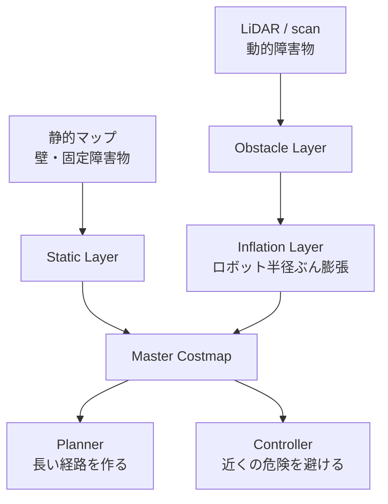
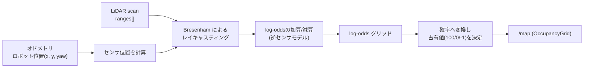

# チュートリアル 8: マップとコストマップ

## 学習目標

- `nav_msgs/OccupancyGrid` メッセージの構造とデータ形式を理解する
- 静的マップと動的コストマップの違いを説明できる
- 簡易マップパブリッシャーを実行して OccupancyGrid の仕組みを確認できる
- コストマップのレイヤー構造を理解する

---

## 図で見るマップとコストマップ



静的マップは「もともと知っている環境」、コストマップは「今走るための危険度マップ」です。障害物そのものだけでなく、ロボットの大きさを考慮して周囲にもコストを広げる点が重要です。

## OccupancyGrid とは

`nav_msgs/OccupancyGrid` は ROS 2 において 2D 地図を表現する標準メッセージ型です。Nav2 の全コンポーネントがこの型を使って地図情報をやり取りします。

### メッセージ構造

```
nav_msgs/OccupancyGrid
├── header
│   ├── stamp       # タイムスタンプ
│   └── frame_id    # 地図が属する座標フレーム（通常 "map"）
├── info (MapMetaData)
│   ├── resolution  # 1 セルのサイズ [m/cell]（例: 0.05 = 5cm）
│   ├── width       # 横方向のセル数
│   ├── height      # 縦方向のセル数
│   └── origin      # 地図左下隅の座標（Pose）
└── data[]          # int8 の 1 次元配列（width × height 個）
```

### data 配列の値の意味

| 値 | 意味 |
|----|------|
| `0` | 空き（Free）: ロボットが通行可能 |
| `100` | 障害物（Occupied）: ロボットが通行不可 |
| `-1` | 未知（Unknown）: センサが届いていない領域 |
| `1〜99` | コストマップでは中間値も使用（膨張領域等） |

### グリッド座標とワールド座標の関係

```
ワールド座標 (x, y) とグリッドインデックス (col, row) の変換:

  col = floor((x - origin.x) / resolution)
  row = floor((y - origin.y) / resolution)

  配列インデックス = row * width + col

例: resolution=0.1, width=20, origin=(-1.0, -1.0)
  座標 (0.5, 0.3) → col=15, row=13 → インデックス=13*20+15=275
```

---

## 静的マップとコストマップ

### 静的マップ（Static Map）

SLAM（Simultaneous Localization and Mapping）などで事前に生成した地図です。起動時に `map_server` がファイルから読み込み、`/map` トピックとして配信します。壁や固定された障害物の情報を含み、基本的に実行中は変化しません。

### コストマップ（Costmap）

静的マップにセンサ情報をリアルタイムで反映したものです。センサが検知した動的障害物（人・移動するものなど）を即座に反映できます。さらに「インフレーション（膨張）」処理によって、障害物の周囲にもコストを与えることでロボットのサイズを考慮した安全マージンを確保します。

### コストマップのレイヤー構造

```
┌─────────────────────────────┐
│    Master Costmap           │  ← 最終的なコスト値（プランナー・コントローラーが参照）
├─────────────────────────────┤
│    Inflation Layer          │  ← 障害物の膨張（ロボット半径分のマージンを付与）
├─────────────────────────────┤
│    Obstacle Layer           │  ← LiDAR 等のリアルタイム障害物
├─────────────────────────────┤
│    Static Layer             │  ← 静的マップ（SLAM 生成）
└─────────────────────────────┘
```

各レイヤーは独立したプラグインとして動作し、最終的に合成された Master Costmap が経路計画と経路追従に使われます。

### グローバルコストマップとローカルコストマップ

| 項目 | グローバルコストマップ | ローカルコストマップ |
|------|----------------------|-------------------|
| 範囲 | マップ全体 | ロボット周辺（例: 半径 3m） |
| 更新頻度 | 低頻度（経路計画時） | 高頻度（制御周期と同期） |
| 用途 | Planner Server が経路計画に使用 | Controller Server が速度制御に使用 |
| 動的障害物 | 反映が遅い | すぐに反映 |

---

## Step 1: simple_map_publisher を実行して OccupancyGrid を理解する

ソースファイル: `src/nav2_learning/nav2_learning/simple_map_publisher.py`

このノードは手動で定義した障害物マップを `OccupancyGrid` メッセージとして `/map` トピックに配信します。

```bash
# ターミナル 1: マップパブリッシャーを起動
ros2 run nav2_learning simple_map_publisher
```

別のターミナルでデータ構造を確認します:

```bash
# /map トピックのデータを 1 回受信して表示
ros2 topic echo /map --once
```

以下のような出力が得られます:

```
header:
  frame_id: map
info:
  resolution: 0.1
  width: 20
  height: 20
  origin:
    position:
      x: -1.0
      y: -1.0
data:
- 0
- 0
- 100
- 0
...
```

`data` 配列の値が `0`（空き）と `100`（障害物）で構成されていることを確認してください。

メッセージ型の定義を確認するには:

```bash
ros2 interface show nav_msgs/msg/OccupancyGrid
```

---

## Step 2: map_utils の座標変換を理解する

ソースファイル: `src/nav2_learning/nav2_learning/map_utils.py`

座標変換の関数を理解することで、ナビゲーションシステムがワールド座標とグリッド座標をどのように相互変換しているかがわかります。

### world_to_grid: ワールド座標 → グリッドインデックス

```python
def world_to_grid(x, y, origin_x, origin_y, resolution):
    """ワールド座標をグリッドのセル座標に変換する"""
    col = int((x - origin_x) / resolution)
    row = int((y - origin_y) / resolution)
    return col, row
```

### grid_to_world: グリッドインデックス → ワールド座標

```python
def grid_to_world(col, row, origin_x, origin_y, resolution):
    """グリッドのセル座標をワールド座標（セル中心）に変換する"""
    x = origin_x + (col + 0.5) * resolution
    y = origin_y + (row + 0.5) * resolution
    return x, y
```

### resolution の意味

`resolution` は 1 セルが何メートルに対応するかを示します。

| resolution 値 | 意味 |
|--------------|------|
| `0.05` | 1 セル = 5cm（Nav2 のデフォルト、精細） |
| `0.1` | 1 セル = 10cm（学習用サンプル） |
| `0.5` | 1 セル = 50cm（広域マップ用、粗い） |

`resolution` が小さいほど地図の精度は高くなりますが、セル数（= メモリ・計算量）が増えます。`width × height / resolution²` に比例して計算量が増加するため、実用システムではトレードオフが重要です。

---

## Step 3: RViz でマップを可視化する

RViz を使って OccupancyGrid を視覚的に確認しましょう。

```bash
# ターミナル 1: マップパブリッシャーを起動
ros2 run nav2_learning simple_map_publisher

# ターミナル 2: RViz を起動
rviz2
```

RViz の設定手順:

1. 左下の「Add」ボタンをクリック
2. 「By topic」タブから `/map` を選択して「Map」を追加
3. 「Fixed Frame」を `map` に設定

障害物セル（値 `100`）が暗色（黒または濃灰色）、空きセル（値 `0`）が明色（白または薄灰色）で表示されることを確認してください。

```bash
# コストマップを確認したい場合（costmap_monitor ノードを使用）
ros2 run nav2_learning costmap_monitor
```

ソースファイル: `src/nav2_learning/nav2_learning/costmap_monitor.py`

このノードはインフレーション処理を簡易的にシミュレートし、障害物周辺にコスト勾配を付加したコストマップを生成します。

---

## 既存パッケージでの応用

### ground_robot_sim の scan データとの関係

`ground_robot_sim` の `lidar_obstacle_avoid.py` は LiDAR の scan データを直接参照して障害物を検知しています:

```python
# lidar_obstacle_avoid.py での直接処理
def scan_callback(self, msg):
    min_dist = min(msg.ranges[i] for i in front_indices if not math.isnan(ranges[i]))
    if min_dist < self.safe_distance:
        # 障害物検知 → 回転
```

Nav2 の Obstacle Layer は同じ `/scan` データを受け取り、それをコストマップのセル値として格納します。コントローラーはコストマップのコスト値を参照するため、センサの生データを直接触りません。この分離により、センサ種別（LiDAR / カメラ / ソナー等）が変わってもコントローラーのコードを変更する必要がなくなります。

```
【カスタム実装】: scan → lidar_obstacle_avoid.py → cmd_vel
【Nav2】        : scan → Obstacle Layer → Costmap → Controller → cmd_vel
```

---

## 演習問題

### 演習 1: 障害物の配置を変更する

`simple_map_publisher.py` の障害物定義を変更して、別の形状の障害物を追加してみましょう:

```python
# 例: L 字型の障害物を追加
obstacles = [
    (5, 5), (5, 6), (5, 7), (5, 8),   # 縦のライン
    (6, 8), (7, 8), (8, 8),             # 横のライン
]
```

変更後にリビルドして、RViz でマップが更新されることを確認してください。

```bash
colcon build --packages-select nav2_learning
source install/setup.bash
ros2 run nav2_learning simple_map_publisher
```

### 演習 2: resolution を変更して比較する

`simple_map_publisher.py` の `resolution` パラメータを `0.05`（5cm）と `0.2`（20cm）に変えて、マップの外観がどう変化するかを RViz で確認しましょう。

- 同じ障害物でも `resolution` によってグリッド上の表現が変わります
- `ros2 topic echo /map --once` で `info.width` と `info.height` の値が変わることを確認してください

### 演習 3: 座標変換を手計算で確認する

以下の条件でワールド座標 `(0.85, 0.55)` がグリッドインデックスに変換されることを手計算で確認してください:

- `resolution = 0.1`
- `width = 20`
- `origin = (-1.0, -1.0)`

計算式: `col = floor((0.85 - (-1.0)) / 0.1)` = ?、`row = floor((0.55 - (-1.0)) / 0.1)` = ?

`map_utils.py` の `world_to_grid` 関数を呼んで検証してみましょう。

> 💡 演習のヒントと解答例は [こちら](answers/08_answers.md) を参照してください。

---

## 確認チェックリスト

このチュートリアルを完了したら、以下の項目を順番に確認してください。

### チェック 1: simple_map_publisher が起動できる

```bash
ros2 run nav2_learning simple_map_publisher
```

期待される出力（別ターミナルで確認）:

```bash
ros2 topic list
# /map が表示されることを確認
```

```
/map
/parameter_events
/rosout
```

- [ ] `/map` トピックがリストに表示される

### チェック 2: OccupancyGrid のデータ構造を確認できる

```bash
ros2 topic echo /map --once
```

期待される出力（抜粋）:

```yaml
header:
  frame_id: map
info:
  resolution: 0.1
  width: 20
  height: 20
  origin:
    position:
      x: -1.0
      y: -1.0
data:
- 0
- 0
- 100
- 0
...
```

- [ ] `resolution`、`width`、`height` の値が確認できる
- [ ] `data` 配列に `0`（空き）と `100`（障害物）が含まれている

### チェック 3: メッセージ型の定義を確認できる

```bash
ros2 interface show nav_msgs/msg/OccupancyGrid
```

期待される出力（抜粋）:

```
std_msgs/Header header
nav_msgs/MapMetaData info
  float32 resolution
  uint32 width
  uint32 height
  geometry_msgs/Pose origin
int8[] data
```

- [ ] `header`、`info`、`data` の 3 フィールドが確認できる

### チェック 4: costmap_monitor が起動できる

```bash
# simple_map_publisher が起動している状態で
ros2 run nav2_learning costmap_monitor
```

```bash
ros2 topic list
# /costmap が表示されることを確認
```

- [ ] `/costmap` トピックがリストに表示される
- [ ] コストマップデータに `0`〜`100` の中間値が含まれている（インフレーション領域）

### チェック 5: RViz でマップが表示できる

```bash
# ターミナル 1
ros2 run nav2_learning simple_map_publisher

# ターミナル 2
rviz2
```

RViz の設定:
1. 「Add」→「By topic」→「/map」→「Map」を追加
2. 「Fixed Frame」を `map` に設定

- [ ] 障害物セル（値 `100`）が黒または濃灰色で表示される
- [ ] 空きセル（値 `0`）が白または薄灰色で表示される

### 完了条件

上記チェックがすべて完了したら、このチュートリアルの学習目標を達成しています:

- [ ] `nav_msgs/OccupancyGrid` のデータ構造（header / info / data）を説明できる
- [ ] `data` 配列の `0`・`100`・`-1` の意味を説明できる
- [ ] ワールド座標とグリッドインデックスの変換式を書ける
- [ ] 静的マップとコストマップの違いを説明できる

### トラブルシューティング

**`ros2 run nav2_learning simple_map_publisher` が失敗する場合**

```bash
# パッケージがビルドされているか確認
colcon build --packages-select nav2_learning
source install/setup.bash
```

**`/map` トピックが見つからない場合**

```bash
# ノードが起動しているか確認
ros2 node list
# /simple_map_publisher が表示されるはず
```

**RViz にマップが表示されない場合**

- Fixed Frame が `map` になっているか確認する
- 「Add」→「By topic」で `/map` を選ぶ（「By display type」では手動で Frame を設定する必要がある）
- `ros2 topic hz /map` でトピックが配信されているか確認する

---

## 発展: オンライン占有格子地図マッピング（SLAM入門）

ここまでの `simple_map_publisher` は障害物の座標をあらかじめ人間が定義した「静的マップ」でした。
実際のロボットは環境を事前に知らないため、走行しながらセンサ情報だけで地図を組み立てる必要があります。
この節では `simple_occupancy_mapper` ノードを使って、LiDAR とオドメトリから `OccupancyGrid` を
オンラインに構築する仕組みを学びます。これは SLAM（Simultaneous Localization and Mapping）の
「マッピング」部分だけを取り出した最小構成です。

### マッピングの原理



#### 逆センサモデル（Inverse Sensor Model）

1本のレイ（1つの `ranges[i]`）が観測されたとき、そのレイが通過したセルは「自由」、
着弾したセルは「障害物」の証拠が少し増えたとみなします。これを確率ではなく
**log-odds**（対数オッズ）で表現すると、複数回の観測を単純な加算・減算だけで統合できるのが
このモデルの利点です。

```
log-odds = log( p / (1 - p) )
```

- ヒット（レイが障害物に当たった終点セル）: `log-odds += hit_log_odds`（既定 `+0.85`）
- ミス（レイが通過しただけの途中セル）: `log-odds += miss_log_odds`（既定 `-0.4`）

同じセルが何度も「自由」と観測されれば log-odds はどんどん下がり、何度も「障害物」と
観測されれば上がっていきます。`log_odds_min` / `log_odds_max` で値を飽和させることで、
一度誤った観測をしても後の観測で修正できるようにしています。

#### Bresenham によるレイキャスティング

センサ位置から着弾点までの間にあるグリッドセルを漏れなく・重複なく列挙するために、
`mapping_utils.bresenham_line` で整数演算のみによる Bresenham のアルゴリズムを使っています。
浮動小数点で刻み幅を決めるより高速かつ正確にセル列を求められます。

```python
# nav2_learning/mapping_utils.py（抜粋）
cells = bresenham_line(sensor_gx, sensor_gy, end_gx, end_gy)
for idx, (gx, gy) in enumerate(cells):
    delta = hit_log_odds if (idx == last_index and is_hit) else miss_log_odds
    log_odds[gy * width + gx] = clamp(log_odds[gy * width + gx] + delta, ...)
```

#### log-odds から占有値への変換

配信直前に log-odds を確率へ戻し、閾値で 3 値（`100` 占有 / `0` 自由 / `-1` 未知）に量子化します。

| 確率 | 占有値 |
|------|--------|
| `occupied_threshold`（既定 `0.65`）を超える | `100`（占有） |
| `free_threshold`（既定 `0.35`）を下回る | `0`（自由） |
| その中間 | `-1`（未知・情報不足） |

### デモの実行方法

```bash
ros2 launch nav2_learning occupancy_mapping_demo.launch.py
```

既定では `diff_drive_patrol` が自動でロボットを走らせ、`simple_occupancy_mapper` が
`/scan` と `/odom` を統合しながら `/map` を配信し、RViz2 に地図が徐々に埋まっていく様子が
表示されます。`use_patrol:=false` を付けると自動走行を止められるので、別ターミナルで
`ros2 run ground_robot_sim teleop_keyboard` を使って手動走行させながらマッピングを試すこともできます。

```bash
ros2 launch nav2_learning occupancy_mapping_demo.launch.py use_patrol:=false
```

### 構築した地図で経路計画・追従まで一気通貫する

`simple_occupancy_mapper` が配信する `/map` は `simple_map_publisher` と同じ
`OccupancyGrid` 型・同じ Latched QoS なので、`simple_path_planner` はマップの出どころを
区別せずにそのまま経路計画に使えます。つまり「地図構築 → 経路計画 → 追従」を
1つの `/map` トピックでつなげられます。

```bash
# ターミナル 1: 自動走行を止めてマッピングデモを起動
ros2 launch nav2_learning occupancy_mapping_demo.launch.py use_patrol:=false

# ターミナル 2: 手動走行でスタート/ゴール周辺を含む範囲を一通り走らせる
ros2 run ground_robot_sim teleop_keyboard
# 十分に走行できたら Ctrl+C で teleop を終了する

# ターミナル 3: 構築済みの /map に対して経路計画を実行
ros2 run nav2_learning simple_path_planner --ros-args \
  -p start_x:=0.0 -p start_y:=0.0 -p goal_x:=2.0 -p goal_y:=2.0

# ターミナル 4: 生成された /plan を追従する
ros2 run nav2_learning simple_path_follower
```

`simple_path_planner` は `cost != -1` のセルしか通行可能とみなさない（[Step 2](#step-2-map_utils-の座標変換を理解する)
参照）ため、スタート地点とゴール地点の周辺が **未走行（未知セル）のままだと経路が見つかりません**。
先に一通り走らせて地図を埋めてから計画する、という順序が重要です。

### 実際の SLAM（slam_toolbox 等）との違い・限界

この簡易実装はマッピングの原理を学ぶためにあえて単純化しています。実際のロボットで使われる
`slam_toolbox` のような本格的な SLAM とは、主に次の点が異なります。

| 項目 | このデモ（simple_occupancy_mapper） | 実際の SLAM（slam_toolbox 等） |
|------|-----------------------------------|-------------------------------|
| 自己位置推定 | オドメトリをそのまま真値として使用（`map`→`odom` は静止 TF） | スキャンマッチングで `map`→`odom` を継続的に補正 |
| オドメトリ誤差 | 補正されず蓄積し続ける（ドリフト） | スキャンマッチングにより誤差蓄積を抑制 |
| ループクロージャ | なし（同じ場所に戻っても地図のズレは解消されない） | 既知の場所への復帰を検出し、地図全体を整合させる |
| スキャンマッチング | なし（各スキャンはオドメトリ姿勢のみで配置） | ICP・相関マッチング等で各スキャンの姿勢を微調整 |
| 最適化 | なし | ポーズグラフ最適化などで過去の姿勢もまとめて修正 |

特に重要なのは、**オドメトリの誤差がそのまま地図の歪みになる**という点です。実機の車輪は
スリップしたり、旋回時の角度誤差が蓄積したりするため、走行距離が伸びるほどオドメトリは
実際の位置からずれていきます。`slam_toolbox` はこのズレをスキャンマッチングで検出し、
`map`→`odom` の TF を動的に補正することで軌道全体を辻褄が合うように調整します（ループクロージャ）。
このデモではその補正処理を省略しているため、シミュレータのようにオドメトリがほぼ正確な環境では
問題なく動作しますが、ドリフトが大きい実機やドリフトを注入した環境では地図が歪んでいく様子を
観察できます。興味があれば `ground_robot_node` の `initial_x` / `initial_yaw` を変えたり、
`diff_drive_patrol` の走行パターンを長時間続けたりして、地図がどう崩れていくか試してみましょう。
