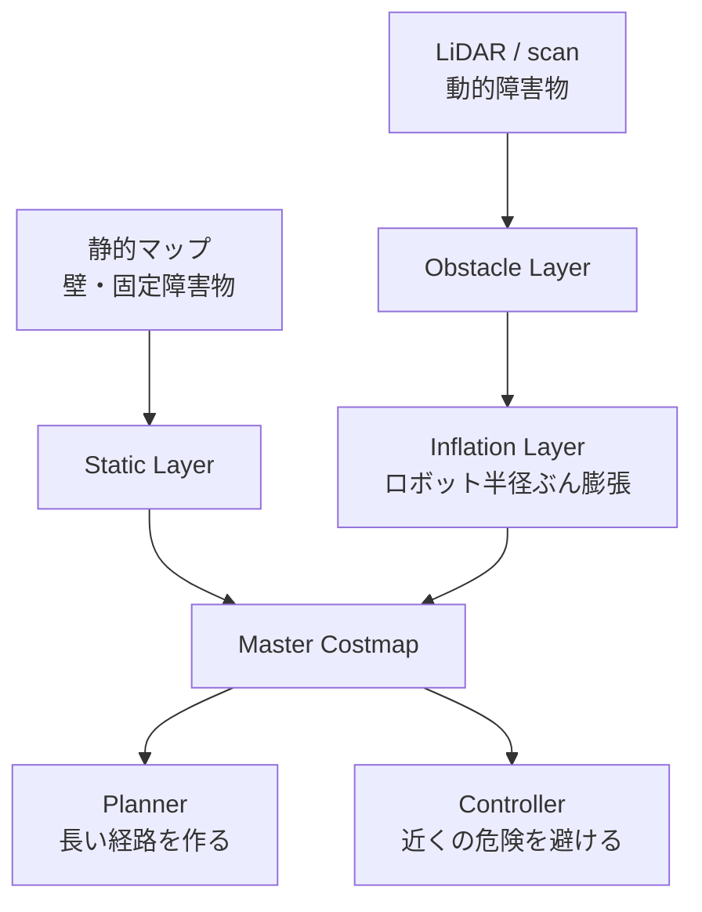

# チュートリアル 8: マップとコストマップ

## 学習目標

- `nav_msgs/OccupancyGrid` メッセージの構造とデータ形式を理解する
- 静的マップと動的コストマップの違いを説明できる
- 簡易マップパブリッシャーを実行して OccupancyGrid の仕組みを確認できる
- コストマップのレイヤー構造を理解する

---

## 図で見るマップとコストマップ



静的マップは「もともと知っている環境」、コストマップは「今走るための危険度マップ」です。障害物そのものだけでなく、ロボットの大きさを考慮して周囲にもコストを広げる点が重要です。

## OccupancyGrid とは

`nav_msgs/OccupancyGrid` は ROS 2 において 2D 地図を表現する標準メッセージ型です。Nav2 の全コンポーネントがこの型を使って地図情報をやり取りします。

### メッセージ構造

```
nav_msgs/OccupancyGrid
├── header
│   ├── stamp       # タイムスタンプ
│   └── frame_id    # 地図が属する座標フレーム（通常 "map"）
├── info (MapMetaData)
│   ├── resolution  # 1 セルのサイズ [m/cell]（例: 0.05 = 5cm）
│   ├── width       # 横方向のセル数
│   ├── height      # 縦方向のセル数
│   └── origin      # 地図左下隅の座標（Pose）
└── data[]          # int8 の 1 次元配列（width × height 個）
```

### data 配列の値の意味

| 値 | 意味 |
|----|------|
| `0` | 空き（Free）: ロボットが通行可能 |
| `100` | 障害物（Occupied）: ロボットが通行不可 |
| `-1` | 未知（Unknown）: センサが届いていない領域 |
| `1〜99` | コストマップでは中間値も使用（膨張領域等） |

### グリッド座標とワールド座標の関係

```
ワールド座標 (x, y) とグリッドインデックス (col, row) の変換:

  col = floor((x - origin.x) / resolution)
  row = floor((y - origin.y) / resolution)

  配列インデックス = row * width + col

例: resolution=0.1, width=20, origin=(-1.0, -1.0)
  座標 (0.5, 0.3) → col=15, row=13 → インデックス=13*20+15=275
```

---

## 静的マップとコストマップ

### 静的マップ（Static Map）

SLAM（Simultaneous Localization and Mapping）などで事前に生成した地図です。起動時に `map_server` がファイルから読み込み、`/map` トピックとして配信します。壁や固定された障害物の情報を含み、基本的に実行中は変化しません。

### コストマップ（Costmap）

静的マップにセンサ情報をリアルタイムで反映したものです。センサが検知した動的障害物（人・移動するものなど）を即座に反映できます。さらに「インフレーション（膨張）」処理によって、障害物の周囲にもコストを与えることでロボットのサイズを考慮した安全マージンを確保します。

### コストマップのレイヤー構造

```
┌─────────────────────────────┐
│    Master Costmap           │  ← 最終的なコスト値（プランナー・コントローラーが参照）
├─────────────────────────────┤
│    Inflation Layer          │  ← 障害物の膨張（ロボット半径分のマージンを付与）
├─────────────────────────────┤
│    Obstacle Layer           │  ← LiDAR 等のリアルタイム障害物
├─────────────────────────────┤
│    Static Layer             │  ← 静的マップ（SLAM 生成）
└─────────────────────────────┘
```

各レイヤーは独立したプラグインとして動作し、最終的に合成された Master Costmap が経路計画と経路追従に使われます。

### グローバルコストマップとローカルコストマップ

| 項目 | グローバルコストマップ | ローカルコストマップ |
|------|----------------------|-------------------|
| 範囲 | マップ全体 | ロボット周辺（例: 半径 3m） |
| 更新頻度 | 低頻度（経路計画時） | 高頻度（制御周期と同期） |
| 用途 | Planner Server が経路計画に使用 | Controller Server が速度制御に使用 |
| 動的障害物 | 反映が遅い | すぐに反映 |

---

## Step 1: simple_map_publisher を実行して OccupancyGrid を理解する

ソースファイル: `src/nav2_learning/nav2_learning/simple_map_publisher.py`

このノードは手動で定義した障害物マップを `OccupancyGrid` メッセージとして `/map` トピックに配信します。

```bash
# ターミナル 1: マップパブリッシャーを起動
ros2 run nav2_learning simple_map_publisher
```

別のターミナルでデータ構造を確認します:

```bash
# /map トピックのデータを 1 回受信して表示
ros2 topic echo /map --once
```

以下のような出力が得られます:

```
header:
  frame_id: map
info:
  resolution: 0.1
  width: 20
  height: 20
  origin:
    position:
      x: -1.0
      y: -1.0
data:
- 0
- 0
- 100
- 0
...
```

`data` 配列の値が `0`（空き）と `100`（障害物）で構成されていることを確認してください。

メッセージ型の定義を確認するには:

```bash
ros2 interface show nav_msgs/msg/OccupancyGrid
```

---

## Step 2: map_utils の座標変換を理解する

ソースファイル: `src/nav2_learning/nav2_learning/map_utils.py`

座標変換の関数を理解することで、ナビゲーションシステムがワールド座標とグリッド座標をどのように相互変換しているかがわかります。

### world_to_grid: ワールド座標 → グリッドインデックス

```python
def world_to_grid(x, y, origin_x, origin_y, resolution):
    """ワールド座標をグリッドのセル座標に変換する"""
    col = int((x - origin_x) / resolution)
    row = int((y - origin_y) / resolution)
    return col, row
```

### grid_to_world: グリッドインデックス → ワールド座標

```python
def grid_to_world(col, row, origin_x, origin_y, resolution):
    """グリッドのセル座標をワールド座標（セル中心）に変換する"""
    x = origin_x + (col + 0.5) * resolution
    y = origin_y + (row + 0.5) * resolution
    return x, y
```

### resolution の意味

`resolution` は 1 セルが何メートルに対応するかを示します。

| resolution 値 | 意味 |
|--------------|------|
| `0.05` | 1 セル = 5cm（Nav2 のデフォルト、精細） |
| `0.1` | 1 セル = 10cm（学習用サンプル） |
| `0.5` | 1 セル = 50cm（広域マップ用、粗い） |

`resolution` が小さいほど地図の精度は高くなりますが、セル数（= メモリ・計算量）が増えます。`width × height / resolution²` に比例して計算量が増加するため、実用システムではトレードオフが重要です。

---

## Step 3: RViz でマップを可視化する

RViz を使って OccupancyGrid を視覚的に確認しましょう。

```bash
# ターミナル 1: マップパブリッシャーを起動
ros2 run nav2_learning simple_map_publisher

# ターミナル 2: RViz を起動
rviz2
```

RViz の設定手順:

1. 左下の「Add」ボタンをクリック
2. 「By topic」タブから `/map` を選択して「Map」を追加
3. 「Fixed Frame」を `map` に設定

障害物セル（値 `100`）が暗色（黒または濃灰色）、空きセル（値 `0`）が明色（白または薄灰色）で表示されることを確認してください。

```bash
# コストマップを確認したい場合（costmap_monitor ノードを使用）
ros2 run nav2_learning costmap_monitor
```

ソースファイル: `src/nav2_learning/nav2_learning/costmap_monitor.py`

このノードはインフレーション処理を簡易的にシミュレートし、障害物周辺にコスト勾配を付加したコストマップを生成します。

---

## 既存パッケージでの応用

### ground_robot_sim の scan データとの関係

`ground_robot_sim` の `lidar_obstacle_avoid.py` は LiDAR の scan データを直接参照して障害物を検知しています:

```python
# lidar_obstacle_avoid.py での直接処理
def scan_callback(self, msg):
    min_dist = min(msg.ranges[i] for i in front_indices if not math.isnan(ranges[i]))
    if min_dist < self.safe_distance:
        # 障害物検知 → 回転
```

Nav2 の Obstacle Layer は同じ `/scan` データを受け取り、それをコストマップのセル値として格納します。コントローラーはコストマップのコスト値を参照するため、センサの生データを直接触りません。この分離により、センサ種別（LiDAR / カメラ / ソナー等）が変わってもコントローラーのコードを変更する必要がなくなります。

```
【カスタム実装】: scan → lidar_obstacle_avoid.py → cmd_vel
【Nav2】        : scan → Obstacle Layer → Costmap → Controller → cmd_vel
```

---

## 演習問題

### 演習 1: 障害物の配置を変更する

`simple_map_publisher.py` の障害物定義を変更して、別の形状の障害物を追加してみましょう:

```python
# 例: L 字型の障害物を追加
obstacles = [
    (5, 5), (5, 6), (5, 7), (5, 8),   # 縦のライン
    (6, 8), (7, 8), (8, 8),             # 横のライン
]
```

変更後にリビルドして、RViz でマップが更新されることを確認してください。

```bash
colcon build --packages-select nav2_learning
source install/setup.bash
ros2 run nav2_learning simple_map_publisher
```

### 演習 2: resolution を変更して比較する

`simple_map_publisher.py` の `resolution` パラメータを `0.05`（5cm）と `0.2`（20cm）に変えて、マップの外観がどう変化するかを RViz で確認しましょう。

- 同じ障害物でも `resolution` によってグリッド上の表現が変わります
- `ros2 topic echo /map --once` で `info.width` と `info.height` の値が変わることを確認してください

### 演習 3: 座標変換を手計算で確認する

以下の条件でワールド座標 `(0.85, 0.55)` がグリッドインデックスに変換されることを手計算で確認してください:

- `resolution = 0.1`
- `width = 20`
- `origin = (-1.0, -1.0)`

計算式: `col = floor((0.85 - (-1.0)) / 0.1)` = ?、`row = floor((0.55 - (-1.0)) / 0.1)` = ?

`map_utils.py` の `world_to_grid` 関数を呼んで検証してみましょう。
