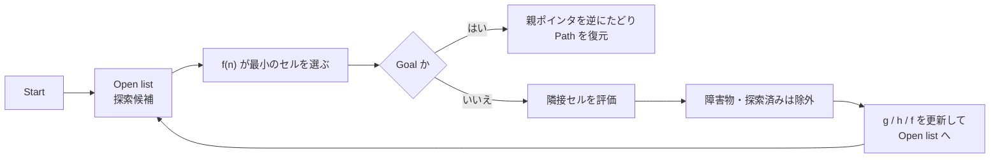

# チュートリアル 9: 経路計画

## 学習目標

- A* アルゴリズムの動作原理とヒューリスティック関数の役割を理解する
- OccupancyGrid 上で A* 経路計画を実行できる
- Nav2 の Planner Server（NavFn / Smac）と簡易実装の違いを説明できる

---

## 図で見る A* の探索



A* は「近そうな候補を勘で選ぶ」のではなく、`g(n)` と `h(n)` を足した `f(n)` が最小のセルを毎回選びます。Open list はこれから調べる候補、Closed list はすでに調べ終えたセルです。

## 経路計画とは

経路計画（Path Planning）とは、スタート地点からゴール地点まで障害物を回避した経路を自動的に生成する技術です。ロボットが自律移動するための前提となる能力であり、Nav2 では Planner Server がこの役割を担います。

良い経路計画アルゴリズムには以下の性質が求められます:

- **完全性**: 経路が存在する場合は必ず発見できる
- **最適性**: 最短または最低コストの経路を返す
- **効率性**: 広大な地図でも短時間で計算できる

---

## A* アルゴリズムの原理

A*（A-star）は最短経路探索の代表的なアルゴリズムです。ダイクストラ法にヒューリスティック関数を加えることで、ゴール方向に優先的に探索を進め、効率よく最短経路を発見できます。

### コスト関数

A* は各ノード `n` に対してコスト `f(n)` を計算し、コストが最小のノードから順に探索します:

```
f(n) = g(n) + h(n)
```

| 変数 | 意味 |
|------|------|
| `g(n)` | スタートから `n` までの実際の移動コスト（確定値） |
| `h(n)` | `n` からゴールまでの推定コスト（ヒューリスティック） |
| `f(n)` | 総合評価値（これを最小化するノードを優先探索） |

ヒューリスティック `h(n)` にはユークリッド距離（直線距離）がよく使われます:

```python
h(n) = sqrt((n.x - goal.x)^2 + (n.y - goal.y)^2)
```

`h(n)` が実際のコストを超えない（アドミッシブル）場合、A* は最適解を保証します。ユークリッド距離はグリッド上の実際の距離以下なので、アドミッシブルです。

### 8 方向移動とコスト

グリッドマップでは各セルから 8 方向（上下左右 + 斜め 4 方向）に移動できます:

```
┌───┬───┬───┐
│ ↖ │ ↑ │ ↗ │  斜め移動コスト: √2 ≈ 1.414
├───┼───┼───┤
│ ← │ ● │ → │  直線移動コスト: 1.0
├───┼───┼───┤
│ ↙ │ ↓ │ ↘ │
└───┴───┴───┘
```

斜め移動は直線移動の `√2` 倍のコストにすることで、ユークリッド的な最短経路に近い結果が得られます。

### アルゴリズムのステップ

```
1. スタートノードを Open リスト（探索候補）に追加
2. Open リストが空でない間、繰り返す:
   a. f(n) が最小のノードを Open リストから取り出す → Current
   b. Current がゴールなら経路を再構築して終了
   c. Current の隣接ノードを列挙する:
      - 障害物 → スキップ
      - すでに Closed リスト（探索済み）にある → スキップ
      - 新しい g コストが既存より小さい → Open リストに追加（更新）
   d. Current を Closed リストに移動
3. Open リストが空になったら経路なし
```

### 小さなグリッドでの例

```
S . . X .      S=スタート (0,0)
. X . . .      G=ゴール  (4,3)
. X . . .      X=障害物
. . * * G      *=計画された経路

A* の探索順序 (f 値が小さい順):
  (0,0): f=0+5.66=5.66  ← スタート
  (1,0): f=1+4.47=5.47
  (0,1): f=1+4.24=5.24
  ...
  最終経路: (0,0)→(0,1)→(0,2)→(1,3)→(2,3)→(3,3)→(4,3)
```

---

## OccupancyGrid 上での A*

OccupancyGrid のグリッドセルをグラフのノードとして扱うことで、2D マップ上で A* を実行できます。

### 障害物の判定

```python
# OccupancyGrid の data 値を使って障害物を判定
COST_THRESHOLD = 50  # この値以上を障害物とみなす

def is_obstacle(grid_data, col, row, width, threshold=COST_THRESHOLD):
    index = row * width + col
    value = grid_data[index]
    # value == -1 (unknown) も障害物として扱う
    return value > threshold or value == -1
```

### ヒューリスティック関数

```python
import math

def heuristic(col1, row1, col2, row2, resolution):
    """ユークリッド距離をヒューリスティックとして使用"""
    dx = (col2 - col1) * resolution
    dy = (row2 - row1) * resolution
    return math.sqrt(dx * dx + dy * dy)
```

### 経路の再構築

A* は各ノードに「親ノード」を記録します。ゴールから親をたどることで経路を再構築します:

```python
def reconstruct_path(came_from, current):
    """came_from 辞書を逆にたどって経路を再構築"""
    path = [current]
    while current in came_from:
        current = came_from[current]
        path.append(current)
    path.reverse()  # スタートからゴール順に並び替え
    return path
```

---

## Step 1: simple_path_planner を動かす

ソースファイル: `src/nav2_learning/nav2_learning/simple_path_planner.py`

このノードは A* アルゴリズムを実装し、`/map` トピックのマップ上でサービスコールによって経路計画を実行します。

```bash
# ターミナル 1: マップパブリッシャーを起動
ros2 run nav2_learning simple_map_publisher

# ターミナル 2: 経路計画ノードを起動
ros2 run nav2_learning simple_path_planner

# または Launch ファイルで一括起動
ros2 launch nav2_learning simple_planning_demo.launch.py
```

別のターミナルでサービスを呼び出して経路計画を実行します:

```bash
# スタート (0.0, 0.0) からゴール (0.8, 0.8) への経路を計画
ros2 service call /plan_path nav2_learning/srv/PlanPath \
  "{start: {x: 0.0, y: 0.0}, goal: {x: 0.8, y: 0.8}}"
```

計画された経路は `/plan` トピックとして配信されるため、RViz で確認できます:

```bash
# ターミナル 3: RViz で確認
rviz2
# Add → Path → /plan を追加
```

---

## Step 2: 経路計画のパラメータを変更する

`simple_path_planner` のパラメータを変更して、経路がどう変化するか観察しましょう。

### cost_threshold（障害物とみなすコスト閾値）

```bash
# 閾値を 30 に下げる（より敏感に障害物を検知）
ros2 param set /simple_path_planner cost_threshold 30

# 閾値を 80 に上げる（より大きなコストの障害物を通過しようとする）
ros2 param set /simple_path_planner cost_threshold 80
```

閾値を下げると、コストマップのインフレーション領域も障害物として扱い、より安全側の経路を生成します。

### diagonal_movement（斜め移動の許可）

```bash
# 斜め移動を禁止（上下左右 4 方向のみ）
ros2 param set /simple_path_planner diagonal_movement false
```

斜め移動を禁止すると経路は L 字型になりますが、計算は単純になります。

---

## Nav2 のプランナーとの比較

### NavFn プランナー

Dijkstra 法または A* をベースとした Nav2 の標準プランナーです。グローバルコストマップ全体を探索してゴールへの経路を計算します。インフレーション処理済みのコストマップを使うため、障害物のマージンを考慮した経路を自動的に生成します。

### Smac Planner

より高度な経路計画アルゴリズムを提供するプランナーです。3 種類のモードがあります:

| モード | 特徴 |
|--------|------|
| 2D A* | 高速なグリッドベース A*（`simple_path_planner` に近い） |
| Hybrid A* | ロボットの向きを考慮した非ホロノミックな経路計画 |
| State Lattice | 動力学的制約を考慮した経路計画 |

### 簡易実装 vs Nav2 プランナーの違い

| 項目 | simple_path_planner | Nav2（NavFn/Smac） |
|------|--------------------|--------------------|
| コストマップ考慮 | 障害物セルのみ | インフレーション込み |
| 動的リプランニング | なし | あり（BT で制御） |
| ロボット向き考慮 | なし | Smac Hybrid A* で可能 |
| スムージング | なし | Smoother Server で実行 |
| 実装規模 | 数百行 | 数千行（本格実装） |

---

## 既存パッケージでの応用

`ground_robot_sim` の `waypoint_follower.py` はあらかじめ定義されたウェイポイントリストを順番に追うだけで、障害物の位置に応じた経路計画は行っていません。

```python
# waypoint_follower.py（事前定義ウェイポイントをそのまま追う）
self.waypoints = [(1.0, 0.0), (1.0, 1.0), (0.0, 1.0), (0.0, 0.0)]
# ウェイポイント間のパスを生成する処理はない
# 途中に障害物があってもそのまま突き進もうとする
```

Nav2 の Planner Server を使うと、スタートとゴールを指定するだけで障害物を回避した経路を自動生成してくれます。経路上に動的障害物が現れた場合は BT Navigator が自動的に Planner を再呼び出し（リプランニング）します。

---

## 演習問題

### 演習 1: 障害物を追加して経路変化を確認する

`simple_map_publisher.py` に障害物を追加して、`simple_path_planner` がどう経路を変更するか確認しましょう:

```python
# 廊下を塞ぐ壁を追加
obstacles = [(10, i) for i in range(0, 15)]  # 縦方向の壁
```

同じスタート・ゴール座標で経路を計画し直して、迂回経路が生成されることを確認してください。

### 演習 2: ヒューリスティックの効果を観察する

`simple_path_planner.py` の `heuristic` 関数を以下のように変更して、探索効率の違いを観察しましょう:

```python
# ヒューリスティックを 0 にする（= Dijkstra 法と同等）
def heuristic(col1, row1, col2, row2, resolution):
    return 0.0
```

ログに出力される「探索ノード数」が増えることを確認してください。A* のヒューリスティックが探索効率を向上させることを体感できます。

### 演習 3: 経路の長さを計算する

計画された経路（`/plan` トピック）を受け取り、経路の総距離を計算するコードを書いてみましょう:

```python
# ヒント: Path メッセージの poses リストを使う
from nav_msgs.msg import Path

def calculate_path_length(path: Path) -> float:
    total = 0.0
    poses = path.poses
    for i in range(1, len(poses)):
        dx = poses[i].pose.position.x - poses[i-1].pose.position.x
        dy = poses[i].pose.position.y - poses[i-1].pose.position.y
        total += math.sqrt(dx**2 + dy**2)
    return total
```
