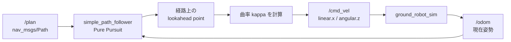

# チュートリアル 10: コントローラーと経路追従

## 学習目標

- Pure Pursuit アルゴリズムの動作原理とルックアヘッドの概念を理解する
- 計画された経路（`nav_msgs/Path`）に沿ってロボットを `cmd_vel` で制御できる
- `ground_robot_sim` の PID 制御と Pure Pursuit の違いを説明できる
- Nav2 のコントローラープラグイン（DWB / RPP / MPPI）との比較ができる

---

## 図で見る経路追従ループ



経路追従は一度だけ計算して終わりではありません。ロボットが動くたびに `/odom` が変わり、ルックアヘッドポイントも進むため、制御ノードは周期的に速度コマンドを再計算します。

## 経路追従制御とは

経路追従制御（Path Following Control）とは、Planner Server が生成した経路（`nav_msgs/Path`）に沿ってロボットを動かすための速度コマンド（`geometry_msgs/Twist`）を計算し続けるタスクです。Nav2 では Controller Server がこの役割を担います。

経路追従制御には以下の入力と出力があります:

```
入力:
  /plan          → nav_msgs/Path        (追従すべき経路)
  /odom          → nav_msgs/Odometry    (現在のロボット位置・速度)
  /local_costmap → nav_msgs/OccupancyGrid (周辺の障害物情報)

出力:
  /cmd_vel       → geometry_msgs/Twist  (速度コマンド)
```

---

## Pure Pursuit アルゴリズム

Pure Pursuit（純粋追跡）は、経路上の「ルックアヘッドポイント」を追いかけるという幾何学的なアプローチで経路追従を実現します。実装がシンプルでありながら、滑らかな曲線追従が可能です。

### ルックアヘッドの概念

```
パス: ──────●────────────────●── (ゴール)
            ↑
            │ lookahead_distance
            │
       ロボット ●→ heading
```

ロボットの現在位置から `lookahead_distance` 先のパス上の点（ルックアヘッドポイント）を目標として速度を計算します。ロボットが進むにつれてルックアヘッドポイントも経路に沿って前進します。

### アルゴリズムのステップ

```
1. 現在のロボット位置 (x_r, y_r) を取得
2. 経路上の全ウェイポイントを走査して、ロボットから
   lookahead_distance 以上離れた最初のポイントを探す
   → これが「ルックアヘッドポイント (x_l, y_l)」
3. ルックアヘッドポイントへの角度差 alpha を計算:
   alpha = atan2(y_l - y_r, x_l - x_r) - heading
4. 曲率 kappa を計算:
   kappa = 2 * sin(alpha) / lookahead_distance
5. 速度コマンドを生成:
   linear.x  = v (設定した線形速度)
   angular.z = v * kappa
```

### 計算式の詳細

```python
import math

def compute_cmd_vel(robot_x, robot_y, robot_heading,
                    lookahead_x, lookahead_y,
                    linear_velocity, lookahead_distance):
    """Pure Pursuit の速度コマンドを計算する"""

    # ルックアヘッドポイントへの角度差
    angle_to_target = math.atan2(
        lookahead_y - robot_y,
        lookahead_x - robot_x
    )
    alpha = angle_to_target - robot_heading

    # 角度を -pi〜pi に正規化
    alpha = math.atan2(math.sin(alpha), math.cos(alpha))

    # 曲率（カーバチャー）
    kappa = 2.0 * math.sin(alpha) / lookahead_distance

    # 速度コマンド
    linear  = linear_velocity
    angular = linear_velocity * kappa

    return linear, angular
```

---

## PID 制御との比較

`ground_robot_sim` の `waypoint_follower.py` は PID 制御でウェイポイント間を点から点へ移動します。Pure Pursuit はパス全体を連続的に追従します。

### waypoint_follower.py の PID 制御

```python
# waypoint_follower.py（地点間の PID 制御）
distance_error = sqrt((target_x - x)^2 + (target_y - y)^2)
heading_error  = atan2(target_y - y, target_x - x) - heading

# PID でそれぞれ独立に制御
linear  = Kp_linear  * distance_error
angular = Kp_angular * heading_error + Ki * integral + Kd * derivative
```

### 2 つのアプローチの違い

| 比較項目 | PID 制御（waypoint_follower） | Pure Pursuit（simple_path_follower） |
|----------|------------------------------|-------------------------------------|
| 追従対象 | 個々のウェイポイント（点） | パス全体（線） |
| 曲線追従 | 不得意（各点に向かって直進） | 得意（曲率を計算して滑らかに追従） |
| ゲイン調整 | Kp / Ki / Kd のチューニングが必要 | `lookahead_distance` のみ |
| 振動 | 小さい Kp → 遅い、大きい Kp → 振動 | 小さい lookahead → 振動 |
| 実装の複雑さ | やや複雑（積分・微分項） | シンプル（幾何学計算のみ） |
| 用途 | 点から点への移動 | パスに沿った連続移動 |

---

## Step 1: simple_path_follower を動かす

ソースファイル: `src/nav2_learning/nav2_learning/simple_path_follower.py`

このノードは `/plan` トピックの経路を受け取り、Pure Pursuit アルゴリズムで `/cmd_vel` を計算して配信します。

```bash
# ターミナル 1: マップパブリッシャーを起動
ros2 run nav2_learning simple_map_publisher

# ターミナル 2: 経路計画ノードを起動
ros2 run nav2_learning simple_path_planner

# ターミナル 3: 経路追従ノードを起動
ros2 run nav2_learning simple_path_follower
```

経路を計画してから追従を開始します:

```bash
# ターミナル 4: 経路を計画（自動的に /plan に配信される）
ros2 service call /plan_path nav2_learning/srv/PlanPath \
  "{start: {x: 0.0, y: 0.0}, goal: {x: 0.8, y: 0.8}}"
```

`/cmd_vel` の出力を確認します:

```bash
ros2 topic echo /cmd_vel
```

以下のような出力が確認できます:

```
linear:
  x: 0.2
angular:
  z: 0.15  ← 曲率に応じた角速度
```

---

## Step 2: lookahead_distance の影響を確認する

`lookahead_distance` の値を変えてロボットの追従挙動がどう変化するかを観察しましょう。

```bash
# lookahead_distance を小さくする（0.1m）→ 路上を細かく追従、振動しやすい
ros2 param set /simple_path_follower lookahead_distance 0.1

# lookahead_distance を大きくする（0.5m）→ 滑らか、コーナーを切りすぎる
ros2 param set /simple_path_follower lookahead_distance 0.5
```

| lookahead_distance | 特徴 |
|-------------------|------|
| 小さい（例: 0.1m） | パスを細かくトレース、急カーブに対応できる、振動しやすい |
| 適切（例: 0.2〜0.3m） | バランスのとれた追従 |
| 大きい（例: 0.5m+） | 滑らかな動き、コーナーを大きく外れる（ショートカット） |

---

## Nav2 のコントローラーとの比較

Nav2 は複数のコントローラープラグインを提供しています。それぞれの特徴を理解することで、用途に合ったプラグインを選択できます。

### DWB（Dynamic Window Based）

速度空間をサンプリングして、コストが最小の速度コマンドを選択するアプローチです。DWA（Dynamic Window Approach）の拡張版で、複数のコスト関数をプラグインとして組み合わせられます。

```
動作原理:
1. 現在の速度から実現可能な (v, w) の組み合わせをサンプリング
2. 各サンプルでロボットの軌跡をシミュレート
3. 各軌跡のコスト（経路からの距離、障害物との距離等）を計算
4. コスト最小の速度コマンドを選択
```

### RPP（Regulated Pure Pursuit）

Pure Pursuit をベースに、障害物への近接度に応じて速度を自動調整する拡張版です。`simple_path_follower` が実装した Pure Pursuit に最も近いアルゴリズムです。

```
拡張点:
- 障害物に近いほど速度を下げる（衝突リスクの低減）
- ゴール近くで速度を落とす（正確な停止）
- パスとの距離が大きい場合は角速度を上げて復帰
```

### MPPI（Model Predictive Path Integral）

確率論的モデル予測制御をベースにした最新のコントローラーです。多数のランダムなサンプル軌跡を並列評価し、コスト最小の制御入力を計算します。

```
特徴:
- GPU 並列計算で数千サンプルを評価可能
- 非線形ダイナミクスにも対応
- 最も滑らかで人間らしい動き
- 計算コストが高い（GPU 推奨）
```

### コントローラー選択の目安

| コントローラー | 推奨シーン |
|--------------|----------|
| DWB | 一般的なナビゲーション、バランス重視 |
| RPP | シンプルな環境、軽量なシステム |
| MPPI | 複雑な環境、高品質な動作が必要 |

---

## 既存パッケージでの応用

`ground_robot_sim` では 2 つのノードが連携して自律移動を実現しています:

- `waypoint_follower.py`: PID 制御でウェイポイント間を移動
- `lidar_obstacle_avoid.py`: LiDAR 検知時に経路追従を一時中断して回避

Nav2 の Controller Server はこの 2 つの機能を統合的に処理します。ローカルコストマップに動的障害物が反映されているため、コントローラーは経路追従をしながら自動的に障害物を回避できます。`cmd_vel` を送信するまでの処理がより洗練されています。

```
【ground_robot_sim のカスタム実装】:
  waypoint_follower → cmd_vel ─→ ロボット
  lidar_obstacle_avoid ─→ cmd_vel（上書き）

【Nav2】:
  経路 + ローカルコストマップ → Controller Server → cmd_vel → ロボット
  （障害物回避はコストマップ経由で統合される）
```

---

## 演習問題

### 演習 1: 複数の経路を比較する

同じスタート・ゴールで、`diagonal_movement = true` と `false` で計画した 2 つの経路を `simple_path_follower` で追従し、生成される `/cmd_vel` の違いを観察してみましょう:

```bash
# L 字経路（斜め移動なし）
ros2 param set /simple_path_planner diagonal_movement false
ros2 service call /plan_path nav2_learning/srv/PlanPath ...

# 斜め経路（斜め移動あり）
ros2 param set /simple_path_planner diagonal_movement true
ros2 service call /plan_path nav2_learning/srv/PlanPath ...
```

L 字経路と斜め経路で `angular.z` の変動がどう異なるかを確認してください。

### 演習 2: 速度制限を実装する

`simple_path_follower.py` に最大線形速度・最大角速度の制限を追加してみましょう:

```python
# ヒント: 計算後に速度をクランプする
MAX_LINEAR = 0.3   # m/s
MAX_ANGULAR = 1.0  # rad/s

linear  = max(-MAX_LINEAR,  min(MAX_LINEAR,  linear))
angular = max(-MAX_ANGULAR, min(MAX_ANGULAR, angular))
```

速度制限を変えてロボットの挙動がどう変わるか確認してください。

### 演習 3: ゴール到達判定を改善する

現在の `simple_path_follower.py` のゴール到達判定を確認し、より正確な判定に改善しましょう。

```python
# 現在の実装例（パスの最後のウェイポイントとの距離で判定）
goal_pose = path.poses[-1]
goal_x = goal_pose.pose.position.x
goal_y = goal_pose.pose.position.y
distance_to_goal = sqrt((robot_x - goal_x)**2 + (robot_y - goal_y)**2)

if distance_to_goal < goal_tolerance:
    # ゴール到達 → 停止
```

`goal_tolerance` パラメータを追加して、外部から調整できるようにしてみましょう。

> 💡 演習のヒントと解答例は [こちら](answers/10_answers.md) を参照してください。

---

## 確認チェックリスト

このチュートリアルを完了したら、以下の項目を順番に確認してください。

### チェック 1: simple_path_follower が起動できる

```bash
# ターミナル 1: マップパブリッシャー
ros2 run nav2_learning simple_map_publisher

# ターミナル 2: 経路計画ノード
ros2 run nav2_learning simple_path_planner

# ターミナル 3: 経路追従ノード
ros2 run nav2_learning simple_path_follower
```

```bash
# ノードが起動しているか確認
ros2 node list
```

期待される出力:

```
/simple_map_publisher
/simple_path_planner
/simple_path_follower
```

- [ ] `/simple_path_follower` ノードがリストに表示される

### チェック 2: 経路計画後に /cmd_vel が配信される

```bash
# ターミナル 4: cmd_vel を監視
ros2 topic echo /cmd_vel &

# ターミナル 5: 経路を計画
ros2 service call /plan_path nav2_learning/srv/PlanPath \
  "{start: {x: 0.0, y: 0.0}, goal: {x: 0.8, y: 0.8}}"
```

期待される出力（`/cmd_vel`）:

```yaml
linear:
  x: 0.2
  y: 0.0
  z: 0.0
angular:
  x: 0.0
  y: 0.0
  z: 0.15
```

- [ ] `/cmd_vel` に `linear.x > 0.0`（前進）が配信される
- [ ] 曲率に応じて `angular.z` が変化する

### チェック 3: lookahead_distance を変えて挙動の違いを確認できる

```bash
# 小さい lookahead（振動しやすい）
ros2 param set /simple_path_follower lookahead_distance 0.1

# 大きい lookahead（滑らか、コーナーでショートカット）
ros2 param set /simple_path_follower lookahead_distance 0.5
```

```bash
# パラメータが反映されたか確認
ros2 param get /simple_path_follower lookahead_distance
```

- [ ] `lookahead_distance = 0.1` のとき `angular.z` の変動が大きい（振動傾向）
- [ ] `lookahead_distance = 0.5` のとき `angular.z` の変動が小さい（滑らか）

### チェック 4: /cmd_vel トピックの配信周波数を確認できる

```bash
ros2 topic hz /cmd_vel
```

期待される出力:

```
average rate: 10.000
  min: 0.099s max: 0.101s std dev: 0.00100s window: 100
```

- [ ] 約 10 Hz（制御周期 0.1 秒）で配信されている

### チェック 5: linear_velocity パラメータを変更できる

```bash
# 速度を落とす
ros2 param set /simple_path_follower linear_velocity 0.1

# 速度を上げる
ros2 param set /simple_path_follower linear_velocity 0.4
```

```bash
# /cmd_vel の linear.x が変わったか確認
ros2 topic echo /cmd_vel --once
```

- [ ] `linear_velocity = 0.1` のとき `linear.x ≈ 0.1` になる
- [ ] `linear_velocity = 0.4` のとき `linear.x ≈ 0.4` になる

### 完了条件

上記チェックがすべて完了したら、このチュートリアルの学習目標を達成しています:

- [ ] Pure Pursuit の「ルックアヘッドポイント」の概念を説明できる
- [ ] 曲率 `kappa = 2*sin(alpha)/lookahead_distance` の意味を説明できる
- [ ] `lookahead_distance` が小さすぎると振動し、大きすぎるとショートカットする理由を説明できる
- [ ] `simple_path_follower` を起動して `/cmd_vel` の出力を確認できる

### トラブルシューティング

**`/cmd_vel` が配信されない場合**

```bash
# /plan トピックにデータが来ているか確認
ros2 topic echo /plan --once

# simple_path_follower が /plan を受信しているか確認
ros2 topic info /plan
# → Subscription count が 1 以上であることを確認
```

**`angular.z` が常に 0 の場合**

経路が直線で、ルックアヘッドポイントがロボットの正面方向にある場合は正常です。スタートとゴールを斜め方向に設定してみてください:

```bash
ros2 service call /plan_path nav2_learning/srv/PlanPath \
  "{start: {x: 0.0, y: 0.0}, goal: {x: 0.5, y: 0.8}}"
```

**経路計画後すぐに停止してしまう場合**

`simple_path_follower` のゴール到達判定が即座に成立している可能性があります。スタート座標とゴール座標が十分に離れているか確認してください。また `goal_tolerance` パラメータが正しく設定されているか確認してください:

```bash
ros2 param list /simple_path_follower
ros2 param get /simple_path_follower goal_tolerance
```
