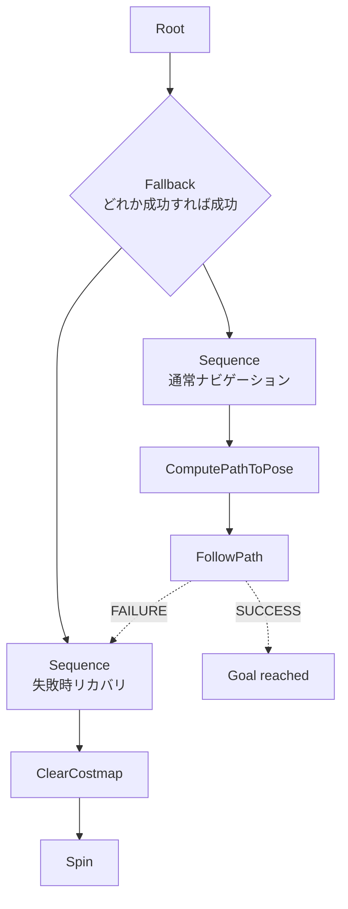

# チュートリアル 11: ビヘイビアツリー入門

## 学習目標

- ビヘイビアツリーの基本概念（Sequence、Fallback、Action、Condition）を理解する
- Nav2 の BT ノードの役割を説明できる
- BT を使ったナビゲーションタスクの構成（リプランニング・リカバリ）を理解する

---

## 図で見る BT の実行順序



BT は上から下へ「状態を持った手順」を評価します。Sequence は全て成功する必要があり、Fallback は左の候補が失敗したときに右の候補へ切り替わります。この性質でリカバリ処理を自然に表現できます。

## ビヘイビアツリーとは

ビヘイビアツリー（Behavior Tree: BT）は、ロボットや AI エージェントの行動を木構造で管理する手法です。もともとはゲーム AI（NPC の行動制御）で普及しましたが、その柔軟性とモジュール性の高さからロボティクスにも広く応用されています。Nav2 はビヘイビアツリーを使ってナビゲーション全体のシーケンスを制御します。

### FSM（有限状態マシン）との比較

従来のロボット行動制御には FSM（有限状態マシン）がよく使われてきました。

| 比較項目 | FSM（有限状態マシン） | ビヘイビアツリー |
|----------|---------------------|----------------|
| 構造 | 状態とその間の遷移 | ノードの木構造 |
| 拡張性 | 状態追加で遷移が爆発的に増える | サブツリーの追加で簡単に拡張 |
| モジュール性 | 低い（状態間の依存が強い） | 高い（サブツリーを再利用可能） |
| リカバリ | 手動で遷移を設計する必要がある | Fallback ノードで自然に表現できる |
| デバッグ | 状態変化のログを見る | ノードの SUCCESS/FAILURE を追う |
| 可読性 | シンプルなケースでは直感的 | 複雑なケースでも構造が明快 |

---

## BT の基本要素

BT を構成するノードには以下の種類があります。すべてのノードは実行結果として `SUCCESS`、`FAILURE`、`RUNNING`（実行中）の 3 つのいずれかを返します。

| ノード種類 | 記号 | 動作 |
|-----------|------|------|
| Sequence | `→` | 子ノードを左から順に実行。子が `FAILURE` を返したら即座に `FAILURE`。全子が `SUCCESS` なら `SUCCESS` |
| Fallback | `?` | 子ノードを左から順に実行。子が `SUCCESS` を返したら即座に `SUCCESS`。全子が `FAILURE` なら `FAILURE` |
| Action | `□` | 実際の動作を実行（例: 経路計画、移動コマンド送信） |
| Condition | `○` | 条件をチェック（例: ゴールに到達したか、障害物があるか） |
| Decorator | `◇` | 子ノードを 1 つ持ち、その結果を修飾（例: Retry は FAILURE を N 回リトライ） |

### Sequence と Fallback の動作例

```
Sequence →（「AかつB」を実現）
  ├── Action A  → SUCCESS
  └── Action B  → SUCCESS
  全体: SUCCESS

Sequence →（「AかつB」を実現）
  ├── Action A  → SUCCESS
  └── Action B  → FAILURE
  全体: FAILURE（A は成功しても B が失敗すれば全体失敗）

Fallback ?（「AまたはB」を実現）
  ├── Action A  → FAILURE
  └── Action B  → SUCCESS
  全体: SUCCESS（A が失敗しても B が成功すれば全体成功）
```

---

## BT の構造例

### シンプルなナビゲーション BT

```
Root
└── Sequence →
    ├── ComputePathToPose □    ← 経路計画
    ├── FollowPath □           ← 経路追従
    └── [SUCCESS]              ← ゴール到達
```

この BT は「経路計画して追従する」という最もシンプルな構成です。しかし、経路計画が失敗したりロボットがスタックしたりした場合のリカバリがありません。

### リカバリ付き BT

```
Root
└── Fallback ?
    ├── Sequence →
    │   ├── ComputePathToPose □    ← 経路計画
    │   └── FollowPath □           ← 経路追従
    └── Sequence →                 ← メインが失敗した場合のリカバリ
        ├── ClearCostmap □         ← コストマップのリセット
        └── Spin □                 ← その場で回転して周囲を確認
```

Fallback を使うことで「まずメインのナビゲーションを試みて、失敗したらリカバリを実行する」という構造を宣言的に記述できます。

### リプランニング付き BT（Nav2 のデフォルトに近い構造）

```
Root
└── Sequence →
    ├── RateController ◇ (1 Hz)       ← 1 秒ごとに子を再評価
    │   └── ComputePathToPose □        ← 定期的に経路を再計画
    └── Fallback ?
        ├── FollowPath □               ← 経路追従を試みる
        └── Sequence →                 ← 追従失敗時のリカバリ
            ├── ClearEntireCostmap □   ← コストマップ全体をクリア
            └── Spin □                 ← 回転してリカバリ
```

RateController デコレータが ComputePathToPose を定期的に再実行することで、動的障害物が現れた場合でも自動的に経路を再計算（リプランニング）します。

---

## Nav2 の BT ノード

Nav2 は多数の BT ノードをプラグインとして提供しています。主要なノードを以下に示します。

### Action ノード

| ノード名 | 機能 |
|---------|------|
| `NavigateToPose` | ゴール位置への移動全体を管理（BT 全体を起動） |
| `ComputePathToPose` | Planner Server を呼び出して経路を計算 |
| `FollowPath` | Controller Server を呼び出して経路を追従 |
| `ClearEntireCostmap` | コストマップ全体をリセット |
| `Spin` | ロボットをその場で回転（障害物検知の改善） |
| `BackUp` | 後退移動（前進できない場合のリカバリ） |
| `Wait` | 一定時間待機 |
| `SmoothPath` | Smoother Server を呼び出して経路をなめらかにする |

### Condition ノード

| ノード名 | チェック内容 |
|---------|------------|
| `GoalReached` | ゴールに到達したか（許容誤差以内か） |
| `IsStuck` | ロボットがスタックしているか |
| `IsBatteryLow` | バッテリー残量が閾値以下か |
| `DistanceTraveled` | 指定距離以上移動したか（リプランニングのトリガー） |
| `TimeExpired` | 指定時間が経過したか（タイムアウト） |

### Decorator ノード

| ノード名 | 機能 |
|---------|------|
| `RateController` | 子ノードを指定頻度で実行 |
| `Inverter` | 子の SUCCESS/FAILURE を反転 |
| `RetryUntilSuccessful` | 子が成功するまで最大 N 回リトライ |
| `ReactiveFallback` | 子を並列実行し、いずれかが SUCCESS なら全体 SUCCESS |

---

## Nav2 のデフォルト BT

Nav2 が標準で提供する `navigate_to_pose_w_replanning_and_recovery.xml` の構造を理解しましょう。このファイルは通常 `/opt/ros/jazzy/share/nav2_bt_navigator/behavior_trees/` に格納されています。

```bash
# デフォルト BT ファイルを確認
cat /opt/ros/jazzy/share/nav2_bt_navigator/behavior_trees/navigate_to_pose_w_replanning_and_recovery.xml
```

このデフォルト BT の主な特徴:

1. **リプランニング**: `DistanceTraveled` または `TimeExpired` をトリガーに定期的に経路を再計算
2. **リカバリシーケンス**: 経路計画・追従が失敗した場合、以下のリカバリを順番に試みる:
   - `ClearLocalCostmap` → 再試行
   - `ClearGlobalCostmap` → 再試行
   - `Spin` → 再試行
   - `BackUp` → 再試行
3. **タイムアウト**: 全体のナビゲーションにタイムアウトを設定し、無限ループを防止

---

## Step 1: BT の動作をトレースする

Nav2 が起動している状態で、BT のログを確認してみましょう。

```bash
# BT の実行ログをリアルタイムで表示
ros2 topic echo /behavior_tree_log
```

ナビゲーションを実行すると以下のようなログが流れます:

```
timestamp: ...
event_log:
- timestamp: ...
  node_name: ComputePathToPose
  node_status: RUNNING
- timestamp: ...
  node_name: ComputePathToPose
  node_status: SUCCESS
- timestamp: ...
  node_name: FollowPath
  node_status: RUNNING
```

各ノードの `RUNNING` → `SUCCESS` / `FAILURE` の遷移を追うことで、ナビゲーションのどのフェーズにいるかが分かります。

---

## Step 2: BT の概念を理解する演習

以下のシナリオを BT で設計してみましょう（コードは不要です）。

**シナリオ**: 倉庫ロボットが棚から商品を取り出してパッキングエリアまで運ぶ

```
考えるべき要素:
- 棚の位置へ移動する（ナビゲーション）
- アームを動かして商品を掴む（マニピュレーション）
- パッキングエリアへ移動する（ナビゲーション）
- 商品を置く（マニピュレーション）
- 途中で障害物があったらどうするか（リカバリ）
- アームが掴み損なったらどうするか（リカバリ）
```

Sequence と Fallback を組み合わせて、このシナリオを BT で表現してみてください。

---

## 既存パッケージとの比較

### ground_robot_sim: シンプルなステートマシン

`ground_robot_sim` の `navigate_waypoints_server.py` はシンプルなステートマシンとして実装されています:

```python
# navigate_waypoints_server.py（FSM 風の実装）
# 状態: idle → moving → arrived → next_waypoint → ...

if state == 'idle':
    if goal_received:
        state = 'moving'
        current_waypoint = 0

elif state == 'moving':
    if distance_to_waypoint < threshold:
        state = 'arrived'
    else:
        send_velocity_command()

elif state == 'arrived':
    current_waypoint += 1
    if current_waypoint >= len(waypoints):
        state = 'done'
    else:
        state = 'moving'
```

この実装はリカバリがなく、障害物で詰まったら永遠に移動コマンドを送り続けます。

### Nav2 の BT による同等機能の実現

同じタスクを Nav2 の BT で実現すると、リカバリが自然に組み込まれます:

```
Root
└── Sequence →
    ├── NavigateToWaypoint1 □   ← 各ウェイポイントを BT で管理
    ├── NavigateToWaypoint2 □
    └── NavigateToWaypoint3 □

各 NavigateToWaypointN は内部で:
└── Fallback ?
    ├── Sequence →（メイン）
    │   ├── ComputePathToPose □
    │   └── FollowPath □
    └── Recovery Sequence
        ├── Spin □
        └── ClearCostmap □
```

### drone_sim: BT で表現可能なパターン

`drone_sim` の `battery_monitor` + 緊急着陸ロジックも BT で表現できます:

```
Root
└── Fallback ?
    ├── Sequence →（通常飛行）
    │   ├── IsBatteryOK ○    ← 条件チェック
    │   └── ExecuteMission □  ← ミッション実行
    └── EmergencyLand □       ← バッテリー低下時の緊急着陸
```

`IsBatteryOK` 条件ノードが `FAILURE` を返すたびに、Fallback が `EmergencyLand` を実行する、という構造が BT によって自然に実現できます。

---

## 演習問題

### 演習 1: BT を設計する

以下のシナリオを Sequence と Fallback を使った BT として設計してください（ASCII アートで表現）:

**シナリオ**: 警備ロボットがエリアをパトロールする。障害物で通れなければ 3 回まで別経路を試みる。それでも失敗したら管理者に通知する。

- ヒント: `RetryUntilSuccessful` デコレータを使うと「最大 N 回リトライ」が表現できます
- ヒント: 管理者通知は `NotifyOperator` というアクションノードとして扱ってください

### 演習 2: FSM と BT を比較する

`ground_robot_sim` の `navigate_waypoints_server.py` の FSM 実装を読んで、以下の改造をしたい場合にどちらが簡単かを考えてください:

1. 「障害物を検知したら 3 秒待って再試行する」機能を追加する
2. 「バッテリーが 20% 以下になったら最寄りの充電ステーションへ移動する」機能を追加する

FSM での実装と BT での実装をスケッチして、どちらがより保守しやすいかを議論してください。

### 演習 3: Nav2 の BT ログを読む

Nav2 を起動してナビゲーションを実行し、`/behavior_tree_log` のログから以下の情報を読み取ってください:

```bash
ros2 topic echo /behavior_tree_log
```

- どのノードが最初に実行されるか
- 経路追従中、`ComputePathToPose` と `FollowPath` の状態はそれぞれどうなっているか
- ゴールに到達したとき、最後に `SUCCESS` を返すノードは何か

ログを読む練習をすることで、ナビゲーションの問題が発生したときのデバッグ力が大きく向上します。
