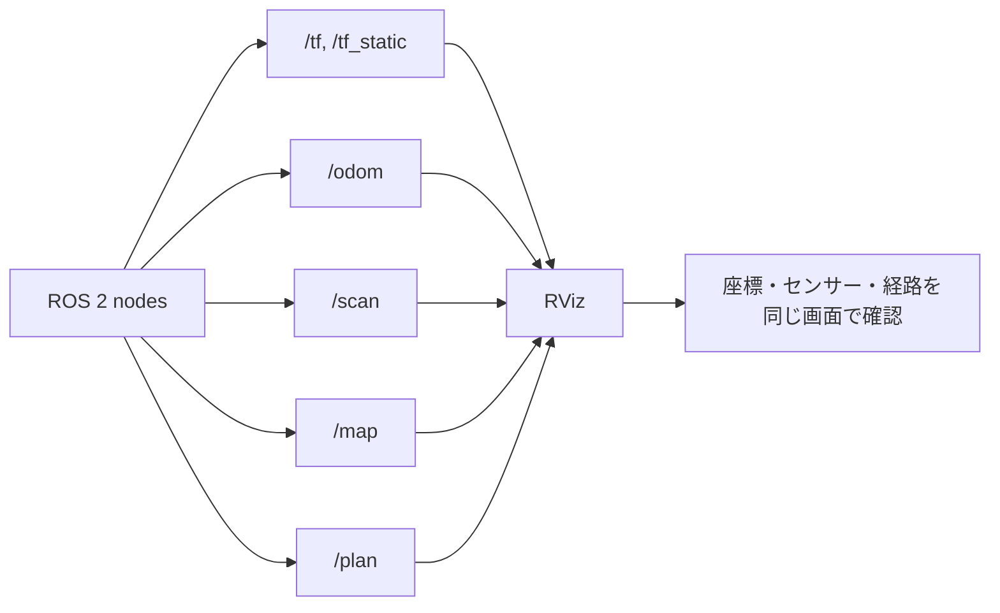

# チュートリアル 12: RViz 可視化

## 学習目標

- RViz で ROS 2 の topic と TF を可視化できる
- Fixed Frame と Display の関係を説明できる
- `/tf`, `/odom`, `/scan`, `/map`, `/plan` を目的に応じて表示できる
- 既存パッケージに同梱された RViz 設定を使ってデモを確認できる

---

## 図で見る RViz の役割



RViz はシミュレータではありません。既に publish されている topic と TF を読み取り、同じ座標系上に重ねて表示する可視化ツールです。何も表示されない場合は、RViz の設定だけでなく、対象 topic と TF が実際に流れているかも確認します。

---

## 前提準備

ワークスペースをビルドし、環境を読み込みます。

```bash
source /opt/ros/jazzy/setup.bash
cd Ros2Sample
colcon build --packages-select \
  ground_robot_sim \
  drone_sim \
  manipulator_sim \
  nav2_learning \
  ros2_learning
source install/setup.bash
```

RViz を単体で起動する場合:

```bash
rviz2
```

同梱設定を指定して起動する場合:

```bash
rviz2 -d install/ground_robot_sim/share/ground_robot_sim/rviz/ground_robot.rviz
rviz2 -d install/drone_sim/share/drone_sim/rviz/drone_sim.rviz
rviz2 -d install/nav2_learning/share/nav2_learning/rviz/nav2_learning.rviz
```

> `install/.../rviz/*.rviz` が見つからない場合は、対象パッケージをビルドしてから `source install/setup.bash` を実行してください。

---

## RViz の基本操作

### Fixed Frame を設定する

RViz の左側にある `Global Options` の `Fixed Frame` は、表示全体の基準フレームです。表示したいデータの `frame_id` や TF ツリーに合わせて設定します。

| 見たい対象 | 推奨 Fixed Frame | 理由 |
| --- | --- | --- |
| 地上ロボットの `/odom`, `/scan` | `odom` | `ground_robot_sim` は `odom -> base_link -> base_scan` を publish する |
| ドローンの `/odom`, `/pose`, `/imu` | `odom` | `drone_sim` の位置情報が `odom` 基準 |
| マニピュレータの TF | `base_link` | アームのリンク構造を本体基準で見やすい |
| Nav2 学習用の `/map`, `/plan` | `map` | OccupancyGrid と経路が `map` 基準 |
| TF チュートリアル | `world` | `ros2_learning` の TF デモは `world` を親フレームにする |

Fixed Frame が存在しない、または TF がつながっていない場合、Display は赤や黄色のエラーになります。

### Display を追加する

RViz 左下の `Add` から Display を追加します。

| Display | 対象 topic | 用途 |
| --- | --- | --- |
| `TF` | `/tf`, `/tf_static` | フレームツリーと座標軸を表示 |
| `Odometry` | `/odom` | ロボット位置と向きを表示 |
| `LaserScan` | `/scan` | LiDAR 風データを点群として表示 |
| `Map` | `/map` | OccupancyGrid を表示 |
| `Path` | `/plan` | 計画された経路を表示 |
| `RobotModel` | `/robot_description` | URDF モデルを表示 |
| `Pose` | `/pose` | ドローンなどの姿勢を矢印で表示 |

---

## Step 1: TF を表示する

TF チュートリアルのデモを起動します。

```bash
ros2 launch ros2_learning tf_demo.launch.py
```

別ターミナルで RViz を起動します。

```bash
rviz2
```

RViz で次を設定します。

1. `Global Options` の `Fixed Frame` を `world` にする
2. `Add` から `TF` を追加する
3. `learning_robot` と `sensor_frame` が表示されることを確認する

CLI でも TF を確認できます。

```bash
ros2 run tf2_tools view_frames
ros2 run tf2_ros tf2_echo world learning_robot
ros2 run tf2_ros tf2_echo learning_robot sensor_frame
```

期待する見え方:

- `world` を中心に `learning_robot` が円軌道を動く
- `sensor_frame` は `learning_robot` に固定されて動く
- `sensor_frame` だけが離れて動く場合は、親子関係か Fixed Frame を確認する

---

## Step 2: 地上ロボットの `/odom` と `/scan` を表示する

地上ロボットの LiDAR 停止デモを起動します。

```bash
ros2 launch ground_robot_sim lidar_obstacle_stop.launch.py
```

同梱 RViz 設定で起動します。

```bash
rviz2 -d install/ground_robot_sim/share/ground_robot_sim/rviz/ground_robot.rviz
```

手動で設定する場合:

1. `Fixed Frame` を `odom` にする
2. `TF` を追加する
3. `Odometry` を追加し、Topic を `/odom` にする
4. `LaserScan` を追加し、Topic を `/scan` にする

確認コマンド:

```bash
ros2 topic list
ros2 topic echo /odom --once
ros2 topic echo /scan --once
ros2 topic hz /scan
```

期待する見え方:

- `base_link` と `base_scan` の TF が見える
- `/odom` の矢印がロボットの現在姿勢を示す
- `/scan` が前方 180 度の点群として表示される

複数ロボット launch を使う場合は、topic と TF frame に namespace が付く点に注意します。

```bash
ros2 launch ground_robot_sim multi_robot.launch.py
ros2 topic list
```

例: `/robot1/odom`, `/robot1/scan`

---

## Step 3: ドローンの姿勢と TF を表示する

単機 waypoint デモを起動します。

```bash
ros2 launch drone_sim single_quad_waypoint.launch.py
```

同梱 RViz 設定で起動します。

```bash
rviz2 -d install/drone_sim/share/drone_sim/rviz/drone_sim.rviz
```

手動で設定する場合:

1. `Fixed Frame` を `odom` にする
2. `TF` を追加する
3. `Odometry` を追加し、Topic を `/odom` にする
4. `Pose` を追加し、Topic を `/pose` にする

確認コマンド:

```bash
ros2 topic echo /odom --once
ros2 topic echo /pose --once
ros2 topic echo /imu --once
```

期待する見え方:

- ドローンの `base_link` が `odom` 上で移動する
- `/pose` の矢印が waypoint に向かって変化する
- `/imu` は RViz 表示より CLI で値を確認する方が分かりやすい

---

## Step 4: マニピュレータの JointState と TF を表示する

平面到達デモを起動します。

```bash
ros2 launch manipulator_sim planar_reach_demo.launch.py
```

RViz を起動し、次を設定します。

1. `Fixed Frame` を `base_link` にする
2. `TF` を追加する
3. 必要に応じて `Pose` を追加し、Topic を `/tool_pose` にする

確認コマンド:

```bash
ros2 topic echo /joint_states --once
ros2 topic echo /tool_pose --once
ros2 run tf2_ros tf2_echo base_link tool0
```

期待する見え方:

- `base_link -> link1 -> tool0` の TF チェーンが見える
- `tool0` がターゲットに向かって滑らかに動く
- `tool_pose` はエンドエフェクタ位置の確認に使う

---

## Step 5: `/map` と `/plan` を表示する

Nav2 学習用の簡易 planning デモを起動します。

```bash
ros2 launch nav2_learning simple_planning_demo.launch.py
```

同梱 RViz 設定で起動します。

```bash
rviz2 -d install/nav2_learning/share/nav2_learning/rviz/nav2_learning.rviz
```

手動で設定する場合:

1. `Fixed Frame` を `map` にする
2. `Map` を追加し、Topic を `/map` にする
3. `Path` を追加し、Topic を `/plan` にする
4. 必要に応じて `Pose` を追加し、Topic を `/goal_pose` にする

経路を生成します。

```bash
ros2 service call /simple_path_planner/plan_path std_srvs/srv/Trigger
```

確認コマンド:

```bash
ros2 topic echo /map --once
ros2 topic echo /plan --once
ros2 service list
ros2 service type /simple_path_planner/plan_path
```

期待する見え方:

- `/map` が OccupancyGrid として表示される
- `/plan` が障害物を避ける線として表示される
- `/plan` が表示されない場合は、service call が成功したか、Path Display の Topic が `/plan` かを確認する

---

## よくある表示トラブル

| 症状 | よくある原因 | 確認コマンド / 対処 |
| --- | --- | --- |
| RViz に何も表示されない | Fixed Frame が topic の frame とつながっていない | `ros2 run tf2_tools view_frames`、Fixed Frame を `odom` / `map` / `world` に変更 |
| Display が赤い | topic が存在しない、型が違う | `ros2 topic list`, `ros2 topic info /topic_name` |
| TF は見えるが scan が見えない | LaserScan の Topic が違う | `ros2 topic list | grep scan` |
| `/map` が真っ黒または空 | Map Display の Topic / Color Scheme 設定が違う | `ros2 topic echo /map --once` |
| `/plan` が出ない | 経路計画 service を呼んでいない | `ros2 service call /plan_path ...` |
| 同梱 `.rviz` が開けない | 対象パッケージをビルドしていない | `colcon build --packages-select <package>` |

---

## まとめ

RViz では、まず Fixed Frame、次に Display の Topic、最後に実際の topic / TF の有無を確認します。CLI でデータが流れていることを確認してから RViz の表示設定を見ると、原因を切り分けやすくなります。
