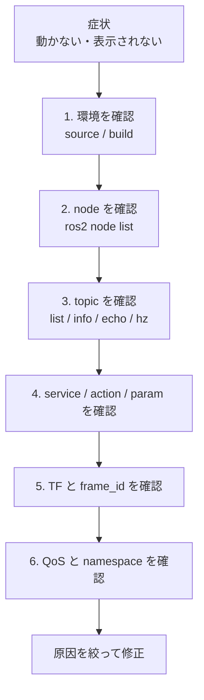

# チュートリアル 13: ROS 2 デバッグ入門

## 学習目標

- ROS 2 システムの状態を CLI で調査できる
- node / topic / service / action / parameter の問題を切り分けられる
- `rqt_graph` でノード間の接続を把握できる
- QoS mismatch や TF 不整合など、初学者が詰まりやすい症状を調べられる

---

## 図で見るデバッグの順番



ROS 2 のデバッグは、いきなりコードを読むよりも「存在するか」「接続しているか」「データが流れているか」を順番に確認する方が速いです。この章では、各段階で使うコマンドと見方を整理します。

---

## まず確認すること

新しいターミナルを開いた直後は、ROS 2 とワークスペースの環境を読み込んでください。

```bash
source /opt/ros/jazzy/setup.bash
cd Ros2Sample
source install/setup.bash
```

パッケージが見つかるか確認します。

```bash
ros2 pkg list | grep ros2_learning
ros2 pkg list | grep ground_robot_sim
ros2 pkg executables ros2_learning
```

`Package not found` や `No executable found` が出る場合は、対象パッケージをビルドしているか、`source install/setup.bash` を実行したかを確認します。

```bash
colcon build --packages-select ros2_learning sample_interfaces
source install/setup.bash
```

---

## node を調べる

### ノード一覧を見る

```bash
ros2 node list
```

例: Publisher/Subscriber デモを起動した状態

```bash
ros2 launch ros2_learning pubsub_demo.launch.py
ros2 node list
```

期待例:

```text
/minimal_publisher
/minimal_subscriber
```

### ノードの詳細を見る

```bash
ros2 node info /minimal_publisher
ros2 node info /minimal_subscriber
```

見るポイント:

| 項目 | 意味 |
| --- | --- |
| Publishers | そのノードが publish している topic |
| Subscribers | そのノードが subscribe している topic |
| Service Servers | そのノードが提供する service |
| Service Clients | そのノードが呼び出す service |
| Action Servers / Clients | action の提供・呼び出し |

ノードが一覧に出ない場合は、launch / run コマンドが失敗していないか、別ターミナルのログを確認します。

---

## topic を調べる

### topic 一覧を見る

```bash
ros2 topic list
```

型付きで一覧を見る場合:

```bash
ros2 topic list -t
```

### topic の接続情報を見る

```bash
ros2 topic info /chatter
ros2 topic info /odom
ros2 topic info /scan
```

Publisher count と Subscription count が期待通りか確認します。`/chatter` に Publisher はいるが Subscriber がいない場合、受信側ノードが起動していません。

### メッセージを 1 回だけ見る

```bash
ros2 topic echo /chatter --once
ros2 topic echo /odom --once
ros2 topic echo /scan --once
```

大量に流れる topic は `--once` を付けると確認しやすくなります。

### 周期を測る

```bash
ros2 topic hz /chatter
ros2 topic hz /scan
```

見るポイント:

- 期待周期に近いか
- 極端に遅くないか
- 表示が止まらないか

### 型を確認する

```bash
ros2 topic type /chatter
ros2 interface show std_msgs/msg/String
ros2 interface show nav_msgs/msg/Odometry
```

Publisher と Subscriber は topic 名だけでなく型も一致している必要があります。

---

## service を調べる

### service 一覧を見る

```bash
ros2 service list
```

地上ロボットを起動した状態では、緊急停止 service を確認できます。

```bash
ros2 run ground_robot_sim ground_robot_node
ros2 service list | grep emergency
```

期待例:

```text
/emergency_stop
/reset_emergency
```

### service の型を確認する

```bash
ros2 service type /emergency_stop
ros2 interface show std_srvs/srv/Trigger
```

### service を呼び出す

```bash
ros2 service call /emergency_stop std_srvs/srv/Trigger
ros2 service call /reset_emergency std_srvs/srv/Trigger
```

`The passed service type is invalid` が出る場合は、service 名と型の組み合わせが間違っています。

---

## action を調べる

### action 一覧を見る

NavigateWaypoints の action server を含むデモを起動します。

```bash
ros2 launch ground_robot_sim navigate_waypoints.launch.py
```

別ターミナルで action を確認します。

```bash
ros2 action list
```

### action の型を確認する

```bash
ros2 action info /navigate_waypoints
ros2 interface show sample_interfaces/action/NavigateWaypoints
```

### action goal を送る

action は長時間タスク向けなので、feedback と result を見ながら確認します。

```bash
ros2 action send_goal /navigate_waypoints sample_interfaces/action/NavigateWaypoints \
  "{waypoints: [
    {header: {frame_id: odom}, pose: {position: {x: 0.5, y: 0.0, z: 0.0}, orientation: {w: 1.0}}},
    {header: {frame_id: odom}, pose: {position: {x: 0.5, y: 0.5, z: 0.0}, orientation: {w: 1.0}}}
  ], loop: false, tolerance_m: 0.15}" \
  --feedback
```

goal が受け付けられない場合は、action server が起動しているか、action 型が一致しているかを確認します。

---

## parameter を調べる

### パラメータ一覧を見る

```bash
ros2 run ros2_learning parameter_demo
ros2 param list /parameter_demo
```

### 値を見る

```bash
ros2 param get /parameter_demo robot_name
ros2 param get /parameter_demo max_speed
```

### 実行中に値を変える

```bash
ros2 param set /parameter_demo max_speed 2.0
ros2 param set /parameter_demo enable_logging false
```

変更が反映されない場合は、対象ノードが `add_on_set_parameters_callback` を実装しているか、値の型が正しいかを確認します。

---

## TF を調べる

TF がつながっていないと、RViz では topic が流れていても表示できないことがあります。

### TF ツリーを出力する

```bash
ros2 launch ros2_learning tf_demo.launch.py
ros2 run tf2_tools view_frames
```

`frames.pdf` が生成され、TF ツリーを確認できます。

### 2 つのフレーム間の変換を見る

```bash
ros2 run tf2_ros tf2_echo world learning_robot
ros2 run tf2_ros tf2_echo learning_robot sensor_frame
```

地上ロボットの場合:

```bash
ros2 run tf2_ros tf2_echo odom base_link
ros2 run tf2_ros tf2_echo base_link base_scan
```

見るポイント:

- 親フレームと子フレームの名前が期待通りか
- 時刻が更新されているか
- RViz の Fixed Frame とつながっているか

---

## rqt_graph で接続を見る

`rqt_graph` はノードと topic の接続関係を図で確認できるツールです。

```bash
rqt_graph
```

見るポイント:

- publish 側と subscribe 側が同じ topic につながっているか
- namespace が想定通りか
- 不要なノードが残っていないか

例: `ros2_learning pubsub_demo` では、`minimal_publisher -> /chatter -> minimal_subscriber` の流れが見えるはずです。

---

## QoS mismatch を疑う

topic 名と型が合っていても、QoS が合わないと通信できない場合があります。特にセンサーデータでは `BEST_EFFORT` と `RELIABLE` の違いに注意します。

### topic info で QoS を見る

```bash
ros2 topic info /scan --verbose
ros2 topic info /map --verbose
```

見るポイント:

| QoS 項目 | 確認すること |
| --- | --- |
| Reliability | `RELIABLE` と `BEST_EFFORT` が期待通りか |
| Durability | `/map` など後参加で受けたい topic は `TRANSIENT_LOCAL` が必要な場合がある |
| History / Depth | 高頻度 topic で depth が小さすぎないか |

QoS が原因の場合、ノード側の QoS profile を合わせる必要があります。CLI の `ros2 topic echo` でも、必要に応じて QoS オプションを指定します。

```bash
ros2 topic echo /scan --qos-reliability best_effort
```

---

## namespace を確認する

複数ロボットや swarm では topic 名に namespace が付きます。

```bash
ros2 launch ground_robot_sim multi_robot.launch.py
ros2 topic list
```

例:

```text
/robot1/odom
/robot1/scan
/robot1/cmd_vel
/robot2/odom
/robot2/scan
```

`/odom` を echo して何も出ない場合でも、実際には `/robot1/odom` に流れていることがあります。

```bash
ros2 topic echo /robot1/odom --once
ros2 topic info /robot1/cmd_vel
```

---

## よくある症状別の調査手順

| 症状 | 最初に見るコマンド | 次に見るポイント |
| --- | --- | --- |
| パッケージが見つからない | `ros2 pkg list | grep <name>` | `colcon build` と `source install/setup.bash` |
| 実行ファイルが見つからない | `ros2 pkg executables <package>` | `setup.py` の `entry_points` |
| topic が流れない | `ros2 topic list -t` | ノード起動、topic 名、型 |
| Subscriber が受信しない | `ros2 topic info /topic --verbose` | Publisher count、Subscription count、QoS |
| service が呼べない | `ros2 service list`, `ros2 service type /name` | service 名と型 |
| action が見つからない | `ros2 action list` | action server の起動 |
| RViz に表示されない | `ros2 topic echo --once`, `tf2_echo` | Fixed Frame、TF、Display の Topic |
| TF エラーが出る | `view_frames`, `tf2_echo` | frame 名、親子関係、時刻 |

---

## デバッグの実例

### `/chatter` が表示されない

1. ノードがいるか確認する

```bash
ros2 node list
```

2. topic があるか確認する

```bash
ros2 topic list -t
```

3. 接続数を見る

```bash
ros2 topic info /chatter
```

4. メッセージを直接見る

```bash
ros2 topic echo /chatter --once
```

この順番で、Publisher がいないのか、Subscriber がいないのか、topic 名が違うのかを切り分けます。

### RViz で `/scan` が見えない

1. topic が流れているか確認する

```bash
ros2 topic echo /scan --once
```

2. `frame_id` を確認する

```bash
ros2 topic echo /scan --once
```

3. TF がつながるか確認する

```bash
ros2 run tf2_ros tf2_echo odom base_scan
```

4. RViz の Fixed Frame と LaserScan Display の Topic を確認する

Fixed Frame が `odom`、LaserScan の Topic が `/scan` になっていれば表示できるはずです。

---

## まとめ

ROS 2 の問題は、環境、node、topic、service/action、parameter、TF、QoS、namespace のどこかに分解できます。まず CLI で実体を確認し、最後に RViz やコードを見ます。この順番を守ると、原因を短時間で絞り込めます。
