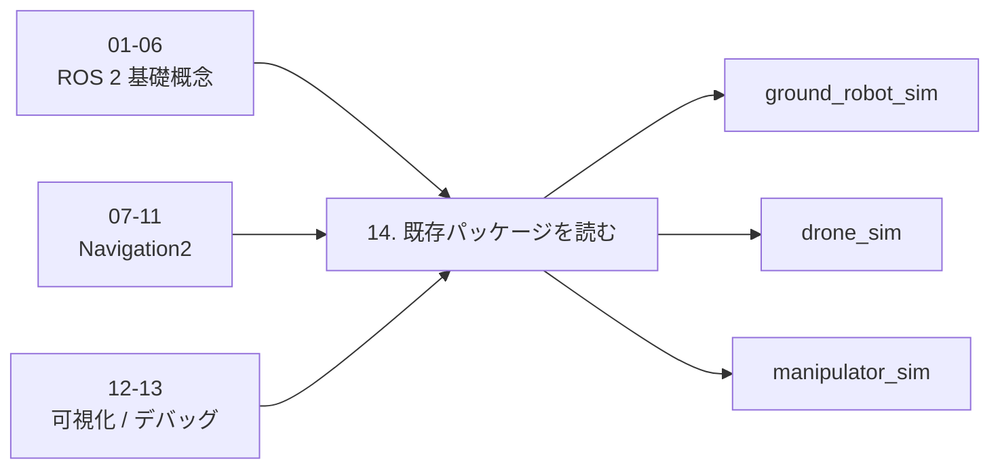
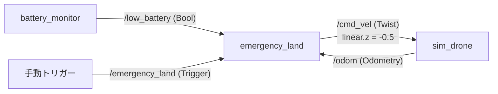

# チュートリアル 14: 既存パッケージを読み解く

## 学習目標

- シミュレーションパッケージのソースコードを起点に ROS 2 の実装パターンを読み取れる
- 各パッケージが使っている topic / service / action / TF を CLI で確認できる
- チュートリアル 01〜13 で学んだ概念が実コードのどこに現れるかを結びつけられる

---

## この章の位置づけ

チュートリアル 01〜06 では `ros2_learning` パッケージの最小サンプルで ROS 2 の基礎概念を学びました。07〜11 では Navigation2 の仕組みを理解し、12〜13 では可視化とデバッグの実践を扱いました。

この章では、それらの概念が **実際のシミュレーションパッケージでどう使われているか** を読み解きます。「コードを書く」のではなく「コードを読んで CLI で確認する」ことが中心です。



---

## 準備

シミュレーションパッケージをビルドしてから進めてください。

```bash
source /opt/ros/jazzy/setup.bash
cd Ros2Sample
colcon build --packages-select \
  sample_interfaces \
  ground_robot_sim \
  drone_sim \
  manipulator_sim
source install/setup.bash
```

---

## 1. ground_robot_sim を読む

### どのファイルから読むか

| 順番 | ファイル | 概要 |
|------|---------|------|
| 1 | `ground_robot_node.py` | シミュレータ本体。topic / service / TF の起点 |
| 2 | `navigate_waypoints_server.py` | アクションサーバーの実装 |
| 3 | `waypoint_follower.py` | PID ウェイポイント追従のデモノード |
| 4 | `lidar_obstacle_avoid.py` | scan を subscribe して回避コマンドを publish |
| 5 | `pid.py` / `geometry.py` | ユーティリティ（PID 制御・角度正規化・レイキャスト） |

### Topic の読み方

`ground_robot_node.py` を開くと、`__init__` で以下の publisher / subscriber が作られています。

```python
# Publisher（65-67行目）
self.odom_publisher = self.create_publisher(Odometry, 'odom', 10)
self.scan_publisher = self.create_publisher(LaserScan, 'scan', 10)
self.status_pub = self.create_publisher(RobotStatus, 'robot_status', 10)

# Subscriber（69行目）
self.create_subscription(Twist, 'cmd_vel', self.cmd_vel_callback, 10)
```

CLI で確認してみましょう。

```bash
# ターミナル 1: シミュレータ起動
ros2 run ground_robot_sim ground_robot_node

# ターミナル 2: topic 一覧
ros2 topic list
# /cmd_vel
# /odom
# /robot_status
# /scan

# topic の型を確認
ros2 topic info /odom
# Type: nav_msgs/msg/Odometry
# Publisher count: 1
# Subscription count: 0

# Odometry データを表示
ros2 topic echo /odom --once
```

> **読み方のポイント**: `create_publisher` の第 1 引数がメッセージ型、第 2 引数が topic 名です。QoS はここでは `10`（キューサイズ）で、デフォルトの Reliable / Volatile が使われています。

### Service の読み方

同じく `__init__` の 70〜72 行目にサービスが定義されています。

```python
self.create_service(Trigger, 'emergency_stop', self._emergency_stop_callback)
self.create_service(Trigger, 'reset_emergency', self._reset_emergency_callback)
self.create_service(GetRobotStatus, 'get_robot_status', self._get_status_callback)
```

CLI で確認します。

```bash
# サービス一覧
ros2 service list
# /emergency_stop
# /get_robot_status
# /reset_emergency

# サービスの型を確認
ros2 service type /emergency_stop
# std_srvs/srv/Trigger

# 緊急停止を呼び出す
ros2 service call /emergency_stop std_srvs/srv/Trigger

# 状態を確認
ros2 service call /get_robot_status sample_interfaces/srv/GetRobotStatus
```

コールバックの `_emergency_stop_callback`（83〜92 行目）を読むと、`_emergency_stopped` フラグを `True` にして速度をゼロにしていることがわかります。`cmd_vel_callback`（105 行目）はこのフラグが立っているときに入力を無視します。

### Action の読み方

`navigate_waypoints_server.py` がアクションサーバーの実装です。

```python
# ActionServer の作成（41-48行目）
self._action_server = ActionServer(
    self,
    NavigateWaypoints,
    'navigate_waypoints',
    execute_callback=self._execute_callback,
    goal_callback=self._goal_callback,
    cancel_callback=self._cancel_callback,
)
```

CLI で確認します。

```bash
# ターミナル 1: シミュレータ + アクションサーバー起動
ros2 launch ground_robot_sim navigate_waypoints.launch.py

# ターミナル 2: アクション一覧
ros2 action list
# /navigate_waypoints

# アクションの型を確認
ros2 action info /navigate_waypoints --type
# Action: sample_interfaces/action/NavigateWaypoints
```

`_execute_callback`（66 行目以降）の流れを追うと、アクションの典型的なパターンが見えます。

1. `goal_handle.request` からゴール（ウェイポイントリスト）を取得
2. ループで距離を計算し、PID 制御で `cmd_vel` を publish
3. `goal_handle.publish_feedback()` で進捗を通知
4. 全 waypoint 到達後に `goal_handle.succeed()` で結果を返す
5. キャンセル時は `goal_handle.canceled()` で中断

### TF の読み方

`ground_robot_node.py` の `update_state` メソッド（149 行目以降）で TF がブロードキャストされています。

```python
# odom → base_link（176-186行目）
transform = TransformStamped()
transform.header.frame_id = self.odom_frame      # 'odom'
transform.child_frame_id = self.base_frame        # 'base_link'
# ... translation と rotation を設定 ...
self.tf_broadcaster.sendTransform(transform)

# base_link → base_scan（188-195行目）
laser_transform = TransformStamped()
laser_transform.header.frame_id = self.base_frame   # 'base_link'
laser_transform.child_frame_id = self.laser_frame    # 'base_scan'
laser_transform.transform.translation.x = 0.18       # センサーのオフセット
```

```bash
# TF ツリーを確認
ros2 run tf2_tools view_frames

# 特定フレーム間の変換を確認
ros2 run tf2_ros tf2_echo odom base_link
```

TF チェーンは `odom → base_link → base_scan` の 2 段階です。`base_scan` はレーザーセンサーの取り付け位置（前方 0.18m、上方 0.12m）を表しています。

---

## 2. drone_sim を読む

### どのファイルから読むか

| 順番 | ファイル | 概要 |
|------|---------|------|
| 1 | `sim_drone.py` | シミュレータ本体。3D 運動モデルと状態配信 |
| 2 | `waypoint_commander.py` | 3D ウェイポイント指令ノード |
| 3 | `battery_monitor.py` | 電力消費シミュレーション |
| 4 | `emergency_land.py` | バッテリー低下時の自動降下 |
| 5 | `geofence_monitor.py` | 飛行範囲の監視と補正 |
| 6 | `wind_disturbance.py` | 風外乱の生成 |

### Waypoint の読み方

`sim_drone.py` と `waypoint_commander.py` の 2 ファイルが連携しています。

**waypoint_commander.py** は `setpoint_pose` topic に `PoseStamped` を publish します。

```python
# 42行目
self.setpoint_pub = self.create_publisher(PoseStamped, 'setpoint_pose', 10)
```

**sim_drone.py** はこれを subscribe し、目標位置への P 制御で `cmd_vel` を内部生成します。

```python
# 80行目
self.create_subscription(PoseStamped, 'setpoint_pose', self._on_setpoint_pose, 10)
```

`_desired_twist` メソッド（148 行目）で、`setpoint_pose` が有効なら目標位置との差分に `position_kp` を掛けた速度指令を生成しています。`cmd_vel` が直接来た場合はそちらが使われます（優先度: setpoint_pose > cmd_vel）。

```bash
# ターミナル 1: waypoint デモ起動
ros2 launch drone_sim single_quad_waypoint.launch.py

# ターミナル 2: setpoint を確認
ros2 topic echo /setpoint_pose

# odom でドローンの位置を確認
ros2 topic echo /odom --field pose.pose.position
```

### Battery の読み方

**battery_monitor.py** は電力消費をシミュレートする独立ノードです。

```python
# Publisher（33-34行目）
self._battery_pub = self.create_publisher(BatteryState, 'battery', 10)
self._low_battery_pub = self.create_publisher(Bool, 'low_battery', 10)

# Subscriber（35行目）
self.create_subscription(Twist, 'cmd_vel', self._on_cmd_vel, 10)
```

消費モデル（`_tick` メソッド、53 行目以降）を読むと:

1. `cmd_vel` からスロットル推定値を算出（`_on_cmd_vel`）
2. `idle_power_w + throttle * motor_power_w` で消費電力を計算
3. 残量が `critical_pct`（デフォルト 15%）を下回ると `low_battery` に `True` を publish

**sim_drone.py** は `battery` topic を subscribe して残量を内部に反映します（122 行目）。

```bash
# バッテリーデモ起動
ros2 launch drone_sim battery_demo.launch.py

# バッテリー状態を監視
ros2 topic echo /battery --field percentage
ros2 topic echo /low_battery
```

### Emergency Landing の読み方

**emergency_land.py** はバッテリー低下時に安全に着陸するノードです。

```python
# Subscriber（27-28行目）
self.create_subscription(Bool, 'low_battery', self._on_low_battery, 10)
self.create_subscription(Odometry, 'odom', self._on_odom, 10)

# Service（29行目）
self.create_service(Trigger, 'emergency_land', self._on_trigger)

# Publisher（26行目）
self._cmd_pub = self.create_publisher(Twist, 'cmd_vel', 10)
```

ノード間のデータフローは以下の通りです。



1. `low_battery` が `True` になると `_landing` フラグが立つ
2. `_tick` で高度 > 0.05m なら `cmd_vel.linear.z = -descent_speed` を publish
3. 高度 ≤ 0.05m になると着陸完了

```bash
# バッテリーデモで緊急着陸を観察
ros2 launch drone_sim battery_demo.launch.py

# または手動でトリガー
ros2 service call /emergency_land std_srvs/srv/Trigger
```

### drone_sim の TF

`sim_drone.py` の `_publish_state` メソッド（211 行目以降）で `odom → base_link` の 3D 変換がブロードキャストされます。ground_robot_sim と異なり、z 軸（高度）の変位を含みます。

---

## 3. manipulator_sim を読む

### どのファイルから読むか

| 順番 | ファイル | 概要 |
|------|---------|------|
| 1 | `manipulator_simulator.py` | シミュレータ本体。JointState / TF / tool_pose を配信 |
| 2 | `target_commander.py` | 関節目標角度の指令ノード |
| 3 | `ik_target_commander.py` | 逆運動学による Cartesian 指令 |
| 4 | `kinematics.py` / `inverse_kinematics.py` | 順運動学・逆運動学のユーティリティ |

### JointState の読み方

`manipulator_simulator.py` の `_publish_joint_state`（87 行目）を見ます。

```python
msg = JointState()
msg.header.stamp = stamp
msg.name = list(self.joint_names)          # ['joint1', 'joint2']
msg.position = list(self.current_joint_positions)  # 現在の関節角度 [rad]
self._joint_pub.publish(msg)
```

`_on_joint_target`（65 行目）で目標角度を受け取り、`_tick`（73 行目）で速度制限付きで追従しています。

```bash
# ターミナル 1: デモ起動
ros2 launch manipulator_sim planar_reach_demo.launch.py

# ターミナル 2: 関節状態を確認
ros2 topic echo /joint_states

# 目標角度を手動で指定
ros2 topic pub /joint_target sensor_msgs/msg/JointState \
  "{name: ['joint1', 'joint2'], position: [0.5, -0.3]}" --once
```

> **読み方のポイント**: `JointState.name` と `JointState.position` は同じインデックスで対応しています。`_on_joint_target` では名前ベースのルックアップで正しい関節にマッピングしています。

### TF の読み方

`_publish_tf`（110 行目）でキネマティックチェーンがブロードキャストされます。

```
base_link → link1     : joint1 の回転（原点に固定、yaw = theta1）
link1     → tool0     : joint2 の回転（link1 の先端、x 方向に l1 オフセット）
```

```bash
# TF チェーンを確認
ros2 run tf2_ros tf2_echo base_link tool0

# 各リンクの変換を個別に確認
ros2 run tf2_ros tf2_echo base_link link1
ros2 run tf2_ros tf2_echo link1 tool0
```

ground_robot_sim・drone_sim の TF が「ロボット全体の位置」を表すのに対し、manipulator_sim の TF は「関節で繋がったリンクの姿勢」を表します。

### Tool Pose の読み方

`_publish_tool_pose`（94 行目）では、順運動学で手先位置を計算して `PoseStamped` として publish しています。

```python
x, y = forward_kinematics(theta1, theta2, l1, l2)
# x = l1 * cos(theta1) + l2 * cos(theta1 + theta2)
# y = l1 * sin(theta1) + l2 * sin(theta1 + theta2)
```

```bash
# 手先位置を確認
ros2 topic echo /tool_pose --field pose.position

# TF と tool_pose が一致していることを確認
ros2 run tf2_ros tf2_echo base_link tool0
```

`tool_pose` は TF の `base_link → tool0` と同じ情報ですが、topic として publish することで TF を使わずに手先位置を取得できます。

---

## チュートリアル対応表

各パッケージの実装が、どのチュートリアルで学んだ概念に対応するかの一覧です。

| チュートリアル | 概念 | ground_robot_sim | drone_sim | manipulator_sim |
|---------------|------|-----------------|-----------|-----------------|
| [01 Publisher/Subscriber](01_publisher_subscriber.md) | topic 通信 | `odom`, `scan`, `cmd_vel` の Pub/Sub | `odom`, `pose`, `imu`, `cmd_vel`, `setpoint_pose` の Pub/Sub | `joint_states`, `tool_pose`, `joint_target` の Pub/Sub |
| [02 サービスとアクション](02_service_action.md) | Service | `emergency_stop`, `get_robot_status` | `get_robot_status` | ― |
| [02 サービスとアクション](02_service_action.md) | Action | `navigate_waypoints` (NavigateWaypoints) | ― | ― |
| [03 Launch とパラメータ](03_launch_params.md) | パラメータ | `wheel_base`, `max_linear_speed`, `obstacles` 等 | `mass_kg`, `position_kp`, `max_linear_speed` 等 | `link_lengths`, `max_joint_speed`, `joint_names` 等 |
| [03 Launch とパラメータ](03_launch_params.md) | Launch ファイル | `diff_drive_patrol.launch.py` 等 7 ファイル | `single_quad_waypoint.launch.py` 等 6 ファイル | `planar_reach_demo.launch.py` 等 2 ファイル |
| [04 TF と座標変換](04_tf_transforms.md) | TF broadcast | `odom→base_link→base_scan` | `odom→base_link`（3D） | `base_link→link1→tool0` |
| [05 カスタムインターフェース](05_custom_interfaces.md) | カスタム msg/srv/action | `RobotStatus`, `GetRobotStatus`, `NavigateWaypoints` | `RobotStatus`, `GetRobotStatus` | ― |
| [06 ライフサイクルと QoS](06_lifecycle_qos.md) | QoS | デフォルト QoS（キューサイズ 10） | デフォルト QoS（キューサイズ 10） | デフォルト QoS（キューサイズ 10） |
| [07-10 Navigation2](07_nav2_overview.md) | 経路追従 | `waypoint_follower.py` の PID 制御 | `waypoint_commander.py` の到達判定 | ― |
| [11 ビヘイビアツリー](11_behavior_tree.md) | 状態遷移 | emergency_stop によるモード切替 | low_battery → emergency_land の連鎖 | ― |
| [12 RViz 可視化](12_rviz_visualization.md) | 可視化 | `rviz/ground_robot.rviz` | `rviz/drone_sim.rviz` | ― |
| [13 デバッグ](13_debugging_ros2_systems.md) | CLI 調査 | `ros2 node info`, `ros2 topic echo` 等 | `ros2 service call`, `ros2 topic hz` 等 | `ros2 run tf2_ros tf2_echo` 等 |

---

## パッケージ横断の比較

### Publisher / Subscriber パターンの比較

| パッケージ | センサー出力 | コマンド入力 | 状態出力 |
|-----------|-------------|-------------|---------|
| ground_robot_sim | `scan` (LaserScan) | `cmd_vel` (Twist) | `odom` (Odometry), `robot_status` |
| drone_sim | `imu` (Imu) | `cmd_vel` (Twist), `setpoint_pose` (PoseStamped) | `odom` (Odometry), `pose`, `battery` |
| manipulator_sim | ― | `joint_target` (JointState) | `joint_states` (JointState), `tool_pose` |

3 パッケージとも「コマンドを subscribe → 状態を更新 → センサーデータを publish」という共通パターンに従っています。

### TF チェーンの比較

```text
ground_robot_sim:  odom → base_link → base_scan
drone_sim:         odom → base_link
manipulator_sim:   base_link → link1 → tool0
```

- **ground_robot_sim** と **drone_sim** は「世界座標系でのロボット位置」を表す
- **manipulator_sim** は「関節で繋がったリンクの姿勢チェーン」を表す

---

## 次のステップ

- コードのパラメータ値を変えて動作の違いを確認する（例: `max_linear_speed` を大きくする）
- `ros2 topic hz` で各 topic の周期を計測し、`publish_rate` パラメータとの関係を確認する
- `drone_sim` の `battery_demo.launch.py` でバッテリー消費から緊急着陸までの一連のフローを観察する
- 独自のデモノードを追加して、既存パッケージの topic に接続してみる
