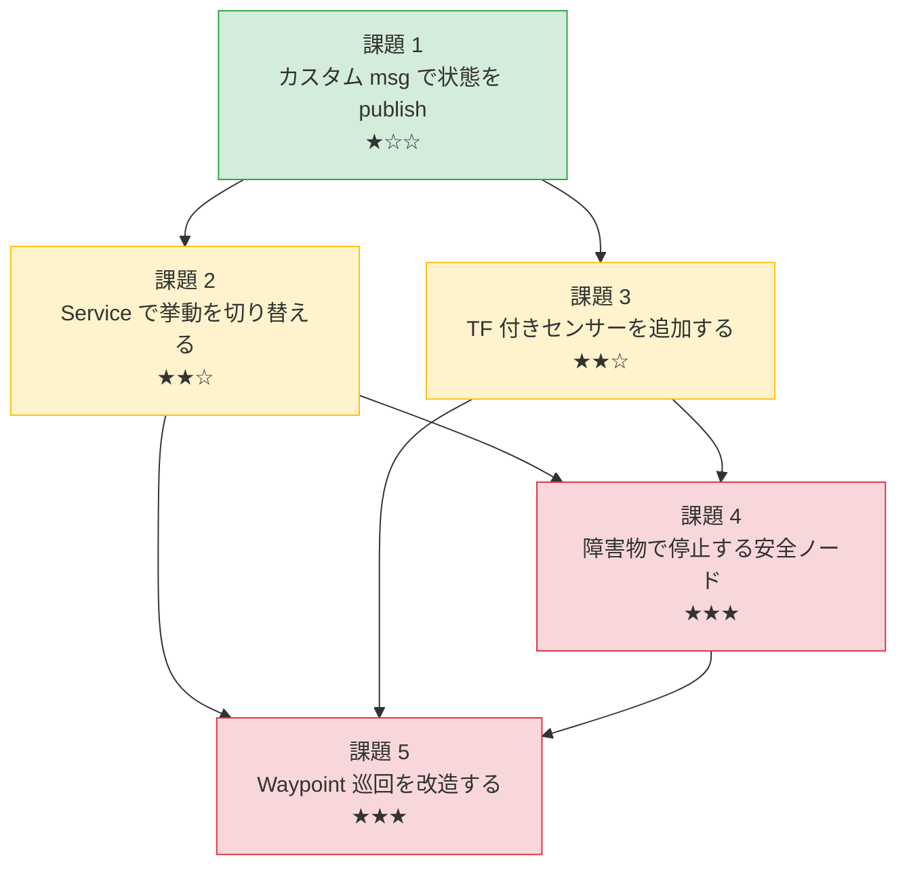

# チュートリアル 15: ミニ課題プロジェクト集

これまでのチュートリアルで学んだ概念を組み合わせて、実践的なミニ課題に取り組みます。
各課題は「読んで理解する」から「自分で組み立てる」へと移行するための橋渡しです。

---

## 学習目標

- 複数のチュートリアルで習得した知識を組み合わせて、動くコードを自力で作れるようになる
- 既存のサンプルコードを「読んで理解する」だけでなく「改造・拡張する」経験を積む
- `ros2` コマンドラインツールを使って自分のノードの動作を検証できるようになる
- ROS 2 開発における典型的なパターン（Pub/Sub、Service、TF、パラメータ）を実感として掴む

---

## 課題の全体マップ



課題 1 を起点に、課題 2・3 を並行して進め、その知識を統合して課題 4・5 に挑むことを推奨します。

---

## 課題 1: カスタム msg を追加して状態を publish する（難易度: ★☆☆）

### 目的

独自のメッセージ型を自分で定義し、それを publish/subscribe するノードを作ることで、
「型定義 → ビルド → 通信確認」という ROS 2 開発の基本サイクルを体験します。

### 使うチュートリアル章

- [1. Publisher と Subscriber](01_publisher_subscriber.md) — トピック通信の基礎
- [5. カスタムインターフェース](05_custom_interfaces.md) — 独自メッセージ型の定義方法

### 変更対象ファイル

| 種別 | パス |
|------|------|
| 新規 msg 定義 | `src/sample_interfaces/msg/SensorReading.msg`（名前は自由） |
| 参考: 既存 msg | `src/sample_interfaces/msg/RobotStatus.msg` |
| 新規 publisher | `src/ros2_learning/ros2_learning/sensor_publisher.py` |
| 新規 subscriber | `src/ros2_learning/ros2_learning/sensor_subscriber.py` |

### 実装のヒント

**ステップ 1: msg ファイルを作る**

`src/sample_interfaces/msg/` に新しい `.msg` ファイルを作成します。
`RobotStatus.msg` を参考に、最低限 `std_msgs/Header` と数値フィールドを 1〜2 個持たせましょう。

```
# SensorReading.msg の例
std_msgs/Header header
string sensor_name
float64 value
string unit
```

**ステップ 2: CMakeLists.txt に追記する**

`src/sample_interfaces/CMakeLists.txt` の `rosidl_generate_interfaces` ブロックに
新しい msg ファイル名を追加します。

**ステップ 3: パッケージをビルドする**

```bash
cd ~/Ros2Sample
colcon build --packages-select sample_interfaces
source install/setup.bash
```

**ステップ 4: publisher ノードを作る**

`src/ros2_learning/ros2_learning/minimal_publisher.py` を参考にしながら、
`std_msgs/String` の代わりに自作の msg 型を import して publish します。

```python
from sample_interfaces.msg import SensorReading
```

**ステップ 5: subscriber ノードを作る**

`src/ros2_learning/ros2_learning/minimal_subscriber.py` を参考に、
受信した値をログに出力するだけのシンプルな subscriber を作ります。

### 確認コマンド

```bash
# msg 型の定義を確認する
ros2 interface show sample_interfaces/msg/SensorReading

# publisher を起動する（別ターミナルで）
ros2 run ros2_learning sensor_publisher

# トピックの内容を確認する
ros2 topic echo /sensor_reading

# トピックの型と配信レートを確認する
ros2 topic info /sensor_reading
ros2 topic hz /sensor_reading
```

### 発展課題

- `header.stamp` に現在時刻を正しく設定し、subscriber 側で受信遅延（現在時刻 − タイムスタンプ）を計算して表示する
- `publish_rate_hz` パラメータを追加して起動時に周波数を変更できるようにする
- 複数種類のセンサー値を 1 つの msg にまとめ、複数のフィールドを持つ msg を設計する

---

## 課題 2: Service で挙動を切り替える（難易度: ★★☆）

### 目的

サービスコールで Publisher の「動作モード」を実行中に切り替えられるノードを作ることで、
Service を「設定変更の手段」として活用するパターンを習得します。

### 使うチュートリアル章

- [2. サービスとアクション](02_service_action.md) — リクエスト/レスポンス型通信
- [3. Launch ファイルとパラメータ](03_launch_params.md) — ノード管理と設定

### 変更対象ファイル

| 種別 | パス |
|------|------|
| 参考: publisher | `src/ros2_learning/ros2_learning/minimal_publisher.py` |
| 参考: service server | `src/ros2_learning/ros2_learning/minimal_service_server.py` |
| 新規ノード | `src/ros2_learning/ros2_learning/mode_publisher.py` |

### 実装のヒント

**ステップ 1: 動作モードを決める**

例えば次の 2 モードを実装してみましょう。

- `"slow"` モード: 1 Hz でメッセージを publish する
- `"fast"` モード: 5 Hz でメッセージを publish する

**ステップ 2: ノードの骨格を作る**

1 つのノードの中に Publisher とサービスサーバーを同時に持たせます。

```python
from std_srvs.srv import SetBool  # True=fast, False=slow

class ModePublisher(Node):
    def __init__(self):
        super().__init__('mode_publisher')
        self._mode = 'slow'
        self._publisher = self.create_publisher(String, 'chatter', 10)
        self._service = self.create_service(
            SetBool, 'set_fast_mode', self._mode_callback
        )
        self._timer = self.create_timer(1.0, self._publish)
```

**ステップ 3: モード切替のコールバックを実装する**

サービスコールバック内でタイマーをキャンセルして新しい周期で作り直すことで、
publish レートを動的に変更できます。

```python
def _mode_callback(self, request, response):
    if request.data:
        self._mode = 'fast'
        new_period = 0.2  # 5 Hz
    else:
        self._mode = 'slow'
        new_period = 1.0  # 1 Hz
    self._timer.cancel()
    self._timer = self.create_timer(new_period, self._publish)
    response.success = True
    response.message = f'Mode changed to {self._mode}'
    return response
```

**ステップ 4: Launch ファイルも作る**

`src/ros2_learning/launch/` に Launch ファイルを作り、
ノード名やデフォルトモードをパラメータとして渡せるようにします。

### 確認コマンド

```bash
# ノードを起動する
ros2 run ros2_learning mode_publisher

# 別ターミナルでトピックを監視する
ros2 topic echo /chatter

# fast モードに切り替える（True を送る）
ros2 service call /set_fast_mode std_srvs/srv/SetBool "{data: true}"

# slow モードに戻す
ros2 service call /set_fast_mode std_srvs/srv/SetBool "{data: false}"

# publish レートの変化を確認する
ros2 topic hz /chatter
```

### 発展課題

- `"stop"` モードを追加し、publish を完全に停止できるようにする
- 独自の srv ファイル（`SetMode.srv`）を作り、モード名を文字列で受け取れるようにする
- モード変更のたびに `std_msgs/String` のトピックでイベントログを publish する

---

## 課題 3: TF 付きセンサーを 1 つ追加する（難易度: ★★☆）

### 目的

既存の TF デモを拡張して新しいセンサーフレームを追加し、
そのフレーム基準でデータを publish することで、
TF ツリーとトピック通信の組み合わせを体験します。

### 使うチュートリアル章

- [4. TF と座標変換](04_tf_transforms.md) — フレーム間の位置関係
- [1. Publisher と Subscriber](01_publisher_subscriber.md) — トピック通信の基礎

### 変更対象ファイル

| 種別 | パス |
|------|------|
| 参考・拡張元 | `src/ros2_learning/ros2_learning/tf_broadcaster_demo.py` |
| 参考: listener | `src/ros2_learning/ros2_learning/tf_listener_demo.py` |
| 新規ノード | `src/ros2_learning/ros2_learning/sensor_tf_publisher.py` |

### 実装のヒント

**ステップ 1: 現在の TF ツリーを把握する**

`tf_broadcaster_demo.py` が配信しているフレーム構成を確認します。

```
world
└─ learning_robot  (動的: 円軌道を移動)
   └─ sensor_frame (静的: Z 軸方向に 0.1m オフセット)
```

**ステップ 2: 新しいセンサーフレームを追加する**

`tf_broadcaster_demo.py` を参考に、`StaticTransformBroadcaster` を使って
`learning_robot` の前方（X 軸方向）に `front_sensor` フレームを追加します。

```python
# front_sensor: ロボット前方 0.2m に取り付けられた前方センサー
msg.header.frame_id = 'learning_robot'
msg.child_frame_id = 'front_sensor'
msg.transform.translation.x = 0.2  # 前方 0.2m
msg.transform.translation.y = 0.0
msg.transform.translation.z = 0.05
```

**ステップ 3: そのフレームからデータを publish する**

センサーデータ（例: `sensor_msgs/Range` や課題 1 で作った `SensorReading`）を publish する際、
`header.frame_id` に `'front_sensor'` を設定します。

```python
from sensor_msgs.msg import Range

msg = Range()
msg.header.stamp = self.get_clock().now().to_msg()
msg.header.frame_id = 'front_sensor'   # どのフレームのデータか
msg.range = 1.5  # 擬似的な距離値
self._range_publisher.publish(msg)
```

**ステップ 4: RViz で確認する**

RViz を起動して TF ツリーと Range 表示を追加すると、フレームが正しく配置されているか
視覚的に確認できます（チュートリアル 12 参照）。

### 確認コマンド

```bash
# TF ツリーをグラフ出力する（frames.pdf が生成される）
ros2 run tf2_tools view_frames

# 特定フレーム間の変換を確認する
ros2 run tf2_ros tf2_echo world front_sensor

# センサーデータトピックを確認する
ros2 topic echo /front_range

# TF ツリーの現在の状態をターミナルで確認する
ros2 topic echo /tf_static --once
```

### 発展課題

- `tf_listener_demo.py` を参考に、`front_sensor` フレームの world 座標系における絶対位置を
  ログに出力するリスナーノードを追加する
- センサーフレームの取り付け位置（オフセット値）をパラメータ化して、起動時に変更できるようにする
- 左右にも `left_sensor`、`right_sensor` フレームを追加し、3 方向のセンサーデータを bundle した
  カスタム msg を publish する

---

## 課題 4: 障害物で停止する安全ノードを作る（難易度: ★★★）

### 目的

`/scan` トピックを subscribe して前方障害物を検出し、`/cmd_vel` にゼロ速度指令を
出す安全ノードを自作することで、リアクティブな制御ループを実装する経験を積みます。
`lidar_obstacle_stop.py` は実装後の参考として読んでください。

### 使うチュートリアル章

- [1. Publisher と Subscriber](01_publisher_subscriber.md) — トピック通信の基礎
- [3. Launch ファイルとパラメータ](03_launch_params.md) — パラメータで閾値を設定
- [6. ライフサイクルノードと QoS](06_lifecycle_qos.md) — QoS の選択

### 変更対象ファイル

| 種別 | パス |
|------|------|
| 参考実装 | `src/ground_robot_sim/ground_robot_sim/lidar_obstacle_stop.py` |
| 新規ノード | `src/ros2_learning/ros2_learning/safety_stop.py` |

### 実装のヒント

**ステップ 1: LaserScan メッセージの構造を理解する**

`sensor_msgs/LaserScan` には以下のフィールドがあります。

```
angle_min      # スキャン開始角度 [rad]
angle_max      # スキャン終了角度 [rad]
angle_increment # 角度分解能 [rad/step]
ranges[]       # 距離値の配列 [m]（無効値は inf）
```

前方 ±N 度の範囲の `ranges` だけを取り出す方法を考えましょう。

**ステップ 2: 最小構成で作る**

まず「常に止まるノード」を作り、動作確認してから制御ロジックを追加するのが近道です。

```python
from sensor_msgs.msg import LaserScan
from geometry_msgs.msg import Twist

class SafetyStop(Node):
    def __init__(self):
        super().__init__('safety_stop')
        self.declare_parameter('stop_distance_m', 0.5)
        self.declare_parameter('front_angle_deg', 30.0)
        self._pub = self.create_publisher(Twist, 'cmd_vel', 10)
        self._sub = self.create_subscription(
            LaserScan, 'scan', self._scan_cb,
            qos_profile=10  # まずはデフォルト QoS で試す
        )
        self._blocked = False
```

**ステップ 3: 前方の障害物判定を実装する**

インデックスと角度の対応を正確に計算します。
`lidar_obstacle_stop.py` の `scan_callback` を参考にしてください。

**ステップ 4: QoS を調整する**

LiDAR センサーは Best-Effort で配信することが多いため、
Subscriber 側の QoS も合わせる必要がある場合があります（チュートリアル 6 参照）。

```python
from rclpy.qos import QoSProfile, ReliabilityPolicy

qos = QoSProfile(depth=10, reliability=ReliabilityPolicy.BEST_EFFORT)
```

### 確認コマンド

```bash
# ノードを起動する
ros2 run ros2_learning safety_stop

# 擬似スキャンデータを流す（前方 0.3m に障害物）
# ranges に障害物があることを模擬するデータを publish する
ros2 topic pub /scan sensor_msgs/msg/LaserScan \
  "{header: {frame_id: 'laser'}, \
    angle_min: -1.57, angle_max: 1.57, \
    angle_increment: 0.01, range_min: 0.1, range_max: 10.0, \
    ranges: [0.3]}" \
  --once

# /cmd_vel の出力を確認する（stop 時は linear.x == 0.0）
ros2 topic echo /cmd_vel

# stop_distance_m パラメータを変更して閾値を調整する
ros2 param set /safety_stop stop_distance_m 1.0

# ノードグラフでトピック接続を確認する
ros2 node info /safety_stop
```

### 発展課題

- 障害物を検出したとき `std_msgs/Bool` の `/obstacle_detected` トピックを publish して
  外部ノードが状態を知れるようにする
- 「障害物あり → 停止」だけでなく「障害物なし → 一定速度で前進」の制御を追加して
  `lidar_obstacle_stop.py` と同等の機能を実装する
- Launch ファイルを作り、`stop_distance_m` と `front_angle_deg` をコマンドライン引数で
  渡せるようにする

---

## 課題 5: Waypoint 巡回を改造する（難易度: ★★★）

### 目的

`waypoint_follower.py` を参考にしながら、
「パラメータで waypoint リストを動的に変更できる」かつ「巡回ログをトピックで配信する」
ノードを新規作成し、アクション・パラメータ・TF を組み合わせた実装を体験します。

### 使うチュートリアル章

- [2. サービスとアクション](02_service_action.md) — アクション通信
- [3. Launch ファイルとパラメータ](03_launch_params.md) — パラメータリストの扱い方
- [4. TF と座標変換](04_tf_transforms.md) — odom フレームの活用

### 変更対象ファイル

| 種別 | パス |
|------|------|
| 参考実装 | `src/ground_robot_sim/ground_robot_sim/waypoint_follower.py` |
| 参考 action 定義 | `src/sample_interfaces/action/NavigateWaypoints.action` |
| 参考 launch | `src/ground_robot_sim/launch/waypoint_follower.launch.py` |
| 新規ノード | `src/ros2_learning/ros2_learning/waypoint_logger.py` |

### 実装のヒント

**ステップ 1: waypoint_follower.py の構造を把握する**

`waypoint_follower.py` が `waypoints` パラメータを `[x1, y1, x2, y2, ...]` の
フラットリストで受け取ることを確認します。`parse_waypoints_xy()` 関数が
このリストを `(x, y)` タプルのリストに変換しています。

**ステップ 2: ログ publish 機能を設計する**

以下のような `std_msgs/String` メッセージを `/waypoint_log` トピックに publish します。

```
"[0] Arrived at (1.50, 0.00) | elapsed: 12.3s"
"[1] Arrived at (1.50, 1.50) | elapsed: 18.7s"
```

巡回開始時刻を記録しておき、各 waypoint 到達時に経過時間を計算します。

**ステップ 3: パラメータの動的変更に対応する**

`ros2 param set` で `waypoints` パラメータを変更しても、
ノードが起動時に一度だけパラメータを読んでいる場合は反映されません。
`add_on_set_parameters_callback` を使ってパラメータ変更を検知し、
waypoint リストを再読み込みする仕組みを実装します。

```python
from rcl_interfaces.msg import SetParametersResult

def __init__(self):
    # ... 初期化 ...
    self.add_on_set_parameters_callback(self._on_params_changed)

def _on_params_changed(self, params):
    for p in params:
        if p.name == 'waypoints':
            try:
                self.waypoints = parse_waypoints_xy(list(p.value))
                self.current_index = 0  # 最初から巡回し直す
                self.get_logger().info(
                    f'Waypoints updated: {len(self.waypoints)} points'
                )
            except ValueError as e:
                return SetParametersResult(successful=False, reason=str(e))
    return SetParametersResult(successful=True)
```

**ステップ 4: Launch ファイルを作る**

`src/ros2_learning/launch/waypoint_logger.launch.py` を作成し、
waypoint リストをコマンドライン引数またはパラメータファイルで渡せるようにします。

### 確認コマンド

```bash
# デフォルト waypoint でノードを起動する
ros2 run ros2_learning waypoint_logger

# 巡回ログを監視する
ros2 topic echo /waypoint_log

# 現在の waypoints パラメータを確認する
ros2 param get /waypoint_logger waypoints

# 実行中に waypoints を変更する（ロボットが新しいルートで巡回し直す）
ros2 param set /waypoint_logger waypoints \
  "[2.0, 0.0, 2.0, 2.0, 0.0, 2.0]"

# ノードの全パラメータを一覧する
ros2 param list /waypoint_logger
ros2 param dump /waypoint_logger
```

### 発展課題

- 全 waypoint 完走時に `NavigateWaypoints.action` の Result 相当の情報
  （完走数・合計時間）を `std_msgs/String` でサマリー publish する
- `tf2_ros.Buffer` を使って現在の `odom` → `base_link` 変換から実際のロボット位置を取得し、
  `/odom` トピックへの依存を TF ベースに置き換える
- 巡回中の軌跡を `nav_msgs/Path` で publish して RViz で可視化する（チュートリアル 12 参照）

---

## 次のステップ

5 つの課題をすべて完了したら、開発中に直面しやすい問題の診断と解決方法を学びましょう。

- **[チュートリアル 16: トラブルシューティング集](16_troubleshooting.md)** —
  よくあるエラーの原因と対処法を症状別に整理
- **[チュートリアル 13: デバッグ入門](13_debugging_ros2_systems.md)** —
  ノードが起動しない、トピックが届かないなど典型的な問題のデバッグ手法
- **[チュートリアル 14: 既存パッケージを読み解く](14_reading_existing_packages.md)** —
  `ground_robot_sim` などの実装を系統立てて読む方法

課題で詰まったときは、参考実装のファイルを `cat` で開いてコードを読み、
設計の意図を理解することが最も効果的な学習法です。
