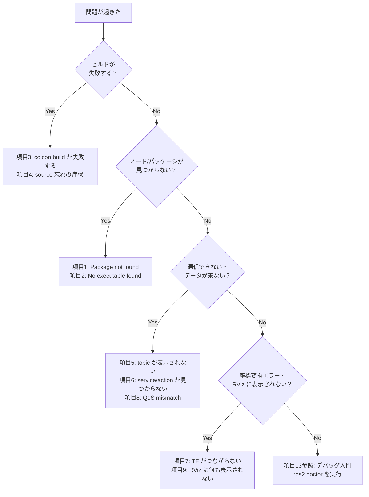

# チュートリアル 16: トラブルシューティング集

ROS 2 の開発中によく遭遇するエラーや問題を症状別に整理しています。エラーが出たらまずこのページを参照し、確認コマンドを順番に実行してみてください。各項目は独立しているので、症状に合った番号に直接ジャンプしても構いません。

---

## 問題が起きたら最初に見るフローチャート



---

## 1. `Package not found`

### 症状

```
Package 'my_package' not found
```

`ros2 run <pkg> <node>` や `ros2 launch` を実行したときに上記のエラーが出る。

### よくある原因

- パッケージをまだビルドしていない
- ビルド後に `source install/setup.bash` を実行していない
- パッケージ名にタイポがある（大文字・小文字、アンダースコアに注意）

### 確認コマンド

```bash
# パッケージが認識されているか確認
ros2 pkg list | grep <pkg>

# ワークスペースが正しく source されているか確認
echo $AMENT_PREFIX_PATH

# ディレクトリ内に src/<pkg>/package.xml があるか確認
ls src/
```

### 修正方法

```bash
# 1. 対象パッケージをビルド
colcon build --packages-select <pkg>

# 2. 環境を再読み込み（毎回必要）
source install/setup.bash

# 3. 再度実行
ros2 run <pkg> <node>
```

`$AMENT_PREFIX_PATH` が空の場合は、`source /opt/ros/jazzy/setup.bash` も実行してください。

### 関連チュートリアル

- [3. Launch ファイルとパラメータ](03_launch_params.md)

---

## 2. `No executable found`

### 症状

```
No executable found
```

`ros2 pkg list` でパッケージは表示されるのに、`ros2 run <pkg> <node>` を実行するとエラーになる。

### よくある原因

- `setup.py` の `console_scripts` にエントリポイントが登録されていない
- エントリポイントの書き方にタイポや構文ミスがある
- ビルド後に `source install/setup.bash` を実行していない

### 確認コマンド

```bash
# パッケージに登録されている実行ファイル一覧を表示
ros2 pkg executables <pkg>

# setup.py のエントリポイントを確認
cat src/<pkg>/setup.py
```

### 修正方法

`setup.py` の `entry_points` が以下のように書かれているか確認します。

```python
entry_points={
    'console_scripts': [
        'my_node = my_package.my_module:main',
    ],
},
```

修正後は再ビルドと再 source が必要です。

```bash
colcon build --packages-select <pkg>
source install/setup.bash
```

### 関連チュートリアル

- [3. Launch ファイルとパラメータ](03_launch_params.md)

---

## 3. `colcon build` が失敗する

### 症状

```
--- stderr: my_package
CMake Error at CMakeLists.txt:10 ...
colcon build failed
```

`colcon build` を実行するとエラーになり、ビルドが完了しない。

### よくある原因

- 依存パッケージがインストールされていない
- `CMakeLists.txt` または `package.xml` の設定ミス
- Python ファイルの構文エラー
- カスタムインターフェース（msg/srv）の記述ミス

### 確認コマンド

```bash
# 依存パッケージが揃っているか確認
rosdep check --from-paths src --ignore-src

# 詳細なビルドログを表示
colcon build --event-handlers console_direct+

# 特定パッケージだけビルドしてエラーを絞り込む
colcon build --packages-select <pkg> --event-handlers console_direct+
```

### 修正方法

```bash
# 不足している依存パッケージを一括インストール
rosdep install --from-paths src --ignore-src -r -y

# package.xml に依存を追加した場合は再ビルド
colcon build --packages-select <pkg>
```

Python の構文エラーはエラーメッセージに行番号が表示されます。`SyntaxError` の行を確認してコードを修正してください。

### 関連チュートリアル

- [5. カスタムインターフェース](05_custom_interfaces.md)

---

## 4. `source install/setup.bash` を忘れた場合の症状

### 症状

ビルドは成功しているのに、実行するとエラーになる。

```
Package 'my_package' not found
```

または Python ノードで:

```
ModuleNotFoundError: No module named 'my_package'
```

### よくある原因

- 新しいターミナルを開いた後、`source` を実行していない
- ビルド後に `source` を実行せずにノードを起動した

### 確認コマンド

```bash
# ROS 2 の環境が読み込まれているか確認
echo $ROS_DISTRO

# ワークスペースが source されているか確認
echo $AMENT_PREFIX_PATH
```

`$ROS_DISTRO` が空なら ROS 2 本体が未 source、`$AMENT_PREFIX_PATH` に `install` パスが含まれていなければワークスペースが未 source です。

### 修正方法

```bash
# ROS 2 本体の環境を読み込む
source /opt/ros/jazzy/setup.bash

# ワークスペースの環境を読み込む
source install/setup.bash
```

毎回手動で実行するのが煩わしい場合は、`~/.bashrc` に追記することで自動化できます。

```bash
echo "source /opt/ros/jazzy/setup.bash" >> ~/.bashrc
echo "source ~/Ros2Sample/install/setup.bash" >> ~/.bashrc
```

### 関連チュートリアル

- [学習パス](00_learning_path.md)

---

## 5. topic が表示されない / 流れない

### 症状

```bash
$ ros2 topic list
# /rosout しか表示されない

$ ros2 topic echo /my_topic
# 何も出力されない（フリーズしたように見える）
```

### よくある原因

- Publisher ノードまたは Subscriber ノードが起動していない
- トピック名が一致していない（スラッシュ `/` の有無、スペルミス）
- namespace の設定が違う
- QoS の設定が不一致（→ 項目8参照）

### 確認コマンド

```bash
# ノードが起動しているか確認
ros2 node list

# トピック一覧を表示
ros2 topic list

# トピックの詳細（Publisher/Subscriber 数、QoS）を確認
ros2 topic info /my_topic --verbose

# データが流れているか確認
ros2 topic echo /my_topic
ros2 topic hz /my_topic
```

### 修正方法

1. `ros2 node list` でノードが起動しているか確認する
2. `ros2 topic list` でトピック名のスペルを確認する
3. namespace が設定されている場合は `/namespace/topic_name` の形になっていることを確認する
4. QoS 不一致の場合は項目8を参照する

### 関連チュートリアル

- [1. Publisher と Subscriber](01_publisher_subscriber.md)
- [6. ライフサイクルノードと QoS](06_lifecycle_qos.md)

---

## 6. service / action が見つからない

### 症状

```bash
$ ros2 service call /my_service std_srvs/srv/Trigger {}
# タイムアウトまたは "service not available" エラー

$ ros2 service list
# 目的のサービスが表示されない
```

### よくある原因

- サーバーノードが起動していない
- サービス名または型名にタイポがある
- namespace が異なる

### 確認コマンド

```bash
# サービス一覧を確認
ros2 service list

# アクション一覧を確認
ros2 action list

# ノードが持つサービス/アクションを確認
ros2 node info <node_name>

# サービスの型を確認
ros2 service type /my_service
```

### 修正方法

```bash
# サーバーノードを起動してから再試行
ros2 run <pkg> <server_node>

# 別ターミナルでサービスを呼び出す
ros2 service call /my_service <type> "{}"
```

アクションの場合は `ros2 action send_goal` を使います。サービス名の前にスラッシュ `/` が必要なことを確認してください。

### 関連チュートリアル

- [2. サービスとアクション](02_service_action.md)

---

## 7. TF がつながらない

### 症状

```
[ERROR] [tf2]: Could not transform map to base_link: Lookup would require extrapolation into the past.

[ERROR] [tf2]: "base_link" passed to lookupTransform argument source_frame does not exist.
```

`tf2_echo` を実行してもフレームが存在しないと表示される。

### よくある原因

- TF broadcaster ノードが起動していない
- フレーム名にタイポがある（`base_link` と `base_Link` など）
- static TF が設定されていない
- TF ツリーに断絶がある（親フレームから子フレームまでのパスが途切れている）

### 確認コマンド

```bash
# TF ツリーを画像ファイルに出力して確認
ros2 run tf2_tools view_frames

# 2つのフレーム間の変換を確認
ros2 run tf2_ros tf2_echo <parent_frame> <child_frame>

# TF の配信状況を確認
ros2 topic echo /tf
ros2 topic echo /tf_static
```

### 修正方法

1. `view_frames` で生成された `frames.pdf` を開き、TF ツリーに断絶がないか確認する
2. 期待するフレームが存在しない場合は broadcaster ノードを起動する
3. static TF が必要な場合は `static_transform_publisher` を使用する

```bash
# static TF を配信する例（robot_base から sensor_frame への変換）
ros2 run tf2_ros static_transform_publisher \
  --x 0.1 --y 0.0 --z 0.2 \
  --roll 0 --pitch 0 --yaw 0 \
  --frame-id robot_base --child-frame-id sensor_frame
```

### 関連チュートリアル

- [4. TF と座標変換](04_tf_transforms.md)

---

## 8. QoS mismatch で受信できない

### 症状

Subscriber ノードは起動しているが、コールバックが一切呼ばれない。ターミナルに以下のような WARNING が出ることがある。

```
[WARN] [rcl]: New subscription discovered on this topic, requesting incompatible QoS.
```

### よくある原因

- Publisher が `RELIABLE`、Subscriber が `BEST_EFFORT`（または逆）の組み合わせ
- `durability` の設定が不一致（`TRANSIENT_LOCAL` vs `VOLATILE`）
- センサーデータ系のトピック（`sensor_data` プロファイル）と通常のプロファイルの混在

### 確認コマンド

```bash
# トピックの Publisher/Subscriber の QoS プロファイルを詳細表示
ros2 topic info /my_topic --verbose
```

出力例:

```
Publisher count: 1
Node name: my_publisher_node
Reliability: RELIABLE
Durability: VOLATILE
...
Subscription count: 1
Node name: my_subscriber_node
Reliability: BEST_EFFORT   ← Publisher と不一致！
Durability: VOLATILE
```

### 修正方法

Publisher と Subscriber の QoS プロファイルを合わせます。一般的には Subscriber 側を Publisher の設定に合わせるか、両方を明示的に同じプロファイルに設定します。

```python
from rclpy.qos import QoSProfile, ReliabilityPolicy, DurabilityPolicy

qos = QoSProfile(
    reliability=ReliabilityPolicy.RELIABLE,
    durability=DurabilityPolicy.VOLATILE,
    depth=10
)

self.publisher_ = self.create_publisher(String, 'my_topic', qos)
self.subscription = self.create_subscription(String, 'my_topic', self.callback, qos)
```

### 関連チュートリアル

- [6. ライフサイクルノードと QoS](06_lifecycle_qos.md)

---

## 9. RViz に何も表示されない

### 症状

RViz は起動するが、追加した Display にデータが表示されない。赤いエラー表示や "No transform from [xxx] to [map]" が出る。

### よくある原因

- **Fixed Frame** の設定が実際に配信されているフレームと異なる
- TF が接続されていない（→ 項目7参照）
- Display に設定したトピック名が実際のトピック名と異なる
- QoS の不一致（→ 項目8参照）

### 確認コマンド

```bash
# 配信されているトピックを確認
ros2 topic list

# 利用可能な TF フレームを確認
ros2 run tf2_tools view_frames

# RViz で表示したいトピックのデータを CLI で確認
ros2 topic echo /my_topic
```

### 修正方法

**Fixed Frame の設定を確認する:**

RViz の左パネル「Global Options」→「Fixed Frame」を確認します。通常は `map`、`odom`、`base_link` のいずれかを使います。配信されているフレームに合わせて設定してください。

**Display のトピック名を確認する:**

RViz の Display パネルで追加した各 Display のトピック名が、`ros2 topic list` の出力と一致しているか確認します。

**手順まとめ:**

1. `ros2 topic list` で正しいトピック名を確認する
2. `ros2 run tf2_tools view_frames` で TF ツリーを確認する
3. RViz の Fixed Frame を TF ツリーのルートフレーム（通常 `map`）に設定する
4. 各 Display のトピック名を正しいトピック名に設定する

### 関連チュートリアル

- [12. RViz 可視化](12_rviz_visualization.md)
- [4. TF と座標変換](04_tf_transforms.md)

---

## それでも解決しない場合

### `ros2 doctor` で環境を診断する

ROS 2 には環境診断ツール `ros2 doctor` が組み込まれています。ネットワーク設定、ミドルウェア、パッケージのバージョン不整合などをまとめて確認できます。

```bash
# 基本診断
ros2 doctor

# 詳細レポートを出力
ros2 doctor --report
```

WARNING や ERROR が表示された場合は、その内容に従って対処してください。

### デバッグの基本に立ち返る

複雑な問題には、[13. ROS 2 デバッグ入門](13_debugging_ros2_systems.md) で解説している体系的なアプローチが有効です。「存在するか → 接続しているか → データが流れているか」の順に確認してください。

### 公式ドキュメントを参照する

- [ROS 2 公式ドキュメント（英語）](https://docs.ros.org/en/jazzy/)
- [ROS Answers（Q&A サイト）](https://answers.ros.org/)
- [ROS Discourse（フォーラム）](https://discourse.ros.org/)

### GitHub Issue で質問する

このリポジトリで再現する問題は GitHub Issue に報告してください。Issue を作成する際は以下の情報を含めると解決が早まります。

1. **環境情報:** `ros2 doctor --report` の出力、OS バージョン
2. **再現手順:** 問題が起きるコマンドを順番に記載
3. **エラーログ:** ターミナルに表示されたエラーメッセージ全文
4. **試したこと:** このページの確認コマンドの実行結果

---

*関連: [ミニ課題プロジェクト集](15_mini_projects.md) で実践的な問題に取り組む際もこのページを参照してください。*
