# チュートリアル 17: Gazebo / GZ Sim 連携入門

## 学習目標

- URDF / SDF が GZ Sim でどのように使われるかを説明できる
- `ros_gz_bridge` で ROS 2 topic と GZ Transport topic を接続できる
- 既存の `ground_robot_sim` を GZ Sim 上に spawn して動作確認できる
- GZ plugin がセンサー、オドメトリ、差動二輪制御を担当する位置づけを理解できる

---

## この章の位置づけ

これまでのチュートリアルでは、Python ノードだけで完結する軽量シミュレーションを扱いました。この章では同じ ROS 2 の topic / TF / launch の考え方を、物理シミュレータである GZ Sim に接続します。

軽量シミュレーションでは、ノード自身が `odom` や `scan` を計算して publish していました。GZ Sim 連携では、ロボットモデル、物理演算、プラグイン、ブリッジの役割が分かれます。

```mermaid
flowchart LR
    controller["ROS 2 node<br/>diff_drive_patrol"] --> cmd["/cmd_vel<br/>geometry_msgs/Twist"]
    cmd --> bridge_cmd["ros_gz_bridge"]
    bridge_cmd --> gz_cmd["GZ topic<br/>cmd_vel"]
    gz_cmd --> plugin["GZ DiffDrive plugin"]
    plugin --> physics["GZ physics world"]
    physics --> gz_odom["GZ topic<br/>odom / tf / joint states"]
    gz_odom --> bridge_state["ros_gz_bridge"]
    bridge_state --> ros_state["ROS 2 topics<br/>/odom /tf /joint_states"]
```



ROS 2 側のコントローラーは `/cmd_vel` を publish するだけです。GZ 側の DiffDrive plugin が車輪を動かし、物理世界の結果としてオドメトリや TF が戻ってきます。

---

## 前提条件

この章は Ubuntu 24.04 + ROS 2 Jazzy を基準にしています。Ubuntu 26.04 / Lyrical など別ディストリビューションでは、利用できる GZ Sim のバージョンと Debian パッケージ名を環境に合わせて確認してください。

必要な ROS 2 パッケージをインストールします。

```bash
sudo apt update
sudo apt install -y \
  ros-${ROS_DISTRO}-ros-gz \
  ros-${ROS_DISTRO}-ros-gz-bridge \
  ros-${ROS_DISTRO}-ros-gz-sim \
  ros-${ROS_DISTRO}-robot-state-publisher
```

このリポジトリでは Foxy 互換を維持していますが、GZ Sim 連携は Foxy を対象外とします。`ground_robot_sim/package.xml` でも `ros_gz_bridge` と `ros_gz_sim` は Foxy 以外の実行依存として扱っています。

---

## 使うファイル

この章では、既存の `ground_robot_sim` に含まれる GZ 用ファイルを使います。

| ファイル | 役割 |
| --- | --- |
| `src/ground_robot_sim/urdf/ground_robot_gazebo.urdf` | GZ plugin 付きの差動二輪ロボットモデル |
| `src/ground_robot_sim/worlds/default.sdf` | 地面、ライト、障害物を含む GZ world |
| `src/ground_robot_sim/launch/gazebo.launch.py` | GZ Sim、spawn、bridge、デモコントローラーをまとめて起動 |
| `src/drone_sim/urdf/quadrotor.urdf` | GZ 連携へ拡張できるクアッドローターの表示用 URDF |

`quadrotor.urdf` はこの章では表示モデルの参考として扱います。実際に GZ 上で飛行させるには、マルチローター用 plugin、推力モデル、センサー設定を別途追加する必要があります。

---

## URDF と SDF の使い分け

URDF は主にロボット本体のリンク、ジョイント、慣性、見た目、衝突形状を表します。`ground_robot_gazebo.urdf` では、車体、左右ホイール、キャスター、LiDAR 台座を定義しています。

SDF は主にシミュレーション世界を表します。`default.sdf` では、GZ world、物理システム、地面、ライト、障害物を定義しています。

このリポジトリの構成では、ロボットは URDF、世界は SDF に分けています。

```text
GZ world (default.sdf)
  ├── ground plane
  ├── boxes
  └── spawned robot (ground_robot_gazebo.urdf)
```

GZ plugin は URDF 内の `<gazebo>` 要素で指定しています。

```xml
<plugin filename="gz-sim-diff-drive-system" name="gz::sim::systems::DiffDrive">
  <left_joint>wheel_left_joint</left_joint>
  <right_joint>wheel_right_joint</right_joint>
  <wheel_separation>0.37</wheel_separation>
  <wheel_radius>0.1</wheel_radius>
  <topic>cmd_vel</topic>
  <odom_topic>odom</odom_topic>
</plugin>
```

この plugin が GZ 側の `cmd_vel` を受け取り、左右ホイールのジョイントを動かします。

---

## ビルド

ROS 2 とワークスペースを読み込んでからビルドします。

```bash
source /opt/ros/jazzy/setup.bash
cd Ros2Sample
colcon build --packages-select sample_interfaces ground_robot_sim
source install/setup.bash
```

ビルド後、GZ 用の URDF / SDF / launch ファイルは `install/ground_robot_sim/share/ground_robot_sim/` 以下にインストールされます。

---

## GZ Sim で地上ロボットを起動する

WSL2 や CI に近い環境では、まず GUI なしで起動します。

```bash
ros2 launch ground_robot_sim gazebo.launch.py use_gui:=false
```

デフォルトでは次の処理が起動します。

| 起動対象 | 内容 |
| --- | --- |
| `ros_gz_sim` | `default.sdf` world を GZ Sim で起動 |
| `robot_state_publisher` | URDF から `/robot_description` と TF を publish |
| `ros_gz_sim create` | `/robot_description` からロボットを GZ world に spawn |
| `ros_gz_bridge parameter_bridge` | `/cmd_vel`, `/odom`, `/tf`, `/joint_states` を bridge |
| `diff_drive_patrol` | `/cmd_vel` を publish する巡回デモ |

GUI を表示できる環境では `use_gui:=true` を指定します。

```bash
ros2 launch ground_robot_sim gazebo.launch.py use_gui:=true
```

GZ Sim のメジャーバージョンを明示したい場合は `gz_version` を指定できます。

```bash
ros2 launch ground_robot_sim gazebo.launch.py gz_version:=8 use_gui:=false
```

---

## ROS 2 側の topic を確認する

別ターミナルでワークスペースを読み込みます。

```bash
source /opt/ros/jazzy/setup.bash
cd Ros2Sample
source install/setup.bash
```

topic 一覧を確認します。

```bash
ros2 topic list -t
```

代表的な topic は次の通りです。

| ROS 2 topic | 型 | 向き | 意味 |
| --- | --- | --- | --- |
| `/cmd_vel` | `geometry_msgs/msg/Twist` | ROS 2 -> GZ | ロボットへの速度指令 |
| `/odom` | `nav_msgs/msg/Odometry` | GZ -> ROS 2 | GZ 物理世界で計算されたオドメトリ |
| `/tf` | `tf2_msgs/msg/TFMessage` | GZ -> ROS 2 | `odom` から `base_link` などの変換 |
| `/joint_states` | `sensor_msgs/msg/JointState` | GZ -> ROS 2 | ホイールジョイント状態 |

オドメトリが流れているか確認します。

```bash
ros2 topic echo /odom --once
ros2 topic hz /odom
```

TF も確認します。

```bash
ros2 run tf2_ros tf2_echo odom base_link
```

---

## 手動で速度指令を送る

巡回デモを止めて手動確認したい場合は、`start_controller:=false` で起動します。

```bash
ros2 launch ground_robot_sim gazebo.launch.py use_gui:=true start_controller:=false
```

別ターミナルから `/cmd_vel` を publish します。

```bash
ros2 topic pub /cmd_vel geometry_msgs/msg/Twist \
  "{linear: {x: 0.3}, angular: {z: 0.4}}" \
  --rate 10
```

ロボットが旋回しながら前進すれば、次の流れが動いています。

```text
ROS 2 /cmd_vel
  -> ros_gz_bridge
  -> GZ cmd_vel
  -> DiffDrive plugin
  -> GZ physics
  -> GZ odom
  -> ros_gz_bridge
  -> ROS 2 /odom
```

---

## GZ 側の topic を確認する

GZ Transport 側の topic は `gz topic` で確認します。

```bash
gz topic -l
```

`cmd_vel`、`odom`、`tf`、`joint_states` に対応する topic が見えます。topic 名は GZ Sim のバージョンや plugin 設定で変わることがあるため、まず `gz topic -l` で実際の名前を確認してください。

GZ 側のメッセージを直接見る例です。

```bash
gz topic -e -t /odom
```

ROS 2 側の `ros2 topic echo /odom` と GZ 側の `gz topic -e -t /odom` を見比べると、bridge が型変換していることを確認できます。

---

## ros_gz_bridge の読み方

`gazebo.launch.py` では `parameter_bridge` に次のような引数を渡しています。

```python
arguments=[
    '/cmd_vel@geometry_msgs/msg/Twist]gz.msgs.Twist',
    '/odom@nav_msgs/msg/Odometry[gz.msgs.Odometry',
    '/tf@tf2_msgs/msg/TFMessage[gz.msgs.Pose_V',
    '/joint_states@sensor_msgs/msg/JointState[gz.msgs.Model',
]
```

記号の意味は次の通りです。

| 記号 | 向き |
| --- | --- |
| `@` | 双方向 bridge |
| `]` | ROS 2 から GZ へ送る |
| `[` | GZ から ROS 2 へ送る |

このデモでは `/cmd_vel` は ROS 2 から GZ へ、`/odom`、`/tf`、`/joint_states` は GZ から ROS 2 へ流します。制御入力とシミュレーション結果の向きを分けると、どちら側がデータの生成元なのか分かりやすくなります。

---

## センサー plugin の注意点

`ground_robot_gazebo.urdf` には LiDAR sensor の定義も含まれています。

```xml
<sensor type="lidar" name="lidar">
  <update_rate>10</update_rate>
  <topic>scan</topic>
  <gz_frame_id>base_scan</gz_frame_id>
</sensor>
```

ただし、このリポジトリの `default.sdf` では WSL2 やヘッドレス環境で動かしやすくするため、GZ の Sensors system を無効にしています。そのため、この launch では `/scan` bridge も省略しています。

GPU レンダリングを使える環境で LiDAR を有効化する場合は、次の作業が必要です。

1. `default.sdf` に Sensors system を追加する
2. `gazebo.launch.py` の bridge に `/scan` を追加する
3. `ros2 topic echo /scan --once` と RViz で LaserScan を確認する

例:

```xml
<plugin filename="gz-sim-sensors-system" name="gz::sim::systems::Sensors">
  <render_engine>ogre2</render_engine>
</plugin>
```

bridge の例:

```text
/scan@sensor_msgs/msg/LaserScan[gz.msgs.LaserScan
```

---

## RViz と組み合わせる

GZ Sim は物理世界を動かし、RViz は ROS 2 topic / TF を可視化します。両方を同時に使うと、シミュレーションと ROS 2 側の見え方を分けて確認できます。

```bash
rviz2 -d install/ground_robot_sim/share/ground_robot_sim/rviz/ground_robot.rviz
```

RViz で見るポイント:

| 表示 | 確認内容 |
| --- | --- |
| TF | `odom -> base_link -> base_scan` がつながっているか |
| Odometry | `/odom` の姿勢が更新されているか |
| RobotModel | `/robot_description` からモデルが表示されるか |

RViz にモデルが出ない場合は、Fixed Frame、`/robot_description`、TF の接続を順番に確認します。

---

## drone_sim を GZ へ拡張する場合

`drone_sim/urdf/quadrotor.urdf` は、GZ に spawn できる表示モデルとして利用できます。ただし、地上ロボットのように DiffDrive plugin を追加するだけでは飛行できません。

GZ 上でクアッドローターを動かすには、少なくとも次の設計が必要です。

| 要素 | 追加内容 |
| --- | --- |
| 推力モデル | 各ローターの回転数から揚力とトルクを発生させる plugin |
| コントローラー | 目標姿勢、目標高度、姿勢角速度を制御するノード |
| IMU / pose / odom | GZ sensor または pose publisher から ROS 2 topic へ bridge |
| 安全制約 | ジオフェンス、低バッテリー、緊急着陸との接続 |

このリポジトリでは、まず `ground_robot_sim` で bridge と plugin の流れを学び、その後に `drone_sim` を GZ 用モデルへ拡張する順番を推奨します。

---

## よくあるトラブル

| 症状 | 確認すること |
| --- | --- |
| `Package 'ros_gz_sim' not found` | `ros-${ROS_DISTRO}-ros-gz-sim` をインストールしたか、ROS 2 環境を source したか |
| ロボットが spawn されない | `/robot_description` が publish されているか、URDF の XML エラーがないか |
| `/cmd_vel` を送っても動かない | `start_controller:=false` で手動 publish しているか、bridge の向きが ROS 2 -> GZ になっているか |
| `/odom` が出ない | DiffDrive plugin が読み込まれているか、GZ world が pause していないか |
| GUI が起動しない | `use_gui:=false` で server-only 起動に切り替える |
| `/scan` が出ない | Sensors system と `/scan` bridge はデフォルトでは無効 |

---

## まとめ

GZ Sim 連携では、ROS 2 ノード、GZ world、URDF/SDF、GZ plugin、`ros_gz_bridge` の責務を分けて考えます。`ground_robot_sim` の GZ デモでは、ROS 2 側が `/cmd_vel` を出し、GZ 側が物理演算とオドメトリ生成を担当し、その結果を bridge で ROS 2 に戻します。

この構造を理解しておくと、軽量 Python シミュレーションから、センサーや物理特性を含む本格的なシミュレーションへ段階的に進めます。
