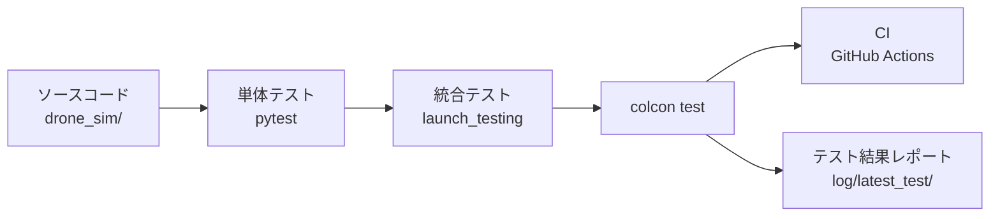

# チュートリアル 18: ROS 2 テストの書き方

## 学習目標

- pytest で ROS 2 パッケージの単体テストを書ける
- テスト fixture とパラメタライズを使いこなせる
- `colcon test` でテストを実行し結果を読める
- `launch_testing` による統合テストの概念を理解する
- CI（GitHub Actions）でテストを自動実行する設定がわかる

---

## テストの全体像



ROS 2 のテストは「単体テスト → 統合テスト → colcon test で一括実行 → CI で自動化」という流れで構成します。この章では単体テストの書き方を中心に学び、統合テストと CI の使い方も概説します。

---

## 前提準備

新しいターミナルを開いたら、ROS 2 とワークスペースの環境を読み込んでビルドします。

```bash
source /opt/ros/jazzy/setup.bash
cd Ros2Sample
colcon build --packages-select drone_sim
source install/setup.bash
```

テストを実行するだけなら再ビルドは不要ですが、ソースを変更した場合は必ずビルドしてから `source install/setup.bash` を実行してください。

---

## pytest による単体テスト

### 最小のテスト

pytest のテストは `test_` で始まる関数として書きます。`assert` 文で期待値を検証します。

```python
def test_addition():
    result = 1 + 1
    assert result == 2
```

関数名がそのままテスト名として表示されるため、何を検証しているかが伝わる名前をつけるのが重要です。

### 実例: test_pid.py

`src/drone_sim/test/test_pid.py` は PIDController クラスを検証します。PIDController は `kp`・`ki`・`kd` パラメータを受け取り、`compute(error, dt)` で制御出力を返します。

```python
from drone_sim.pid import PIDController
import pytest

def test_p_only_output():
    """P-only controller output equals kp multiplied by error."""
    pid = PIDController(kp=2.0)
    assert pid.compute(3.0, 0.1) == pytest.approx(6.0)
```

各テスト関数は PIDController をその場で生成します。テストが独立することで、あるテストの状態が別のテストに影響しません。

実際のファイルには以下のテストが含まれます。

| テスト関数 | 確認内容 |
| --- | --- |
| `test_p_only_output` | P 項のみの出力が kp × error と一致する |
| `test_pi_integral_accumulates` | 積分項が複数ステップで蓄積する |
| `test_pd_derivative_on_second_call` | 微分項がエラーの変化に応答する |
| `test_full_pid_combines_all_terms` | P/I/D の合算が正しい |
| `test_anti_windup_clamps_integral_positive` | インテグラルワインドアップ制限が機能する |
| `test_reset_clears_integral` | `reset()` が積分状態をクリアする |
| `test_zero_dt_returns_zero` | dt=0 の場合に 0 を返し状態を変えない |

### pytest.approx

浮動小数点数は `==` で直接比較できません。`0.1 + 0.2` は `0.30000000000000004` になるため、誤差の許容範囲を指定する `pytest.approx()` を使います。

```python
# 悪い例: 浮動小数点誤差でテストが不安定になる
assert 0.1 + 0.2 == 0.3          # 失敗する可能性がある

# 良い例: pytest.approx で相対誤差 1e-6 以内を許容
assert 0.1 + 0.2 == pytest.approx(0.3)
```

デフォルトの許容誤差は相対値 1e-6 です。絶対誤差で指定したい場合は `pytest.approx(0.3, abs=1e-6)` と書きます。

### 実例: test_math_utils.py

`src/drone_sim/test/test_math_utils.py` は `clamp`・`normalize_angle`・`quat_from_euler` を検証します。境界値と特殊ケースを網羅するのがポイントです。

```python
from drone_sim.math_utils import clamp, normalize_angle, quat_from_euler
import math, pytest

def test_clamp_inside_range():
    assert clamp(0.5, 0.0, 1.0) == pytest.approx(0.5)

def test_clamp_below_range():
    assert clamp(-1.0, 0.0, 1.0) == pytest.approx(0.0)

def test_clamp_above_range():
    assert clamp(2.0, 0.0, 1.0) == pytest.approx(1.0)

def test_normalize_angle_zero():
    assert normalize_angle(0.0) == pytest.approx(0.0)

def test_quat_from_euler_zero_angles_identity():
    x, y, z, w = quat_from_euler(0.0, 0.0, 0.0)
    assert w == pytest.approx(1.0)
```

テストの命名規則に注目してください。`test_<関数名>_<条件>` の形式にすると、失敗時に何が壊れたかが一目でわかります。

### テストクラスによる整理

関連するテストをクラスにまとめると、テスト対象の「観点」が明確になります。`src/drone_sim/test/test_battery_monitor.py` は `TestThrottle` と `TestDrain` の 2 クラスに分けています。

```python
class TestThrottle:
    def test_zero_velocity(self):
        assert compute_throttle(0.0, 0.0, 0.0, 0.0) == 0.0

    def test_max_throttle_clamped(self):
        assert compute_throttle(5.0, 5.0, 5.0, 5.0) == 1.0

    def test_partial_throttle(self):
        result = compute_throttle(1.0, 0.0, 0.0, 0.0)
        assert result == pytest.approx(0.25)


class TestDrain:
    def test_idle_drain(self):
        remaining, pct, voltage, current = compute_drain(
            remaining_wh=50.0, capacity_wh=50.0,
            idle_power_w=5.0, motor_power_w=80.0,
            throttle=0.0, dt_sec=1.0,
        )
        assert remaining == pytest.approx(50.0 - 5.0 / 3600.0, abs=1e-6)

    def test_drain_does_not_go_negative(self):
        remaining, pct, _, _ = compute_drain(
            remaining_wh=0.001, capacity_wh=50.0,
            idle_power_w=5.0, motor_power_w=80.0,
            throttle=1.0, dt_sec=3600.0,
        )
        assert remaining == 0.0
```

クラスを使ってもテスト間で状態は共有されません。各テストメソッドは独立して実行されます。

### fixture

同じセットアップコードを複数のテストで繰り返す場合は `@pytest.fixture` でまとめます。

```python
import pytest
from drone_sim.pid import PIDController


@pytest.fixture
def pid():
    """デフォルトパラメータの PIDController を返す fixture。"""
    return PIDController(kp=1.0, ki=0.1, kd=0.05)


def test_pid_responds_to_positive_error(pid):
    result = pid.compute(2.0, 0.1)
    assert result > 0.0


def test_pid_responds_to_negative_error(pid):
    result = pid.compute(-2.0, 0.1)
    assert result < 0.0


def test_pid_zero_error_gives_zero(pid):
    result = pid.compute(0.0, 0.1)
    assert result == pytest.approx(0.0)
```

テスト関数の引数名を fixture 名と一致させると、pytest が自動的に注入します。fixture は各テストの実行前に呼び出されるため、テスト間で状態が混入しません。

### parametrize

同じロジックを異なる入力で何度もテストしたい場合は `@pytest.mark.parametrize` を使います。

```python
import pytest
from drone_sim.math_utils import clamp


@pytest.mark.parametrize("value, lo, hi, expected", [
    (0.5,  0.0, 1.0, 0.5),   # 範囲内
    (-1.0, 0.0, 1.0, 0.0),   # 下限クランプ
    (2.0,  0.0, 1.0, 1.0),   # 上限クランプ
    (0.0,  0.0, 1.0, 0.0),   # 下限境界
    (1.0,  0.0, 1.0, 1.0),   # 上限境界
])
def test_clamp_parametrized(value, lo, hi, expected):
    assert clamp(value, lo, hi) == pytest.approx(expected)
```

pytest は各行を独立したテストとして実行し、失敗した場合はどの入力で失敗したかをレポートに表示します。テストコードを繰り返し書く代わりに、入力と期待値のテーブルを管理するだけで済みます。

---

## Linter テスト（ament_flake8 / ament_pep257）

ROS 2 パッケージには、コードスタイルを自動チェックする Linter テストを含めるのが慣例です。`src/drone_sim/test/test_flake8.py` は次のように書かれています。

```python
import pytest

ament_flake8_main = pytest.importorskip('ament_flake8.main')


@pytest.mark.flake8
@pytest.mark.linter
def test_flake8():
    """Enforce PEP8 / flake8 compliance across the drone_sim package."""
    rc, errors = ament_flake8_main.main_with_errors(argv=[])
    assert rc == 0, f'Found {len(errors)} code style errors / warnings'
```

`pytest.importorskip` は `ament_flake8` がインストールされていない環境でテストをスキップします。`ament_pep257` も同様のパターンで `test_pep257.py` に書かれています。

新しいパッケージを作るときは、この 2 ファイルをそのままコピーするのが最速です。Linter テストが通るようにコードを書く習慣をつけると、レビューでスタイル指摘を受けることがなくなります。

---

## テストの配置と設定

colcon はパッケージの `test/` ディレクトリを自動的にテストディレクトリとして認識します。

```
src/drone_sim/
├── drone_sim/          # ソースコード (Python パッケージ)
│   ├── __init__.py
│   ├── pid.py
│   ├── math_utils.py
│   └── ...
├── test/               # テストディレクトリ
│   ├── test_pid.py
│   ├── test_math_utils.py
│   ├── test_battery_monitor.py
│   ├── test_flake8.py
│   └── test_pep257.py
├── setup.py
└── setup.cfg
```

`setup.py` では `find_packages(exclude=['test'])` でテストディレクトリをインストール対象から除外しています。テストファイルはあくまでビルド成果物ではなく、開発・検証用のファイルです。

---

## colcon test の実行

### パッケージを指定して実行

```bash
colcon test --packages-select drone_sim
```

テスト結果のサマリーを確認します。

```bash
colcon test-result --verbose
```

成功時の出力例:

```text
build/drone_sim/test_results/drone_sim/pytest.xml: 42 tests, 0 errors, 0 failures, 0 skipped
```

失敗があった場合は、どのテスト関数で何のエラーが起きたかが表示されます。

### 特定のテストファイルだけ実行

```bash
colcon test --packages-select drone_sim --pytest-args test/test_pid.py
```

開発中に変更したファイルに対応するテストだけを素早く確認したいときに便利です。

### コンソールに出力をリアルタイム表示

```bash
colcon test --packages-select drone_sim --event-handlers console_direct+
```

`console_direct+` を付けると、pytest の出力がそのままターミナルに流れます。テストが失敗したときのデバッグに使います。

### テスト結果ログの場所

colcon はテスト結果を `log/latest_test/<パッケージ名>/` に保存します。`stdout_stderr.log` に pytest の完全な出力が、`pytest.xml` に JUnit 形式のレポートが入ります。

---

## launch_testing による統合テスト（概念紹介）

単体テストは関数単位の検証ですが、複数のノードが連携する動作は `launch_testing` で検証します。このリポジトリでは現在 `launch_testing` を使っていませんが、実際の開発では重要な手法です。

`launch_testing` の基本的な構造は以下のとおりです。

```python
import launch
import launch_testing
import pytest
import unittest


@pytest.mark.launch_test
def generate_test_description():
    # テスト対象のノードを含む LaunchDescription を定義する
    node = launch_ros.actions.Node(
        package='my_package',
        executable='my_node',
    )
    return launch.LaunchDescription([
        node,
        launch_testing.actions.ReadyToTest(),
    ]), {'test_node': node}


class TestNodeOutput(unittest.TestCase):
    def test_topic_published(self, proc_output):
        # ノードが起動した後、topic が publish されているかを検証する
        proc_output.assertWaitFor('expected output', timeout=10)
```

`generate_test_description` でノードを起動し、`unittest.TestCase` のテストメソッドでノードの振る舞いを検証します。単体テストと違い、実際に ROS 2 ノードを起動して topic やサービスの疎通を確認できます。

---

## GitHub Actions での CI テスト

`.github/workflows/ci.yml` にテストステップが定義されています。Jazzy 向けのジョブでは次のように実行されます。

```yaml
- name: Test
  run: |
    export AMENT_TRACE_SETUP_FILES="${AMENT_TRACE_SETUP_FILES:-}"
    source /opt/ros/jazzy/setup.bash
    colcon test --event-handlers console_direct+
    colcon test-result --verbose
```

このステップは Build ステップの後に実行されます。`colcon test-result --verbose` が非ゼロを返した場合、ジョブは失敗として扱われます。

CI でテストが自動実行されることで、次のメリットがあります。

- プッシュのたびにすべてのテストが実行され、デグレードをすぐに検出できる
- 複数の ROS 2 バージョン（Foxy・Jazzy・Lyrical）に対して並列で検証できる
- プルリクエストのマージ前に品質チェックが自動で行われる

---

## 実践演習: テストを書いてみよう

`src/drone_sim/drone_sim/math_utils.py` の `normalize_angle` 関数には、`test_math_utils.py` でカバーされていないケースがあります。次のテストを追加してみてください。

**課題**: ±2π を超える角度に対するテストを parametrize で書く

ヒント:

```python
@pytest.mark.parametrize("angle, expected", [
    (3 * math.pi, ...),       # 3π → [-π, π] の範囲に正規化すると?
    (-3 * math.pi, ...),      # -3π → ?
    (5 * math.pi / 2, ...),   # 5π/2 → ?
    (-5 * math.pi / 2, ...),  # -5π/2 → ?
])
def test_normalize_angle_beyond_two_pi(angle, expected):
    assert normalize_angle(angle) == pytest.approx(expected)
```

期待値を自分で計算し、`normalize_angle` の実装と照合してみてください。テストを書くことで、関数の仕様を正確に把握できます。

テストを追加したら実行して確認します。

```bash
colcon test --packages-select drone_sim --pytest-args test/test_math_utils.py
colcon test-result --verbose
```

---

## まとめ

| 要素 | 説明 |
| --- | --- |
| `def test_xxx():` | pytest が自動収集するテスト関数 |
| `pytest.approx()` | 浮動小数点比較に必須 |
| `@pytest.fixture` | テストセットアップの再利用 |
| `@pytest.mark.parametrize` | 複数入力を 1 つのテスト関数で検証 |
| `class TestXxx:` | 関連テストの論理的なグループ化 |
| `ament_flake8` / `ament_pep257` | ROS 2 標準の Linter テスト |
| `colcon test` | パッケージのテストを一括実行 |
| `colcon test-result --verbose` | 結果のサマリーを表示 |
| `launch_testing` | ノード起動を含む統合テスト |

テストを書く習慣は、コードを変更するたびにデグレードがないことを確認する安全網になります。新しい関数を追加したとき、バグを修正したとき、リファクタリングをしたときにテストを更新・追加する習慣をつけてください。

デバッグの方法論については [チュートリアル 13: ROS 2 デバッグ入門](13_debugging_ros2_systems.md) を参照してください。
