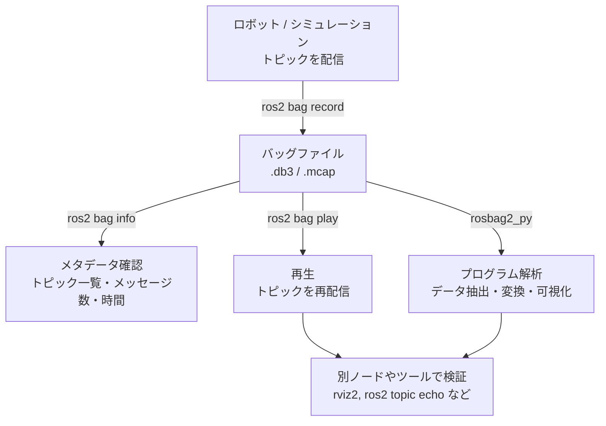

# チュートリアル 19: ROS 2 Bag の記録・再生

## 学習目標

- `ros2 bag record` でトピックデータをファイルに記録できる
- `ros2 bag info` で記録データのメタデータを確認できる
- `ros2 bag play` で記録データを再生し動作を検証できる
- `rosbag2_py` を使ってプログラムからバッグファイルを読み書きできる
- 既存デモ（sensor_fusion_sim / drone_sim）のデータを記録・再解析する実践パターンを身につける

---

## rosbag2 の全体像

ROS 2 Bag（rosbag2）は、トピックのメッセージをファイルに記録し、後から再生するための仕組みです。センサデータのデバッグ、アルゴリズムの検証、テストデータの作成など、幅広い用途で活用されます。



---

## 1. 基本: ros2 bag record

### すべてのトピックを記録する

現在 ROS 2 ネットワーク上に流れているすべてのトピックを記録するには `-a` オプションを使います。

```bash
ros2 bag record -a
```

記録を止めるには `Ctrl+C` を押します。カレントディレクトリに `rosbag2_YYYY_MM_DD-HH_MM_SS/` という名前のフォルダが作成されます。

> **注意**: `-a` で記録するとすべてのトピックが対象になるため、ファイルサイズが大きくなりがちです。実際の運用では記録するトピックを絞り込むことを推奨します。

### 特定のトピックだけを記録する

```bash
ros2 bag record /topic1 /topic2
```

### 出力フォルダ名を指定する

`-o` オプションで出力フォルダ名を指定できます。

```bash
ros2 bag record -o my_bag /topic1 /topic2
```

### 実践例: sensor_fusion_sim のデータを記録する

このリポジトリの `sensor_fusion_sim` デモを動かしながら、センサフュージョン前後のデータを記録してみましょう。

**ターミナル 1**: sensor_fusion_sim デモを起動します。

```bash
ros2 launch sensor_fusion_sim sensor_fusion_demo.launch.py
```

**ターミナル 2**: 記録を開始します。

```bash
ros2 bag record -o sensor_data /gps /imu /wheel_odom /fused_odom
```

デモをしばらく動かしたあと `Ctrl+C` で記録を停止すると、`sensor_data/` フォルダにバッグファイルが作成されます。

---

## 2. ros2 bag info

記録したバッグファイルのメタデータを確認するには `ros2 bag info` を使います。

```bash
ros2 bag info sensor_data/
```

出力例:

```text
Files:             sensor_data_0.db3
Bag size:          2.4 MiB
Storage id:        sqlite3
Duration:          30.521s
Start:             Jun 28 2026 10:00:01.123 (1751062801.123)
End:               Jun 28 2026 10:00:31.644 (1751062831.644)
Messages:          4521
Topic information: Topic: /gps | Type: geometry_msgs/msg/PointStamped | Count: 302 | Serialization Format: cdr
                   Topic: /imu | Type: sensor_msgs/msg/Imu | Count: 3020 | Serialization Format: cdr
                   Topic: /wheel_odom | Type: nav_msgs/msg/Odometry | Count: 604 | Serialization Format: cdr
                   Topic: /fused_odom | Type: nav_msgs/msg/Odometry | Count: 595 | Serialization Format: cdr
```

### メタデータの見方

| フィールド | 説明 |
|---|---|
| `Files` | 実際のデータファイル名（.db3 または .mcap）|
| `Bag size` | ファイルの総サイズ |
| `Storage id` | ストレージ形式（sqlite3 または mcap）|
| `Duration` | 記録時間（秒）|
| `Start / End` | 記録開始・終了の絶対時刻 |
| `Messages` | 記録された全メッセージ数 |
| `Topic information` | 各トピックの型・メッセージ数・シリアライゼーション形式 |

> **注意**: ROS 2 Humble 以降はデフォルトのストレージ形式が `sqlite3` ですが、`mcap` 形式も選択できます。`mcap` はより高速なシーク操作に対応しており、大規模データに向いています。

---

## 3. ros2 bag play

記録したバッグファイルを再生するには `ros2 bag play` を使います。再生中はバッグ内の各トピックが実際の記録タイミングに合わせて再配信されます。

### 基本の再生

```bash
ros2 bag play sensor_data/
```

### 再生速度を変更する

`--rate` オプションで再生速度を変更できます。2.0 で 2 倍速、0.5 で半速です。

```bash
ros2 bag play sensor_data/ --rate 2.0
```

### ループ再生する

```bash
ros2 bag play sensor_data/ --loop
```

### トピック名をリマップして再生する

再生時にトピック名を別の名前に変更できます。既存のノードと名前が衝突しそうな場合などに便利です。

```bash
ros2 bag play sensor_data/ --remap /fused_odom:=/replayed_pose
```

### 開始オフセットを指定する

バッグの先頭から指定した秒数をスキップして再生します。

```bash
ros2 bag play sensor_data/ --start-offset 5.0
```

### 実践例: 再生しながらトピックを確認する

**ターミナル 1**: バッグを再生します。

```bash
ros2 bag play sensor_data/
```

**ターミナル 2**: 再生中のトピックを受信して確認します。

```bash
ros2 topic echo /fused_odom
```

期待される出力例:

```text
header:
  stamp:
    sec: 1751062801
    nanosec: 234567890
  frame_id: world
child_frame_id: base_link_fused
pose:
  pose:
    position:
      x: 1.23
      y: 4.56
      z: 0.0
    orientation:
      x: 0.0
      y: 0.0
      z: 0.12
      w: 0.99
---
```

> **注意**: バッグ再生中は、バッグが配信するトピックを受信するノードが起動していなくても再生自体は続きます。受信側のノードを別ターミナルで起動してから再生を開始すると確実です。

---

## 4. 記録のフィルタリングと時間制限

### 記録時間を制限する

`-d` オプションで記録時間を秒単位で指定します。指定した時間が経過すると自動的に記録が停止します。

```bash
ros2 bag record -d 30 /gps /fused_odom
```

### ファイルサイズを制限する

`--max-bag-size` オプションでバッグファイルの最大サイズをバイト単位で指定します。サイズを超えると次のファイルに分割されます。

```bash
ros2 bag record --max-bag-size 100000000 /gps /fused_odom
```

### 正規表現でトピックをフィルタリングする

`-e` オプションで正規表現パターンに一致するトピックだけを記録できます。

```bash
ros2 bag record -e "/drone/.*"
```

### 実践例: drone_sim のウェイポイント飛行を記録する

**ターミナル 1**: drone_sim デモを起動します。

```bash
ros2 launch drone_sim single_quad_waypoint.launch.py
```

**ターミナル 2**: ドローン関連トピックを 60 秒間記録します。

```bash
ros2 bag record -o waypoint_flight -d 60 -e "/drone/.*"
```

記録完了後に `ros2 bag info` で内容を確認します。

```bash
ros2 bag info waypoint_flight/
```

出力例:

```text
Files:             waypoint_flight_0.db3
Bag size:          1.1 MiB
Storage id:        sqlite3
Duration:          60.000s
Start:             Jun 28 2026 10:05:00.000 (1751063100.000)
End:               Jun 28 2026 10:06:00.000 (1751063160.000)
Messages:          3610
Topic information: Topic: /drone/pose | Type: geometry_msgs/msg/PoseStamped | Count: 1805 | Serialization Format: cdr
                   Topic: /drone/cmd_vel | Type: geometry_msgs/msg/Twist | Count: 1805 | Serialization Format: cdr
```

---

## 5. rosbag2_py によるプログラム的アクセス

`rosbag2_py` は Python からバッグファイルを読み書きするための公式ライブラリです。記録データをスクリプトで解析したり、独自形式に変換したりする際に使います。

### バッグファイルを読み込む

以下のスクリプトは `sensor_data/` バッグから `/gps` トピックのデータを読み込み、各メッセージの座標を表示します。

```python
import rosbag2_py
from rclpy.serialization import deserialize_message
from geometry_msgs.msg import PointStamped

reader = rosbag2_py.SequentialReader()
storage_options = rosbag2_py.StorageOptions(
    uri='sensor_data/',
    storage_id='sqlite3',
)
converter_options = rosbag2_py.ConverterOptions(
    input_serialization_format='cdr',
    output_serialization_format='cdr',
)
reader.open(storage_options, converter_options)

while reader.has_next():
    topic_name, data, timestamp = reader.read_next()
    if topic_name == '/gps':
        msg = deserialize_message(data, PointStamped)
        print(f't={timestamp}: x={msg.point.x:.2f}, y={msg.point.y:.2f}')
```

実行例:

```text
t=1751062801123456789: x=1.23, y=4.56
t=1751062801456789012: x=1.25, y=4.59
t=1751062801789012345: x=1.22, y=4.54
...
```

### 特定トピックだけを対象にフィルタリングする

`get_all_topics_and_types()` でトピック一覧を取得し、`set_filter()` で読み込むトピックを絞り込めます。

```python
import rosbag2_py
from rclpy.serialization import deserialize_message
from geometry_msgs.msg import PointStamped
from nav_msgs.msg import Odometry

reader = rosbag2_py.SequentialReader()
storage_options = rosbag2_py.StorageOptions(uri='sensor_data/', storage_id='sqlite3')
converter_options = rosbag2_py.ConverterOptions(
    input_serialization_format='cdr',
    output_serialization_format='cdr',
)
reader.open(storage_options, converter_options)

# 読み込むトピックを絞り込む
storage_filter = rosbag2_py.StorageFilter(topics=['/gps', '/fused_odom'])
reader.set_filter(storage_filter)

while reader.has_next():
    topic_name, data, timestamp = reader.read_next()
    if topic_name == '/gps':
        msg = deserialize_message(data, PointStamped)
        print(f'[GPS]   t={timestamp}: x={msg.point.x:.2f}, y={msg.point.y:.2f}')
    elif topic_name == '/fused_odom':
        msg = deserialize_message(data, Odometry)
        pos = msg.pose.pose.position
        print(f'[Fused] t={timestamp}: x={pos.x:.2f}, y={pos.y:.2f}')
```

### バッグファイルにデータを書き込む

`SequentialWriter` を使うと、プログラムからバッグファイルを新規作成してデータを書き込めます。テストデータの生成や別形式からの変換に便利です。

```python
import rosbag2_py
from rclpy.serialization import serialize_message
from geometry_msgs.msg import PointStamped
from builtin_interfaces.msg import Time

writer = rosbag2_py.SequentialWriter()
storage_options = rosbag2_py.StorageOptions(
    uri='synthetic_bag/',
    storage_id='sqlite3',
)
converter_options = rosbag2_py.ConverterOptions(
    input_serialization_format='cdr',
    output_serialization_format='cdr',
)
writer.open(storage_options, converter_options)

# トピックを登録する
topic_info = rosbag2_py.TopicMetadata(
    name='/synthetic_gps',
    type='geometry_msgs/msg/PointStamped',
    serialization_format='cdr',
)
writer.create_topic(topic_info)

# メッセージを書き込む
for i in range(10):
    msg = PointStamped()
    msg.header.frame_id = 'map'
    msg.point.x = float(i) * 0.1
    msg.point.y = float(i) * 0.2
    timestamp_ns = i * 100_000_000  # 100ms ごと
    writer.write('/synthetic_gps', serialize_message(msg), timestamp_ns)

del writer  # ファイルを確定して閉じる
print('synthetic_bag/ に書き込みました')
```

> **注意**: `SequentialWriter` は `del` または `with` ブロックの終了時にファイルを確定します。スクリプト終了前に必ず閉じるようにしてください。

---

## 6. 実践例: 既存デモのデータ記録と再解析

### シナリオ 1: sensor_fusion_sim の精度検証

センサフュージョン前後の誤差を定量的に評価するワークフローです。

**ステップ 1**: デモを起動してデータを記録します。

```bash
# ターミナル 1
ros2 launch sensor_fusion_sim sensor_fusion_demo.launch.py

# ターミナル 2 (30 秒間記録)
ros2 bag record -o fusion_eval -d 30 /gps /imu /wheel_odom /fused_odom
```

**ステップ 2**: 記録内容を確認します。

```bash
ros2 bag info fusion_eval/
```

**ステップ 3**: Python スクリプトで誤差を計算します。

```python
import rosbag2_py
from rclpy.serialization import deserialize_message
from geometry_msgs.msg import PointStamped
from nav_msgs.msg import Odometry

reader = rosbag2_py.SequentialReader()
storage_options = rosbag2_py.StorageOptions(uri='fusion_eval/', storage_id='sqlite3')
converter_options = rosbag2_py.ConverterOptions(
    input_serialization_format='cdr',
    output_serialization_format='cdr',
)
reader.open(storage_options, converter_options)

gps_positions = []
fused_positions = []

while reader.has_next():
    topic_name, data, timestamp = reader.read_next()
    if topic_name == '/gps':
        msg = deserialize_message(data, PointStamped)
        gps_positions.append((msg.point.x, msg.point.y))
    elif topic_name == '/fused_odom':
        msg = deserialize_message(data, Odometry)
        pos = msg.pose.pose.position
        fused_positions.append((pos.x, pos.y))

print(f'GPS メッセージ数: {len(gps_positions)}')
print(f'Fused メッセージ数: {len(fused_positions)}')

# GPS と Fused の平均位置を比較 (簡易評価)
if gps_positions and fused_positions:
    avg_gps_x = sum(p[0] for p in gps_positions) / len(gps_positions)
    avg_fused_x = sum(p[0] for p in fused_positions) / len(fused_positions)
    print(f'GPS 平均 X: {avg_gps_x:.3f}  Fused 平均 X: {avg_fused_x:.3f}')
```

### シナリオ 2: drone_sim ウェイポイント飛行の軌跡解析

ドローンの飛行軌跡をオフラインで解析するワークフローです。

**ステップ 1**: ウェイポイント飛行を記録します。

```bash
# ターミナル 1
ros2 launch drone_sim single_quad_waypoint.launch.py

# ターミナル 2
ros2 bag record -o waypoint_log -e "/drone/.*"
```

**ステップ 2**: 飛行中に `Ctrl+C` で記録停止後、位置データを抽出します。

```python
import rosbag2_py
from rclpy.serialization import deserialize_message
from geometry_msgs.msg import PoseStamped

reader = rosbag2_py.SequentialReader()
storage_options = rosbag2_py.StorageOptions(uri='waypoint_log/', storage_id='sqlite3')
converter_options = rosbag2_py.ConverterOptions(
    input_serialization_format='cdr',
    output_serialization_format='cdr',
)
reader.open(storage_options, converter_options)

positions = []
while reader.has_next():
    topic_name, data, timestamp = reader.read_next()
    if topic_name == '/drone/pose':
        msg = deserialize_message(data, PoseStamped)
        positions.append({
            'ts': timestamp,
            'x': msg.pose.position.x,
            'y': msg.pose.position.y,
            'z': msg.pose.position.z,
        })

print(f'位置データ {len(positions)} 件を取得しました')
for p in positions[:5]:  # 最初の 5 件を表示
    print(f"  t={p['ts']}: x={p['x']:.2f}, y={p['y']:.2f}, z={p['z']:.2f}")
```

### シナリオ 3: バッグを使ったデバッグ

バグが発生した状況を記録し、後から再現してデバッグするワークフローです。

**ステップ 1**: 問題が発生する可能性のある場面でデータを記録します。

```bash
ros2 bag record -o debug_session -a
```

**ステップ 2**: 問題が再現したら記録を停止し、バッグを再生して検証します。

```bash
# 問題を再現しながら別ターミナルでトピックを確認する
ros2 bag play debug_session/

# 別ターミナル: 疑わしいトピックを確認
ros2 topic echo /fused_odom
```

**ステップ 3**: 再生速度を下げてゆっくり確認します。

```bash
ros2 bag play debug_session/ --rate 0.1
```

> **注意**: `ground_robot_sim` など他のデモでも同様の手法でデータを記録・再解析できます。デバッグにバッグを活用することで、問題の再現性を確保しながら落ち着いて原因を調査できます。

---

## まとめ

このチュートリアルで学んだ内容を振り返ります。

| コマンド / 機能 | 用途 |
|---|---|
| `ros2 bag record -a` | すべてのトピックを記録 |
| `ros2 bag record -o 出力名 /topic` | 特定トピックを指定フォルダに記録 |
| `ros2 bag record -d 秒数` | 指定時間だけ記録 |
| `ros2 bag record -e "正規表現"` | 正規表現でトピックをフィルタリング |
| `ros2 bag info バッグ/` | メタデータ（トピック・件数・時間）の確認 |
| `ros2 bag play バッグ/` | バッグを再生してトピックを再配信 |
| `ros2 bag play --rate 倍率` | 再生速度を変更 |
| `ros2 bag play --remap A:=B` | 再生時にトピック名を変更 |
| `rosbag2_py.SequentialReader` | Python でバッグを読み込む |
| `rosbag2_py.SequentialWriter` | Python でバッグに書き込む |

ROS 2 Bag はデバッグ・アルゴリズム検証・テストデータ作成など、ロボット開発のあらゆる場面で役立ちます。チュートリアル 13（デバッグ手法）と組み合わせることで、さらに効果的な開発フローを構築できます。

---

## 練習問題

### 練習 1: sensor_fusion_sim のデータを記録・確認・再生する

1. `sensor_fusion_sim` デモを起動する
2. `/gps`, `/imu`, `/wheel_odom`, `/fused_odom` を 30 秒間記録する
3. `ros2 bag info` で各トピックのメッセージ数と記録時間を確認する
4. バッグを再生しながら `ros2 topic echo /fused_odom` で内容を確認する
5. `--rate 0.5` で半速再生し、出力の変化を観察する

### 練習 2: rosbag2_py でデータを抽出してグラフを描く

1. 練習 1 で作成したバッグから `/gps` と `/fused_odom` の X 座標を Python で読み込む
2. タイムスタンプを横軸、X 座標を縦軸にしてデータを比較する（`matplotlib` を使用）
3. ノイズありの GPS データとフュージョン後のデータの差を定量的に評価する

### 練習 3: drone_sim のスウォームデータを記録・解析する

1. `drone_sim` のスウォームデモを起動する
2. `-e "/drone.*"` で全ドローンのトピックを 60 秒間記録する
3. `rosbag2_py` を使って各ドローンの飛行距離を計算し、ドローンごとに出力する
