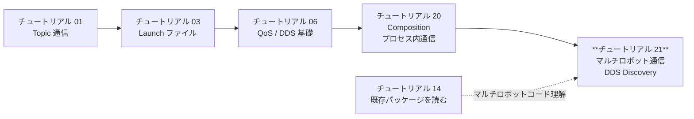
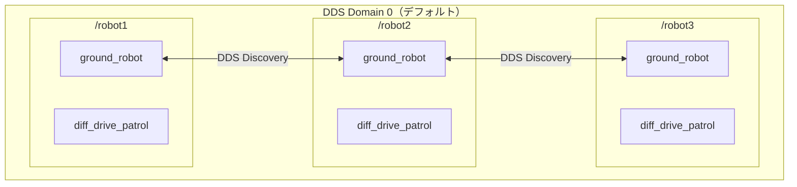
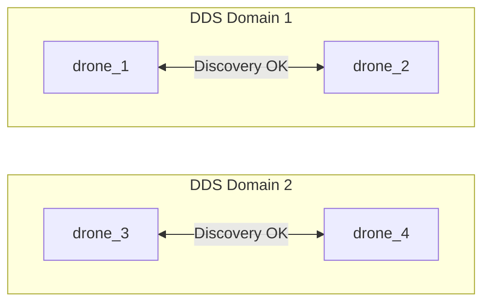
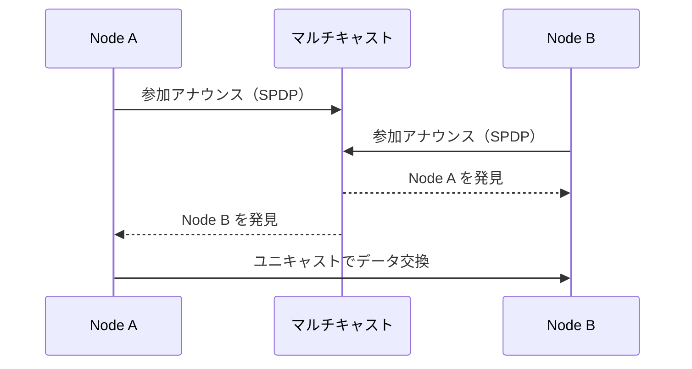
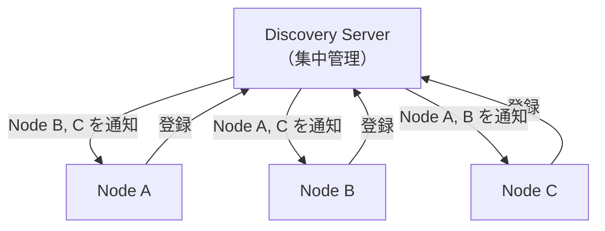
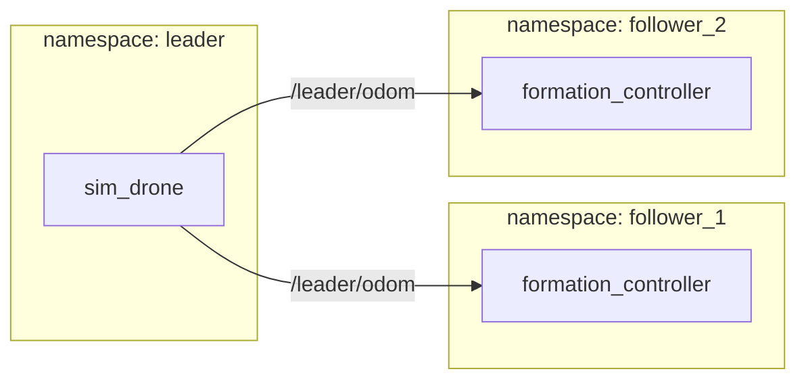
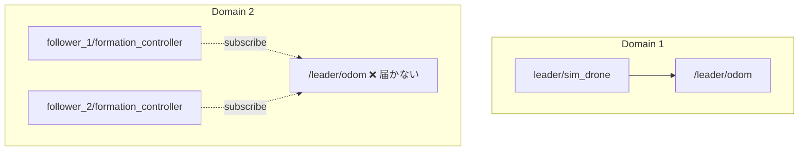

# チュートリアル 21: マルチロボット通信と DDS Discovery 設定

---

## 学習目標

- `ROS_DOMAIN_ID` によるネットワーク分離を理解し、用途に応じて使い分けられる
- DDS の Simple Discovery Protocol と Discovery Server の違いを説明できる
- `ROS_LOCALHOST_ONLY` でローカル通信に制限する方法がわかる
- 既存の `swarm` / `multi_robot` デモを複数ドメインで分離して動かせる
- Docker コンテナ間で ROS 2 ノードを通信させる設定ができる
- RMW 実装の切り替え方を理解し、適切な実装を選択できる

---

## この章の位置づけ



チュートリアル 1〜20 では、主に **単一の DDS ドメイン上・1 台のマシン内** での通信を扱ってきました。本チュートリアルでは視野を広げ、**複数ドメイン・複数マシン** にまたがるシナリオを扱います。

このリポジトリにはすでにマルチロボット機能が実装されています。

| ファイル | 内容 |
|---------|------|
| `ground_robot_sim/launch/multi_robot.launch.py` | `PushRosNamespace` を使って 3 台の地上ロボットを名前空間で分離 |
| `drone_sim/launch/swarm.launch.py` | 起動時に台数を引数で指定できる動的 N ドローン群 |
| `drone_sim/launch/formation_demo.launch.py` | 名前空間をまたいだリーダー／フォロワー通信のデモ |

これらはいずれも **名前空間（Namespace）による分離** を使っており、すべてのノードが同一の DDS ドメイン（デフォルトではドメイン 0）上に存在します。本チュートリアルでは、これらの既存デモを土台として、ドメイン ID や Discovery の仕組みを深掘りします。

---

## 前提準備

作業を始める前に、ワークスペースをビルドして環境を整えます。

```bash
source /opt/ros/jazzy/setup.bash
cd Ros2Sample
colcon build --packages-select ground_robot_sim drone_sim
source install/setup.bash
```

```
Starting >>> ground_robot_sim
Starting >>> drone_sim
Finished <<< ground_robot_sim [2.34s]
Finished <<< drone_sim [3.12s]

Summary: 2 packages finished [3.45s]
```

---

## Namespace と Domain ID の違い

マルチロボットシステムで最初に混乱しがちなのが「名前空間による分離」と「ドメイン ID による分離」の違いです。この 2 つは **分離のレベルが根本的に異なります**。

### Namespace（復習）

`PushRosNamespace` はトピック名やサービス名に接頭辞を付けます。`multi_robot.launch.py` を例に見てみましょう。起動すると、次のようなトピックが生成されます。

```
/robot1/cmd_vel
/robot1/odom
/robot2/cmd_vel
/robot2/odom
/robot3/cmd_vel
/robot3/odom
```

しかし、**どのターミナルから `ros2 node list` を実行しても、すべてのノードが見えます**。名前空間はあくまで「アプリケーション層の名前分離」であり、DDS の Discovery は影響を受けません。



> **ポイント**: 名前空間 = アプリケーション層の名前分離。すべてのノードは DDS レベルで互いを発見できる。

### Domain ID

`ROS_DOMAIN_ID` は DDS レベルで通信を分離します。異なるドメイン ID を持つノード群は **異なるマルチキャストグループと UDP ポートを使用するため、互いを一切発見できません**。



ドメイン 1 とドメイン 2 の間には矢印がありません。これが「ネットワーク層の完全分離」を意味します。

### 分離方式の比較

| 分離方式 | レベル | 効果 | 用途 |
|---------|--------|------|------|
| Namespace | アプリケーション層 | トピック名を接頭辞で分離。全ノードは互いに発見可能 | 同一システム内のロボット識別 |
| Domain ID | ネットワーク層 | DDS 通信を完全に分離。異なるドメインのノードは発見不可 | チーム・プロジェクト間の分離、テスト環境の分離 |

---

## ROS_DOMAIN_ID の仕組み

### 仕様と有効範囲

ROS 2 の仕様では、`ROS_DOMAIN_ID` の有効値は **0〜232** です（DDS 規格上の最大値 232 と同一ですが、ポート番号の計算式により上限が設けられています）。設定しない場合のデフォルトは **0** です。

```bash
# ドメイン ID を設定する
export ROS_DOMAIN_ID=42

# 現在の設定を確認する
echo $ROS_DOMAIN_ID
```

```
42
```

### ポート計算の仕組み

DDS は `ROS_DOMAIN_ID` をもとにポート番号を算出します。たとえばドメイン 0 と ドメイン 1 ではマルチキャストグループと UDP ポートが異なるため、パケットが混在することはありません。

```
ベースポート: 7400
ドメイン 0 のディスカバリポート: 7400 + (250 × 0) + オフセット
ドメイン 1 のディスカバリポート: 7400 + (250 × 1) + オフセット
```

### 動かして確認：ドメイン分離のデモ

3 つのターミナルを用意して確認します。

**ターミナル 1（ドメイン 1 でパブリッシャー起動）**

```bash
export ROS_DOMAIN_ID=1
ros2 run ros2_learning minimal_publisher
```

```
[INFO] [minimal_publisher]: Publishing: "Hello, ROS 2! 0"
[INFO] [minimal_publisher]: Publishing: "Hello, ROS 2! 1"
[INFO] [minimal_publisher]: Publishing: "Hello, ROS 2! 2"
```

**ターミナル 2（ドメイン 2 でサブスクライバー起動 → 受信しない）**

```bash
export ROS_DOMAIN_ID=2
ros2 run ros2_learning minimal_subscriber
```

```
（何も表示されない — ドメインが異なるため通信不可）
```

**ターミナル 2（ドメイン 1 に切り替えると受信する）**

```bash
export ROS_DOMAIN_ID=1
ros2 run ros2_learning minimal_subscriber
```

```
[INFO] [minimal_subscriber]: I heard: "Hello, ROS 2! 5"
[INFO] [minimal_subscriber]: I heard: "Hello, ROS 2! 6"
[INFO] [minimal_subscriber]: I heard: "Hello, ROS 2! 7"
```

### ドメインごとにトピックリストを確認する

```bash
# ドメイン 1 のトピックを確認
ROS_DOMAIN_ID=1 ros2 topic list
```

```
/chatter
/parameter_events
/rosout
```

```bash
# ドメイン 2 のトピックを確認（何もない）
ROS_DOMAIN_ID=2 ros2 topic list
```

```
/parameter_events
/rosout
```

ドメイン 2 には `/chatter` トピックが存在しないことが確認できます。

---

## DDS Discovery の基礎

DDS ノードが互いを「見つける（Discovery）」仕組みには主に 2 種類あります。それぞれの動作原理と適した用途を理解することが、マルチロボットシステム設計の鍵です。

### Simple Discovery Protocol（SPDP）— デフォルト

ROS 2 のデフォルト動作です。すべての参加者（Participant）がマルチキャストを使って自分の存在を定期的にアナウンスし、互いを自動的に発見します。



**特徴**:
- 設定不要で自動動作する
- LAN 環境でマルチキャストが使える場合に有効
- ノード数が増えるとディスカバリトラフィックが増大する（目安: 100 ノード未満）

### Discovery Server モード

中央集権型のサーバーがディスカバリを管理します。各ノードはマルチキャストではなく、サーバーに登録することで互いを発見します。Fast DDS が提供する機能です。



**特徴**:
- マルチキャスト不要（WiFi 環境やクラウドで有効）
- 大規模システムでもスケールする
- サーバーの設定と起動が必要

### 方式の比較

| 方式 | マルチキャスト | スケーラビリティ | 設定の手軽さ | 適用場面 |
|------|--------------|----------------|-------------|---------|
| Simple Discovery | 必要 | △（大規模で帯域圧迫） | ◎（設定不要） | LAN 上の小〜中規模システム |
| Discovery Server | 不要 | ◎ | △（サーバー設定が必要） | 大規模システム、WiFi 環境、クラウド |

### Discovery Server の起動方法（参考）

Fast DDS の `fastdds` コマンドでサーバーを起動します。

```bash
fastdds discovery -i 0 -l 127.0.0.1 -p 11811
```

```
### Server is running ###
  Participant Type:   SERVER
  Server GUID prefix: 44.53.00.5f.45.50.52.4f.53.49.4d.41
  Server Addresses:  UDPv4:[127.0.0.1]:11811
```

クライアント側（各 ROS 2 ノードを起動するターミナル）では次の環境変数を設定します。

```bash
export ROS_DISCOVERY_SERVER=127.0.0.1:11811
```

> **注意**: Discovery Server を使用するには、RMW として Fast DDS（`rmw_fastrtps_cpp`）が必要です。Cyclone DDS では利用できません。

---

## ROS_LOCALHOST_ONLY と RMW 選択

### ROS_LOCALHOST_ONLY

開発中に「同じ LAN 上の他のマシンと誤って通信してしまう」のを防ぐには `ROS_LOCALHOST_ONLY` が便利です。

```bash
export ROS_LOCALHOST_ONLY=1
```

この環境変数を設定すると、DDS がループバックインターフェース（`127.0.0.1`）のみを使用するよう制限されます。同一マシン内のノード同士は通信できますが、ネットワーク上の他のマシンとは通信しません。

| 用途 | 設定 |
|------|------|
| 開発・テスト（他マシンと干渉させたくない） | `export ROS_LOCALHOST_ONLY=1` |
| 同一 LAN 上のマルチマシン通信 | `ROS_LOCALHOST_ONLY` を設定しない（デフォルト） |

### RMW 実装の切り替え

ROS 2 は **RMW（ROS Middleware）層** によって DDS 実装を抽象化しています。これにより、アプリケーションコードを変えずに DDS 実装を切り替えられます。

```bash
# Cyclone DDS に切り替える
export RMW_IMPLEMENTATION=rmw_cyclonedds_cpp
ros2 run ros2_learning minimal_publisher
```

```
[INFO] [minimal_publisher]: Publishing: "Hello, ROS 2! 0"
```

> **重要**: 通信するすべてのノードは **同じ RMW 実装を使用する必要があります**。`rmw_fastrtps_cpp` と `rmw_cyclonedds_cpp` を混在させると通信できません。

| RMW 実装 | 特徴 |
|----------|------|
| `rmw_fastrtps_cpp` | Discovery Server 対応、広く使われている、Jazzy のデフォルト |
| `rmw_cyclonedds_cpp` | 軽量、XML 設定でユニキャストピア指定が容易、組み込み向け |

### SROS2 によるセキュリティ（概要）

本番環境や屋外環境でロボットを運用する場合、DDS 通信のセキュリティが重要になります。ROS 2 は **SROS2（Secure ROS 2）** という仕組みを通じて、DDS レベルのセキュリティ機能を提供しています。

SROS2 は X.509 証明書を使った **認証（Authentication）**、通信内容の **暗号化（Encryption）**、そしてどのノードがどのトピックにアクセスできるかを制御する **アクセス制御（Access Control）** の 3 つの機能を備えています。

SROS2 を有効にするには、次の環境変数を設定します。

```bash
export ROS_SECURITY_ENABLE=true
export ROS_SECURITY_STRATEGY=Enforce
export ROS_SECURITY_KEYSTORE=/path/to/keystore
```

証明書と鍵の生成には `ros2 security` コマンドを使用します。詳細な設定手順は [ROS 2 公式ドキュメントの SROS2 セクション](https://docs.ros.org/en/jazzy/Tutorials/Advanced/Security/Introducing-ros2-security.html) を参照してください。本チュートリアルではアーキテクチャの概要にとどめ、実際の証明書管理は応用編として扱います。

---

## 実践 — swarm デモを複数ドメインで分離

既存の `swarm.launch.py` を使って、ドローン群を 2 つの独立したドメインに分割する方法を示します。

**ターミナル 1（Domain 1 — ドローン 2 機）**

```bash
export ROS_DOMAIN_ID=1
ros2 launch drone_sim swarm.launch.py drone_count:=2
```

**ターミナル 2（Domain 2 — ドローン 2 機）**

```bash
export ROS_DOMAIN_ID=2
ros2 launch drone_sim swarm.launch.py drone_count:=2
```

**ターミナル 3（Domain 1 を観察）**

```bash
export ROS_DOMAIN_ID=1
ros2 topic list
```

期待される出力（Domain 1 のトピックのみ表示）:

```
/drone_1/cmd_vel
/drone_1/odom
/drone_2/cmd_vel
/drone_2/odom
/parameter_events
/rosout
```

**ターミナル 4（Domain 2 を観察）**

```bash
export ROS_DOMAIN_ID=2
ros2 topic list
```

期待される出力（Domain 2 のトピックのみ表示）:

```
/drone_1/cmd_vel
/drone_1/odom
/drone_2/cmd_vel
/drone_2/odom
/parameter_events
/rosout
```

> **重要な観察点**: Domain 1 と Domain 2 の両方に `/drone_1/...` と `/drone_2/...` という**同名のトピック**が存在します。`swarm.launch.py` の名前空間番号付けは起動ごとにリセットされるため、1 から始まる番号が付きます。もし単一のドメインで `drone_count:=4` を指定すれば、`drone_1` ～ `drone_4` というユニークな名前になります。Domain ID 分離は**名前の衝突を隠蔽**しているのではなく、DDS レベルで完全な通信境界を作っています。

---

`ground_robot_sim` の `multi_robot.launch.py` でも同じ分離を確認できます。

**ターミナル A（Domain 10 でマルチロボット起動）**

```bash
export ROS_DOMAIN_ID=10
ros2 launch ground_robot_sim multi_robot.launch.py
```

**ターミナル B（同じ Domain 10 — ノード一覧が見える）**

```bash
export ROS_DOMAIN_ID=10
ros2 node list
```

期待される出力:

```
/robot1/ground_robot
/robot1/diff_drive_patrol
/robot2/ground_robot
/robot2/diff_drive_patrol
/robot3/ground_robot
/robot3/diff_drive_patrol
```

**ターミナル C（異なる Domain 20 — 何も見えない）**

```bash
export ROS_DOMAIN_ID=20
ros2 node list
```

期待される出力:

```
（出力なし）
```

ターミナル C からは `robot1`〜`robot3` のノードが一切見えません。Domain ID の壁は ROS 2 の全通信レイヤーに及びます。

---

## 実践 — formation_demo と Domain ID の落とし穴

`formation_demo.launch.py` は、`follower_1` と `follower_2` が**絶対トピック** `/leader/odom` をサブスクライブするよう実装されています。namespace をまたいだ意図的なクロス通信の例として設計されています。



**同じ Domain ID の場合**: `/leader/odom` は名前空間を越えて届きます（絶対パス指定のため）。

---

**考えてみよう**: もし leader を Domain 1、follower を Domain 2 に分けたらどうなるでしょうか？



`/leader/odom` は Domain 1 内にのみ存在します。Domain 2 の follower ノードは、絶対パスで指定していても、Domain をまたいでトピックを受け取ることができません。フォーメーションは崩壊します。

> **重要なポイント**: Domain ID 分離は namespace 分離よりも**根本的に強力**です。Namespace では `/` から始まる絶対パスを使えばどこからでもアクセスできますが、Domain ID の境界は DDS プロトコルレベルの壁であり、アプリケーション層からは越えられません。クロスドメイン通信にはシステムレベルのブリッジ（`domain_bridge` パッケージなど）が必要です。

---

## Docker コンテナ間通信のデモ

実際のマルチロボットシステムでは、各ロボットや機能モジュールを別々のコンテナで動かすことがあります。このリポジトリには、既存の `docker/compose.yml` を拡張した `docker/compose.multi.yml` が用意されています。内容を確認しましょう。

```yaml
services:
  robot_alpha:
    build:
      context: ..
      dockerfile: docker/Dockerfile
    image: ros2sample:${ROS_DISTRO:-lyrical}
    working_dir: /workspace/Ros2Sample
    volumes:
      - ..:/workspace/Ros2Sample:cached
    environment:
      ROS_DISTRO: ${ROS_DISTRO:-lyrical}
      ROS_DOMAIN_ID: "1"
    command: >
      bash -lc "source /opt/ros/$${ROS_DISTRO}/setup.bash &&
      source install/setup.bash &&
      ros2 launch ground_robot_sim multi_robot.launch.py"
    networks:
      - rosnet
    tty: true

  robot_beta:
    build:
      context: ..
      dockerfile: docker/Dockerfile
    image: ros2sample:${ROS_DISTRO:-lyrical}
    working_dir: /workspace/Ros2Sample
    volumes:
      - ..:/workspace/Ros2Sample:cached
    environment:
      ROS_DISTRO: ${ROS_DISTRO:-lyrical}
      ROS_DOMAIN_ID: "1"
    command: >
      bash -lc "source /opt/ros/$${ROS_DISTRO}/setup.bash &&
      source install/setup.bash &&
      ros2 launch drone_sim swarm.launch.py drone_count:=2"
    networks:
      - rosnet
    tty: true

  robot_gamma:
    build:
      context: ..
      dockerfile: docker/Dockerfile
    image: ros2sample:${ROS_DISTRO:-lyrical}
    working_dir: /workspace/Ros2Sample
    volumes:
      - ..:/workspace/Ros2Sample:cached
    environment:
      ROS_DISTRO: ${ROS_DISTRO:-lyrical}
      ROS_DOMAIN_ID: "2"
    command: >
      bash -lc "source /opt/ros/$${ROS_DISTRO}/setup.bash &&
      source install/setup.bash &&
      ros2 launch drone_sim swarm.launch.py drone_count:=2"
    networks:
      - rosnet
    tty: true

networks:
  rosnet:
    driver: bridge
```

この構成のポイントをまとめます。

| コンテナ | `ROS_DOMAIN_ID` | 起動内容 | 他コンテナから見えるか |
|---------|----------------|---------|-------------------|
| `robot_alpha` | 1 | `multi_robot.launch.py`（地上ロボット 3 機） | `robot_beta` から見える |
| `robot_beta` | 1 | `swarm.launch.py`（ドローン 2 機） | `robot_alpha` から見える |
| `robot_gamma` | 2 | `swarm.launch.py`（ドローン 2 機） | Alpha・Beta からは見えない |

`robot_alpha` と `robot_beta` は同じ `ROS_DOMAIN_ID=1` を持つため、DDS Discovery を通じてお互いのノードとトピックを認識できます。`robot_gamma` は `ROS_DOMAIN_ID=2` のため、同一の Docker bridge ネットワーク（L2 接続性は存在する）にいても DDS レベルで完全に分離されます。

---

**コンテナの起動**

```bash
cd docker
docker compose -f compose.multi.yml up --build
```

**別ターミナルからコンテナに入って確認（Domain 1）**

```bash
docker compose -f compose.multi.yml exec robot_alpha bash
source /opt/ros/${ROS_DISTRO}/setup.bash
ros2 topic list
```

期待される出力（`robot_alpha` と `robot_beta` 両方のトピックが見える）:

```
/drone_1/cmd_vel
/drone_1/odom
/drone_2/cmd_vel
/drone_2/odom
/robot1/cmd_vel
/robot1/odom
/robot2/cmd_vel
/robot2/odom
/robot3/cmd_vel
/robot3/odom
/parameter_events
/rosout
```

**`robot_gamma` コンテナから確認（Domain 2）**

```bash
docker compose -f compose.multi.yml exec robot_gamma bash
source /opt/ros/${ROS_DISTRO}/setup.bash
ros2 topic list
```

期待される出力（自分のドローンのトピックのみ）:

```
/drone_1/cmd_vel
/drone_1/odom
/drone_2/cmd_vel
/drone_2/odom
/parameter_events
/rosout
```

`robot_gamma` からは `robot_alpha` の地上ロボットも `robot_beta` のドローンも見えません。

---

## 異なるマシン間での ROS 2 通信

複数の物理マシンで ROS 2 を連携させる場合は、ネットワーク設定が重要になります。

### ネットワーク要件

- **同一サブネット**内、またはマルチキャストフォワーディングが有効なルーティング環境
- **マルチキャスト通信**が使用可能なこと（多くの有線 LAN では有効、Wi-Fi では無効のケースあり）
- **ファイアウォール**で以下のポートを開放:
  - UDP 7400〜7500（DDS Discovery）
  - UDP 32768〜60999（エフェメラルポート、データ通信）

```bash
# Ubuntu での一時的なファイアウォール開放例
sudo ufw allow 7400:7500/udp
sudo ufw allow 32768:60999/udp
```

### マルチキャストが使えない場合

企業 Wi-Fi やクラウド環境ではマルチキャストが遮断されていることがあります。CycloneDDS のユニキャスト設定で回避できます。

以下の内容で `cyclonedds_unicast.xml` を作成してください（各マシンの IP アドレスを記載）。

```xml
<?xml version="1.0" encoding="UTF-8"?>
<CycloneDDS>
  <Domain>
    <General>
      <Interfaces>
        <NetworkInterface autodetermine="true"/>
      </Interfaces>
      <AllowMulticast>false</AllowMulticast>
    </General>
    <Discovery>
      <ParticipantIndex>auto</ParticipantIndex>
      <Peers>
        <Peer address="192.168.1.100"/>
        <Peer address="192.168.1.101"/>
      </Peers>
    </Discovery>
  </Domain>
</CycloneDDS>
```

この XML を各マシンで読み込ませます。

```bash
export RMW_IMPLEMENTATION=rmw_cyclonedds_cpp
export CYCLONEDDS_URI=file:///path/to/cyclonedds_unicast.xml
ros2 launch ground_robot_sim multi_robot.launch.py
```

### 動作確認

マルチマシン構成が正しく設定されていれば、通常の ROS 2 コマンドで確認できます。

```bash
# マシン A でパブリッシャーを起動
ros2 run ros2_learning minimal_publisher

# マシン B でサブスクライバーを起動（同じ ROS_DOMAIN_ID を設定すること）
ros2 run ros2_learning minimal_subscriber
```

```bash
# マシン B からマシン A のトピックが見えるか確認
ros2 topic list
ros2 topic echo /chatter
```

マシン B からマシン A のトピックが見えれば、マルチマシン通信は成功です。

---

## 実践演習

### 演習 1: ドメイン分離の確認

`multi_robot.launch.py` は `robot1`〜`robot3` を一括起動します。`robot1` と `robot2` を Domain 1 で、`robot3` を Domain 2 で起動するにはどうすればよいでしょうか。

**ヒント**: 現在の launch ファイルは全ロボットを同じプロセスで起動するため、ドメインを分けるには launch ファイルの分割または個別起動が必要です。以下の方向性を検討してください。

- `multi_robot_12.launch.py`（robot1 と robot2 のみ）と `multi_robot_3.launch.py`（robot3 のみ）に分割する
- それぞれを異なる `ROS_DOMAIN_ID` 環境変数付きで起動する
- `ros2 node list` で分離が実現されているかを両方のドメインから確認する

### 演習 2: Docker コンテナ間通信

`docker/compose.multi.yml` を参考に、3 機のドローンをそれぞれ別のコンテナで起動し、**全て同じ Domain ID** で通信させる構成を作ってみてください。

```bash
# 別コンテナのドローンの odometry を確認
docker compose -f compose.multi.yml exec drone_a bash
ros2 topic echo /drone_1/odom  # drone_b コンテナのドローンの値が届くか？
```

全コンテナが同じ `ROS_DOMAIN_ID` を持つ場合、コンテナをまたいでトピックが受信できることを確認してください。

### 演習 3: Discovery Server の試用

Fast DDS の Discovery Server を使って、マルチキャストなしのノード間通信を実現してみてください。

```bash
# ステップ 1: Discovery Server を起動
fastdds discovery --server-id 0

# ステップ 2: 各ターミナルで以下を設定してから ROS 2 ノードを起動
export RMW_IMPLEMENTATION=rmw_fastrtps_cpp
export ROS_DISCOVERY_SERVER=127.0.0.1:11811

ros2 run ros2_learning minimal_publisher
```

Discovery Server 経由でノードが発見されることを `ros2 node list` で確認してください。

---

## まとめ

本チュートリアルで学んだ設定と環境変数を以下にまとめます。

| 環境変数 / 設定 | 説明 | デフォルト値 |
|----------------|------|------------|
| `ROS_DOMAIN_ID` | DDS ドメインの分離（0〜232） | `0` |
| `ROS_LOCALHOST_ONLY` | ローカル通信に制限 | `0`（無効） |
| `RMW_IMPLEMENTATION` | DDS 実装の選択 | ディストリビューション依存 |
| `ROS_DISCOVERY_SERVER` | Discovery Server のアドレス | 未設定（Simple Discovery） |
| `CYCLONEDDS_URI` | CycloneDDS の XML 設定ファイルパス | 未設定 |
| `FASTRTPS_DEFAULT_PROFILES_FILE` | Fast DDS の XML 設定ファイルパス | 未設定 |

---

### シナリオ別推奨設定

| シナリオ | 推奨設定 |
|---------|---------|
| 単一マシンでの開発・デバッグ | `ROS_LOCALHOST_ONLY=1`、デフォルト Domain ID |
| 同一 LAN 上の複数チームが並行開発 | チームごとに異なる `ROS_DOMAIN_ID` |
| 異なるプロジェクトの完全分離 | 異なる `ROS_DOMAIN_ID` |
| マルチキャスト非対応ネットワーク（企業 Wi-Fi 等） | Discovery Server または CycloneDDS ユニキャスト設定 |
| 大規模分散システム（ノード数 100 以上） | Discovery Server（スケーラビリティのため） |
| セキュリティが必要な本番環境 | SROS2 + DDS セキュリティプラグイン |
| 異なるマシン間での通信 | 同一 `ROS_DOMAIN_ID`、ファイアウォール開放 |

---

## トラブルシューティング

### トピックが見えない / `ros2 topic list` が空

**症状**: Publisher を起動しているはずなのに、別ターミナルで `ros2 topic list` を実行しても何も表示されない。

**原因**: `ROS_DOMAIN_ID` が送信側と受信側で異なっている可能性が最も高いです。

**対処法**:

```bash
# 両方のターミナルで実行して値を確認
echo $ROS_DOMAIN_ID
```

値が異なる場合は、一方のターミナルで `export ROS_DOMAIN_ID=<同じ値>` を設定してください。値が未設定（空）の場合はデフォルトの `0` として扱われます。

---

### 別マシンと通信できない

**症状**: 同じ `ROS_DOMAIN_ID` を設定しているにもかかわらず、別の物理マシン上のノードやトピックが見えない。

**原因**: ファイアウォールによる UDP ブロック、またはマルチキャスト通信が無効になっている可能性があります。

**対処法**:

```bash
# ファイアウォールの確認（Ubuntu）
sudo ufw status

# マルチキャスト疎通確認
ping 239.255.0.1

# ファイアウォールの一時開放
sudo ufw allow 7400:7500/udp
sudo ufw allow 32768:60999/udp
```

マルチキャストが使えない環境では、CycloneDDS のユニキャスト設定（セクション 11 参照）または Fast DDS Discovery Server を使用してください。

---

### Docker コンテナ間で通信できない

**症状**: `compose.multi.yml` で複数コンテナを起動したが、別コンテナのトピックが見えない。

**原因 1**: 各コンテナの `ROS_DOMAIN_ID` が異なっている。
**原因 2**: `ROS_LOCALHOST_ONLY=1` が設定されている（コンテナの外には出るが別コンテナには届かない）。
**原因 3**: コンテナが同一の Docker ネットワークに属していない。

**対処法**:

```bash
# 各コンテナの環境変数を確認
docker compose -f compose.multi.yml exec robot_alpha env | grep ROS

# ネットワーク接続を確認
docker network ls
docker network inspect docker_rosnet
```

`ROS_LOCALHOST_ONLY` が `1` になっていないか、全コンテナが同じネットワーク（例: `rosnet`）に属しているかを確認してください。

---

### Discovery Server に接続できない

**症状**: `ROS_DISCOVERY_SERVER` を設定したが、ノードが互いを発見できない。

**原因**: Discovery Server が起動していない、アドレスとポートが間違っている、または `RMW_IMPLEMENTATION` が Fast DDS 以外になっている可能性があります。

**対処法**:

```bash
# RMW が Fast DDS かどうか確認
echo $RMW_IMPLEMENTATION
# rmw_fastrtps_cpp または rmw_fastrtps_dynamic_cpp であること

# Discovery Server の起動確認
ps aux | grep fastdds

# 接続先アドレスとポートの確認
echo $ROS_DISCOVERY_SERVER
# 例: 127.0.0.1:11811

# Discovery Server を手動起動（未起動の場合）
fastdds discovery --server-id 0 --ip-address 127.0.0.1 --port 11811
```

Discovery Server は CycloneDDS では使用できません。`RMW_IMPLEMENTATION=rmw_fastrtps_cpp` を設定した上で試してください。

---

### RMW が異なるノードと通信できない

**症状**: 一部のノードだけ通信できず、ROS_DOMAIN_ID は一致しているはずなのにトピックが届かない。

**原因**: ノードによって異なる `RMW_IMPLEMENTATION`（例: 一方が CycloneDDS、他方が Fast DDS）が使われている可能性があります。異なる DDS 実装間では通信できません（DDS 仕様上はワイヤフォーマットが共通ですが、実装によっては互換性の問題が生じます）。

**対処法**:

```bash
# 全ノードで同じ RMW を使用するよう統一する
export RMW_IMPLEMENTATION=rmw_cyclonedds_cpp  # または rmw_fastrtps_cpp

# 使用中の RMW を確認
ros2 doctor --report | grep middleware
```

システム全体で同一の `RMW_IMPLEMENTATION` を統一することを強く推奨します。

---

### 同じ Domain ID なのに通信できない（ローカル同士）

**症状**: 同じマシンの異なるターミナル間で、`ROS_DOMAIN_ID` は同じなのにトピックが見えない。

**原因**: 一方のターミナルに `ROS_LOCALHOST_ONLY=1` が設定されていても通信できるはずですが、`ROS_LOCALHOST_ONLY` の値が不一致の場合に問題が生じることがあります。また、シェルを新しく開いた際に環境変数が引き継がれていない場合もあります。

**対処法**:

```bash
# 全ターミナルで環境変数を確認
echo "DOMAIN_ID=${ROS_DOMAIN_ID}, LOCALHOST_ONLY=${ROS_LOCALHOST_ONLY}, RMW=${RMW_IMPLEMENTATION}"
```

`~/.bashrc` や `~/.zshrc` に誤った値が書き込まれていないかも確認してください。一時的なデバッグには以下が有効です。

```bash
# 環境変数をいったんクリアして確認
unset ROS_DOMAIN_ID ROS_LOCALHOST_ONLY RMW_IMPLEMENTATION
source /opt/ros/${ROS_DISTRO}/setup.bash
ros2 topic list
```
