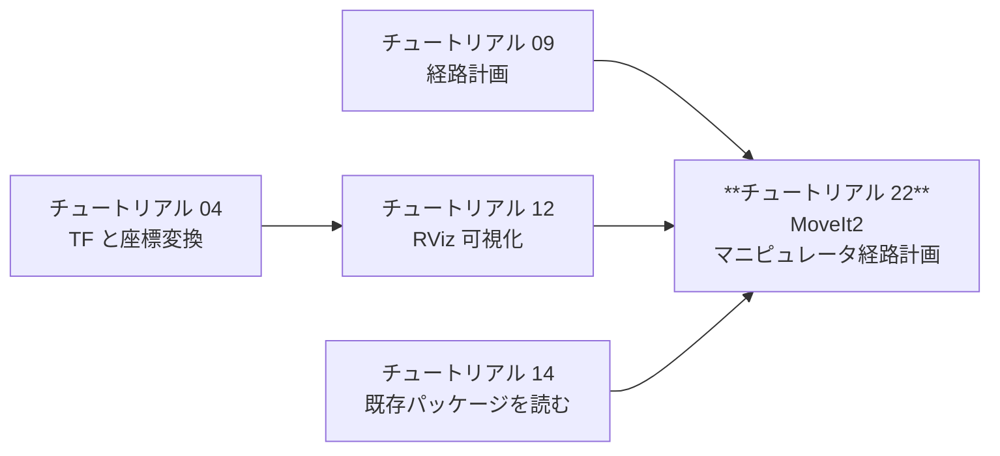
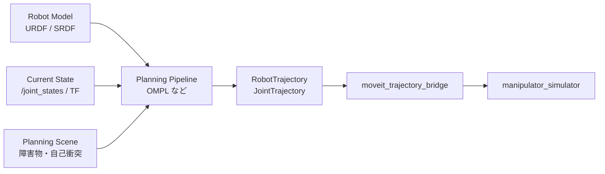
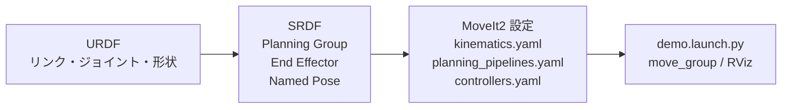

# チュートリアル 22: MoveIt2 / マニピュレータ経路計画入門

---

## 学習目標

- MoveIt2 の Planning Pipeline、Kinematics、Collision Detection の役割を説明できる
- `manipulator_sim` の 2 自由度平面マニピュレータを MoveIt2 用 URDF と対応づけられる
- MoveIt Setup Assistant で SRDF と MoveIt2 設定パッケージを生成する流れがわかる
- `moveit_py` で計画した `JointTrajectory` を既存シミュレータに渡せる
- Planning Scene に障害物を置いた場合に、経路計画が衝突回避を考慮することを理解できる

---

## この章の位置づけ



これまでのチュートリアルでは、移動ロボット向けの Nav2 と、このリポジトリ独自の軽量シミュレーションを扱いました。本章では対象をマニピュレータに移し、MoveIt2 を使った関節空間・作業空間の経路計画を学びます。

`manipulator_sim` は次の ROS 2 インターフェースを持っています。

| インターフェース | 型 | 役割 |
|------------------|----|------|
| `/joint_states` | `sensor_msgs/msg/JointState` | 現在の関節角 |
| `/joint_target` | `sensor_msgs/msg/JointState` | シミュレータへの目標関節角 |
| `/tool_pose` | `geometry_msgs/msg/PoseStamped` | 手先位置 |
| `/tf` | `base_link -> link1 -> link2 -> tool0` | リンク構造 |
| `/planned_joint_trajectory` | `trajectory_msgs/msg/JointTrajectory` | MoveIt2 から受け取る計画軌道 |

---

## MoveIt2 の全体像

MoveIt2 はマニピュレータ向けのモーションプランニングフレームワークです。単に「IK を解く」だけではなく、ロボットモデル、関節制限、障害物、自己衝突、制御インターフェースをまとめて扱います。



主要コンポーネントの役割は次の通りです。

| 要素 | 役割 |
|------|------|
| Planning Pipeline | OMPL などのプランナーを呼び出し、開始状態から目標状態までの軌道を生成する |
| Kinematics | 関節角と手先姿勢の変換を扱う。IK プラグインは作業空間目標に必要 |
| Collision Detection | ロボット自身や環境オブジェクトとの衝突を判定する |
| Planning Scene | 現在のロボット状態、障害物、許可衝突行列をまとめた計画用の世界モデル |
| Controller / Execution | 計画された軌道を実機またはシミュレータへ送る |

このリポジトリでは実機用 controller ではなく、`moveit_trajectory_bridge` が `JointTrajectory` を `/joint_target` に変換して既存シミュレータへ渡します。

---

## 前提準備

MoveIt2 を使うターミナルでは、ROS 2 Jazzy と MoveIt2 をインストールしておきます。

```bash
sudo apt update
sudo apt install ros-jazzy-moveit ros-jazzy-moveit-py
```

ワークスペースをビルドします。

```bash
source /opt/ros/jazzy/setup.bash
cd Ros2Sample
rosdep install --from-paths src --ignore-src -r -y
colcon build --packages-select manipulator_sim
source install/setup.bash
```

`manipulator_sim` には MoveIt2 設定生成の入力として、次の URDF が含まれています。

```bash
ros2 pkg prefix manipulator_sim
ls install/manipulator_sim/share/manipulator_sim/urdf
```

期待されるファイル:

```text
planar_manipulator.urdf
```

---

## URDF から MoveIt2 設定へ

MoveIt2 の設定は、おおまかに次の順で作ります。



`planar_manipulator.urdf` では、2 つの revolute joint を定義しています。

| Joint | Parent | Child | Axis | 説明 |
|-------|--------|-------|------|------|
| `joint1` | `base_link` | `link1` | `0 0 1` | 根元関節 |
| `joint2` | `link1` | `link2` | `0 0 1` | 肘関節 |
| `tool0_fixed` | `link2` | `tool0` | fixed | 手先フレーム |

この構造は `manipulator_simulator` が publish する TF と一致します。

---

## MoveIt Setup Assistant で設定パッケージを生成する

Setup Assistant を起動します。

```bash
ros2 launch moveit_setup_assistant setup_assistant.launch.py
```

GUI で次のように設定します。

| 画面 | 設定 |
|------|------|
| Start | `Create New MoveIt Configuration Package` を選び、`planar_manipulator.urdf` を読み込む |
| Self-Collisions | デフォルト設定で `Generate Collision Matrix` |
| Virtual Joints | 固定ベースなので追加しない |
| Planning Groups | `arm` を作成し、Kinematic Chain として `base_link` から `tool0` を選ぶ |
| Robot Poses | `home` を追加し、`joint1=0.0`, `joint2=0.0` |
| End Effectors | 2 自由度の簡易アームなので省略してよい |
| ROS 2 Controllers | 実機 controller は使わないため最小設定でよい |
| MoveIt Controllers | 後段の `moveit_trajectory_bridge` に渡す場合は実行 controller を使わず、計画結果を publish する |
| Generate Files | `src/planar_manipulator_moveit_config` などに生成 |

生成後は設定パッケージもビルドします。

```bash
colcon build --packages-select manipulator_sim planar_manipulator_moveit_config
source install/setup.bash
```

---

## 既存シミュレータを MoveIt2 の軌道で動かす

このリポジトリでは、MoveIt2 が生成した軌道を直接シミュレータへ入れるために `moveit_trajectory_bridge` を追加しています。

```bash
ros2 launch manipulator_sim moveit_bridge_demo.launch.py
```

別ターミナルで、手動の `JointTrajectory` を publish して接続を確認します。

```bash
ros2 topic pub --once /planned_joint_trajectory trajectory_msgs/msg/JointTrajectory "{
  joint_names: ['joint1', 'joint2'],
  points: [
    {positions: [0.0, 0.0], time_from_start: {sec: 0, nanosec: 0}},
    {positions: [0.8, -0.5], time_from_start: {sec: 2, nanosec: 0}},
    {positions: [0.2, 0.9], time_from_start: {sec: 4, nanosec: 0}}
  ]
}"
```

確認します。

```bash
ros2 topic echo /joint_target
ros2 topic echo /tool_pose
ros2 run tf2_ros tf2_echo base_link tool0
```

`moveit_trajectory_bridge` は `/planned_joint_trajectory` の時刻付き waypoint を補間し、`/joint_target` として publish します。`manipulator_simulator` は既存の速度制限付き追従ロジックでその目標に向かいます。

---

## moveit_py から計画軌道を publish する

MoveIt2 設定パッケージを生成したら、`moveit_py` で計画して、結果の `RobotTrajectory.joint_trajectory` を `/planned_joint_trajectory` へ publish します。

以下は考え方を示す最小例です。実際の import 名や launch は MoveIt2 のインストール状態と生成した設定パッケージに合わせて調整してください。

```python
import rclpy
from moveit.core.robot_state import RobotState
from moveit.planning import MoveItPy
from trajectory_msgs.msg import JointTrajectory


def main():
    rclpy.init()
    node = rclpy.create_node("planar_moveit_py_demo")
    trajectory_pub = node.create_publisher(
        JointTrajectory,
        "/planned_joint_trajectory",
        10,
    )

    moveit = MoveItPy(node_name="planar_moveit_py")
    arm = moveit.get_planning_component("arm")

    robot_model = moveit.get_robot_model()
    goal_state = RobotState(robot_model)
    goal_state.joint_positions = {
        "joint1": 0.8,
        "joint2": -0.5,
    }

    arm.set_start_state_to_current_state()
    arm.set_goal_state(robot_state=goal_state)
    plan_result = arm.plan()

    if plan_result:
        trajectory_pub.publish(plan_result.trajectory.joint_trajectory)
        node.get_logger().info("Published planned trajectory")
    else:
        node.get_logger().error("Planning failed")

    rclpy.shutdown()


if __name__ == "__main__":
    main()
```

実行時は、`move_group`、生成した MoveIt2 設定、`manipulator_sim` の `/joint_states` が同じ ROS graph 上に存在している必要があります。

---

## 障害物回避を含む Planning Scene

障害物回避は Planning Scene に Collision Object を追加して行います。2 自由度の平面アームなので、障害物は薄い box として z 方向に高さを持たせると確認しやすくなります。

```python
from moveit_msgs.msg import CollisionObject
from shape_msgs.msg import SolidPrimitive
from geometry_msgs.msg import Pose

planning_scene_monitor = moveit.get_planning_scene_monitor()

with planning_scene_monitor.read_write() as scene:
    obstacle = CollisionObject()
    obstacle.header.frame_id = "base_link"
    obstacle.id = "center_box"

    box = SolidPrimitive()
    box.type = SolidPrimitive.BOX
    box.dimensions = [0.18, 0.18, 0.3]

    pose = Pose()
    pose.position.x = 0.55
    pose.position.y = 0.15
    pose.position.z = 0.0
    pose.orientation.w = 1.0

    obstacle.primitives.append(box)
    obstacle.primitive_poses.append(pose)
    obstacle.operation = CollisionObject.ADD
    scene.apply_collision_object(obstacle)
    scene.current_state.update()
```

障害物なしで成功する目標が、障害物追加後に別経路になる、または計画失敗することを RViz の MotionPlanning パネルで確認します。MoveIt2 の Collision Detection は URDF の collision geometry と Planning Scene のオブジェクトを使うため、URDF のリンク形状が粗すぎると判定も粗くなります。

---

## RViz で確認する観点

| 観点 | 確認方法 |
|------|----------|
| RobotModel が表示される | RViz の `RobotModel` Display を有効にする |
| TF が一致する | `base_link -> link1 -> link2 -> tool0` が切れていないか見る |
| JointState が届く | `/joint_states` を echo し、関節角が変わるか確認 |
| 計画軌道が流れる | `/planned_joint_trajectory` に点列が publish されるか確認 |
| シミュレータが追従する | `/tool_pose` と RViz 上の `tool0` が滑らかに動くか確認 |
| 障害物を避ける | Planning Scene に box を追加し、計画が変化するか確認 |

---

## トラブルシューティング

### Setup Assistant で URDF が読み込めない

`planar_manipulator.urdf` が install space に入っているか確認します。

```bash
colcon build --packages-select manipulator_sim
source install/setup.bash
ls install/manipulator_sim/share/manipulator_sim/urdf/planar_manipulator.urdf
```

### `arm` planning group が見つからない

`moveit_py` の `get_planning_component("arm")` は、SRDF で作成した Planning Group 名と一致している必要があります。Setup Assistant で別名にした場合は、Python 側も同じ名前に変えてください。

### 計画は成功するがシミュレータが動かない

次を順番に確認します。

```bash
ros2 topic list | grep planned_joint_trajectory
ros2 topic echo /planned_joint_trajectory --once
ros2 topic echo /joint_target --once
ros2 topic echo /joint_states --once
```

`/planned_joint_trajectory` はあるのに `/joint_target` が出ない場合は、`JointTrajectory.joint_names` に `joint1` と `joint2` が含まれているか確認してください。

### 手先目標の planning が失敗する

2 自由度平面アームは姿勢自由度が少ないため、3D pose goal の向きまで厳密に指定すると解が存在しないことがあります。最初は joint goal で動作確認し、その後 pose goal を試してください。

---

## まとめ

本章では、`manipulator_sim` を MoveIt2 の学習に使うための最小構成を作りました。

- `planar_manipulator.urdf` を MoveIt2 設定生成の入力にした
- MoveIt Setup Assistant で SRDF と設定パッケージを生成する流れを確認した
- `moveit_py` で計画した `JointTrajectory` を `/planned_joint_trajectory` に publish する構成を示した
- `moveit_trajectory_bridge` で既存の `/joint_target` インターフェースへ接続した
- Planning Scene に障害物を追加し、衝突回避を含む計画を試す準備を整えた

MoveIt2 の詳細 API はバージョン差が出やすいため、実際にコード化する場合は利用中の MoveIt2 ドキュメントも併せて確認してください。

参考:

- [MoveIt2 Motion Planning Python API](https://moveit.picknik.ai/main/doc/examples/motion_planning_python_api/motion_planning_python_api_tutorial.html)
- [MoveIt Setup Assistant](https://moveit.picknik.ai/main/doc/examples/setup_assistant/setup_assistant_tutorial.html)
